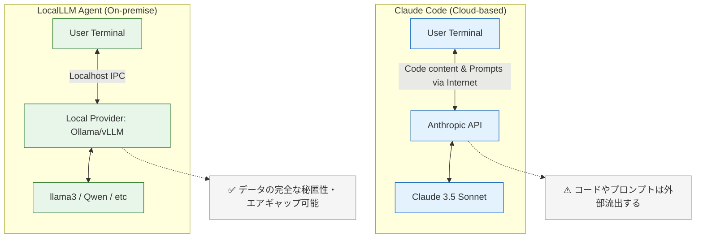

# Claude Code との対比表 (Comparison with Claude Code)

本システム（LocalLLM Agent）は「Claude Code」にインスパイアされて設計・開発されていますが、利用環境や技術アプローチにおいていくつかの重要な設計の差異があります。
本ドキュメントでは、両者の機能やアーキテクチャの対比を整理します。

## 1. 構成・アーキテクチャの違い

クラウドに依存するClaude Codeと、端末内で完結するLocalLLM Agentにはデータの流れに根本的な違いがあります。

## 2. 基本アプローチと機能の比較詳細

| 比較項目 | Claude Code (Anthropic) | LocalLLM Agent (本システム) |
| :--- | :--- | :--- |
| **推論基盤 (LLM)** | クラウド (Claude 3.5 Sonnet 等) | **ローカルオンプレミス** (Ollama, LM Studio等) |
| **運用コスト** | 従量課金 (APIトークン消費) | **無料** (マシンの電気代などのみ) |
| **プライバシー・ 機密保持** | ソースコードが外部(Anthropic等)のAPIサーバに送信される | **完全オフライン動作可能**。機密性の高いコードや社外秘データを外部に送信しない |
| **環境構築** | `npm install -g @anthropic-ai/claude-code` | Node.js + ローカルLLM環境(Ollama等)の事前セットアップが必要 |
| **ツール数** | 30以上 (ファイル操作, bash, ブラウザ, Task/SubAgent等) | **21種** (ファイル5, bash, Web2, ブラウザ5, vision, タスク管理6, ask_user) |
| **サブエージェント** | Task tool による4タイプ (explore, plan, general-purpose, bash) | **4タイプ** (explore, plan, general-purpose, bash) を独自実装 |
| **プランモード** | 組み込み (EnterPlanMode / ExitPlanMode) | **組み込み** (idle→planning→awaiting_approval→approved/rejected の状態遷移) |
| **スキルシステム** | Skill tool + `/command` トリガー | **対応** (builtin 4スキル + ユーザー定義 `~/.localllm/skills/`, `.claude/skills/`) |

### 2.1 コンテキスト管理
- **Claude Code**: 基盤モデル側で長大なコンテキストウインドウ (200K トークンなど) がサポートされており、基本的にはAPI任せのコンテキスト保持を採用しています（大規模なプロジェクト全体の理解が得意）。
- **LocalLLM Agent**: ローカルのメモリ制限（一般的なPCでは数K〜32Kトークン程度）に対応するため、**「コンテキストの自動圧縮機能（要約機能）」**を独自に実装しています。トークン消費量が設定値（例: 80%）に達すると、LLM自身に過去の会話履歴を要約させ、コンテキスト溢れを防止します。

### 2.2 権限とセキュリティモデル
- **Claude Code**: ツール実行時の承認モデルを備えており、危険なコマンドを実行前に検知してユーザーに確認を求めます。
- **LocalLLM Agent**: Claude Code同様の **「auto」「ask」「deny」の3段階権限モデル** を実装。さらに、より厳密な**パス解決ベースの「サンドボックス」機能**や、正規表現チェックによる静的な危険コマンドブロック(`rm -rf /`等)を組み込んでおり、ローカルマシンの破壊リスクを低減する工夫を行っています。

### 2.3 拡張性とカスタマイズ性
- **Claude Code**: 提供される機能セットはベンダー(Anthropic)のアップデートに依存します。
- **LocalLLM Agent**: OSSライクなアプローチを採用し、**スキル** を独自のMarkdownで拡張することが容易です。スキルは以下の3箇所から自動ロードされます:
  - `~/.localllm/skills/` (ユーザーグローバル)
  - `.claude/skills/` (プロジェクト固有・Claude Code互換)
  - `.localllm/skills/` (プロジェクト固有)

  また、LLMプロバイダを柔軟に切り替えられるため（Ollama, LM Studio, llama.cpp, vLLM）、ハードウェアの進化に併せて任意のモデルを利用できます。

### 2.4 ブラウザテスト自動化
- **Claude Code**: 一般的なCLI上のファイル操作やコマンド実行が主用途です。
- **LocalLLM Agent**: システム内に **Playwright** が統合されており、LLM自身がブラウザを開いて画面の操作（クリック、入力、スクショ取得、アクセシビリティツリー解析）を実行可能な点が大きな特徴です。Vision APIを持たないローカルモデルのため、必要に応じて画像認識用のサブLLMに推論を委譲する機能も備えています。

## 3. まとめ

LocalLLM Agentは、Claude Codeの持つ「シームレスなCLI体験」や「自律的なツール実行」といった優れたUXを踏襲しつつ、**データプライバシーの絶対的な保護**と**ランニングコストゼロ**を主な目的として開発されています。

一方で、ローカルマシンのLLMはパラメータ数やコンテキストサイズに物理的限界があるため、それをソフトウェア側（プロンプトの工夫、コンテキスト圧縮、サブエージェント委譲）で補うアプローチを取っている点が最大の違いです。
