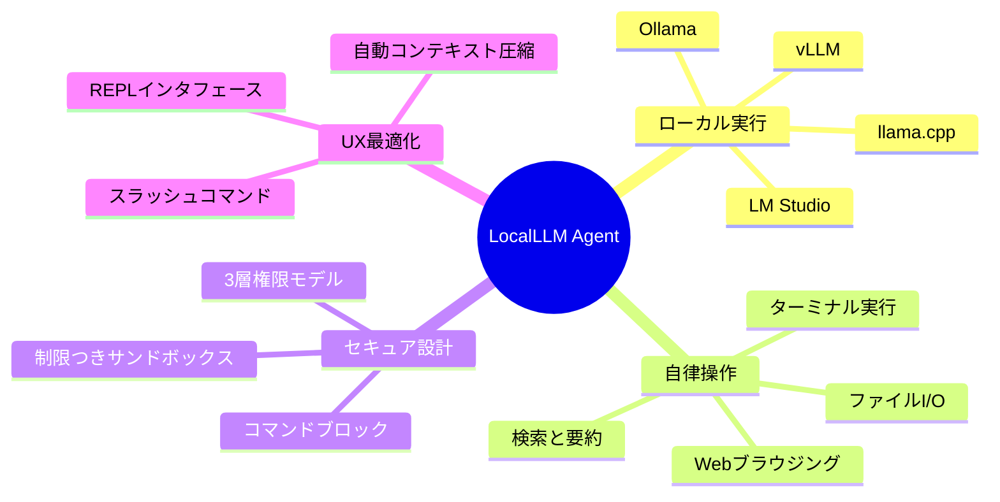
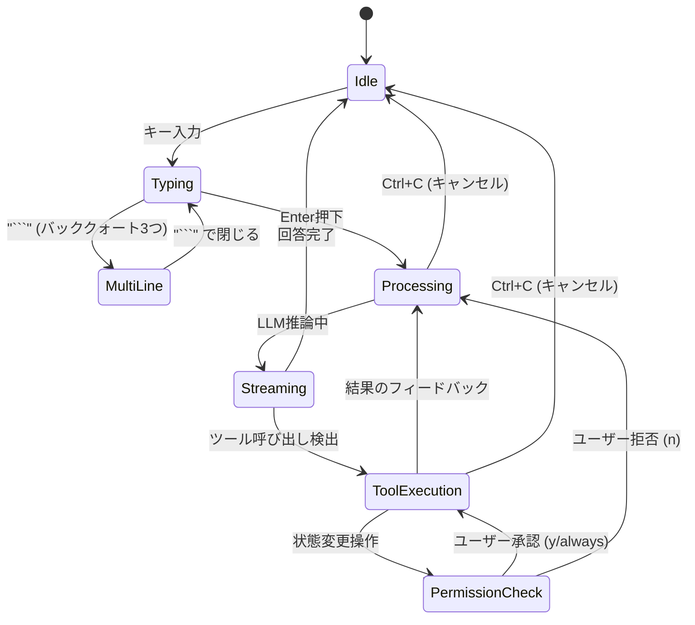
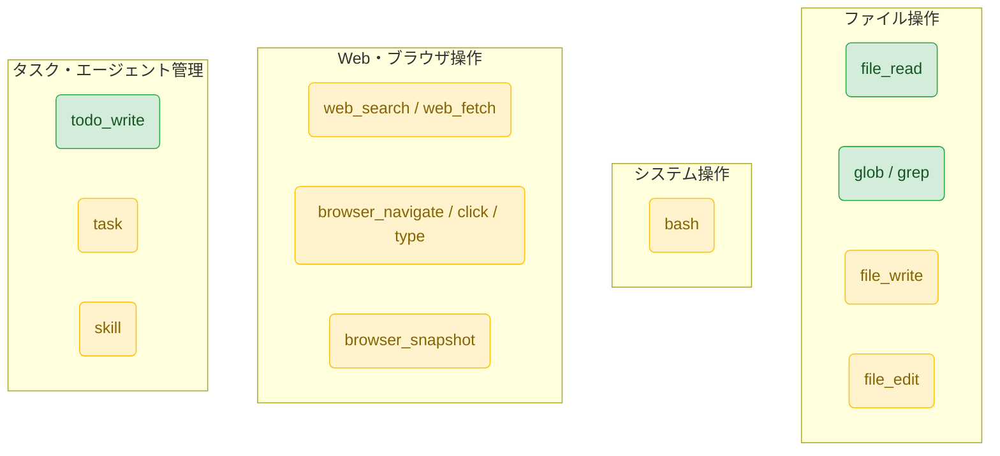
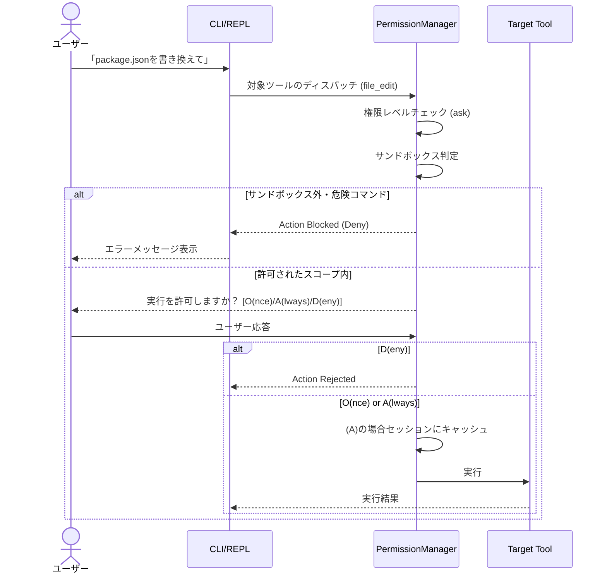

# 外部設計書 (External Design)

本ドキュメントでは、LocalLLM Agent の外部仕様（ユーザー向け機能・インターフェース・動作要件）について定義します。

## 1. システム概要

LocalLLM Agent は、ローカルで稼働するLLM（大規模言語モデル）を活用した**CLI型AIエージェント**です。ユーザーのPC上で自律的に動作し、ファイルの読み書き、Web検索、ブラウザ操作、コマンドの実行などを通じてタスクを遂行します。Claude Code にインスパイアされた対話型の REPL インターフェースを提供します。

### 1.1 主な特徴とユースケース



```mermaid
usecase
  %% ユーザーとエージェント間のインタラクション概要
  actor User as "ユーザー"
  
  package "LocalLLM Agent" {
    usecase "REPL対話" as UC1
    usecase "コマンド操作(/help等)" as UC2
    usecase "ファイル編集・検索" as UC3
    usecase "OSコマンド実行(bash)" as UC4
    usecase "Web操作(Playwright)" as UC5
    usecase "プランモード(タスク設計)" as UC6
  }
  
  User --> UC1
  User --> UC2
  User --> UC6
  
  UC1 ..> UC3 : "LLM自律判断"
  UC1 ..> UC4 : "LLM自律判断"
  UC1 ..> UC5 : "LLM自律判断"
  
  note right of UC4
    ※実行前にユーザーの承認(Ask)またはブロック(Deny)が発生
  end note
```

## 2. ユーザーインターフェース (UI)

### 2.1 REPL コマンドラインUI
エージェントはターミナル上で動作し、コマンドプロンプト形式でユーザーの自然言語入力を受け付けます。



### 2.2 スラッシュコマンド一覧

| コマンド | 説明 |
|----------|------|
| `/help` | ヘルプや使用可能なコマンド一覧を表示します |
| `/quit` | エージェントを終了します |
| `/clear` | 現在の会話履歴とコンテキストをクリアします |
| `/context` | 現在のコンテキスト（トークン）使用状況を表示します |
| `/setup` | 設定ウィザードを再実行し、LLMプロバイダーやモデルを変更します |
| `/plan` | タスクを事前に分析・設計する「プランモード」を手動で開始します |
| `/skill` | 追加ロードされているスキル（builtin含む）の一覧を表示します |
| `/agents` | バックグラウンド等で稼働しているサブエージェントの一覧・状態を表示します |
| `/status` | 全体の稼働ステータス（コンテキスト・タスク・エージェント）を一括表示します |

## 3. 提供機能とツール群

エージェントはLLMの推論結果に基づき、以下の機能（ツール）を抽象化された関数(Function Calling)として呼び出します。


※緑色: 自動許可(`auto`)、黄色: 確認必須(`ask`)

## 4. セキュリティ・権限モデルのUXフロー



## 5. 設定と環境要件

- **要件**: Node.js 18+
- **LLM**: ローカルLLM環境（Ollama等）の起動
- **設定ロケーション**: `~/.localllm/config.json`
- **主要な設定値**:
  - `providerType`: `ollama`, `lmstudio`, `llamacpp`, `vllm`, `openai-compat`
  - `contextWindow`: トークン上限。これの80%(デフォルト)に達すると自動圧縮。
  - `allowedDirectories`: サンドボックスでアクセスを許可する追加のディレクトリリスト。
