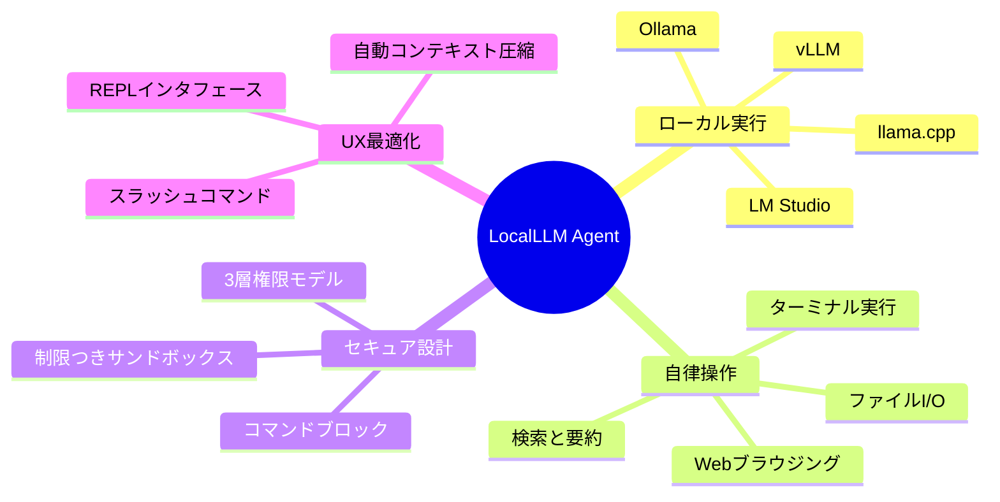
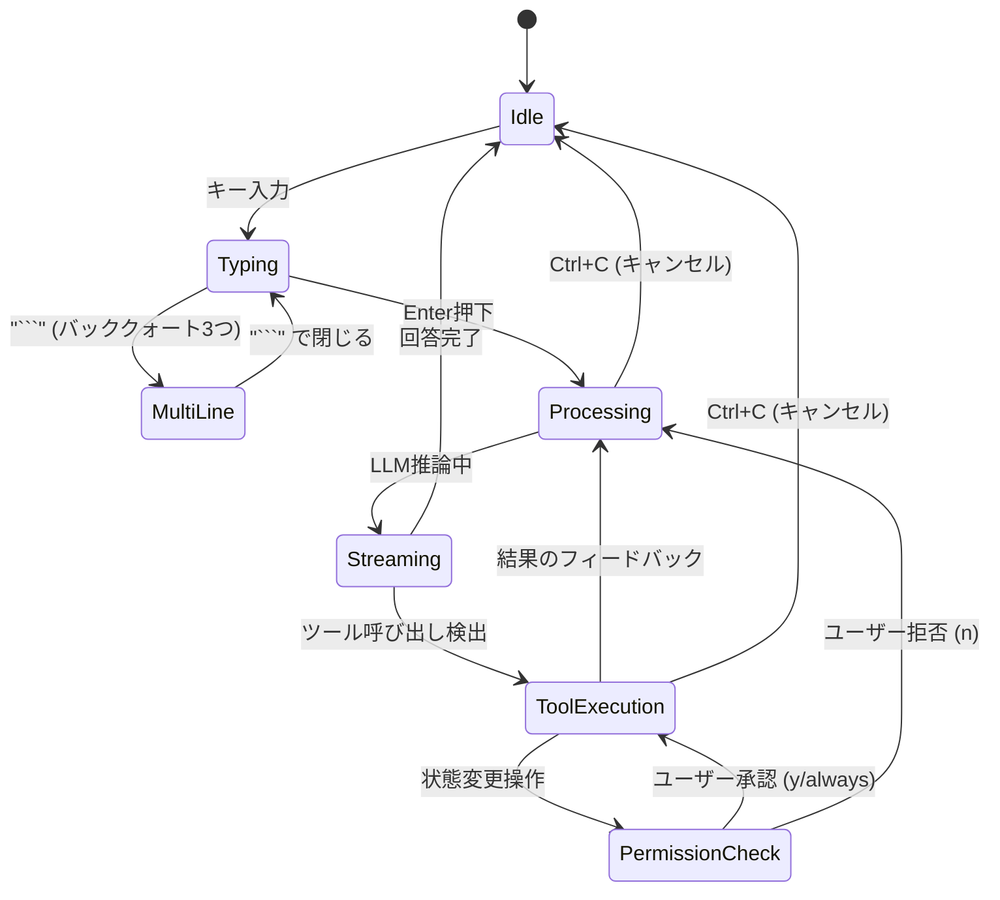
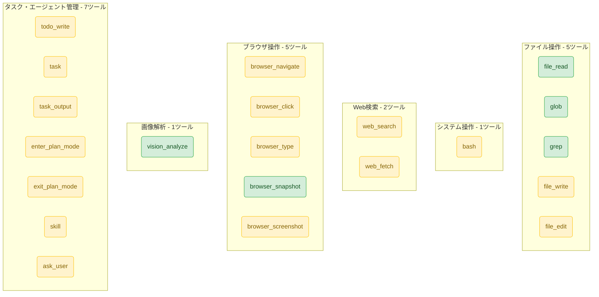
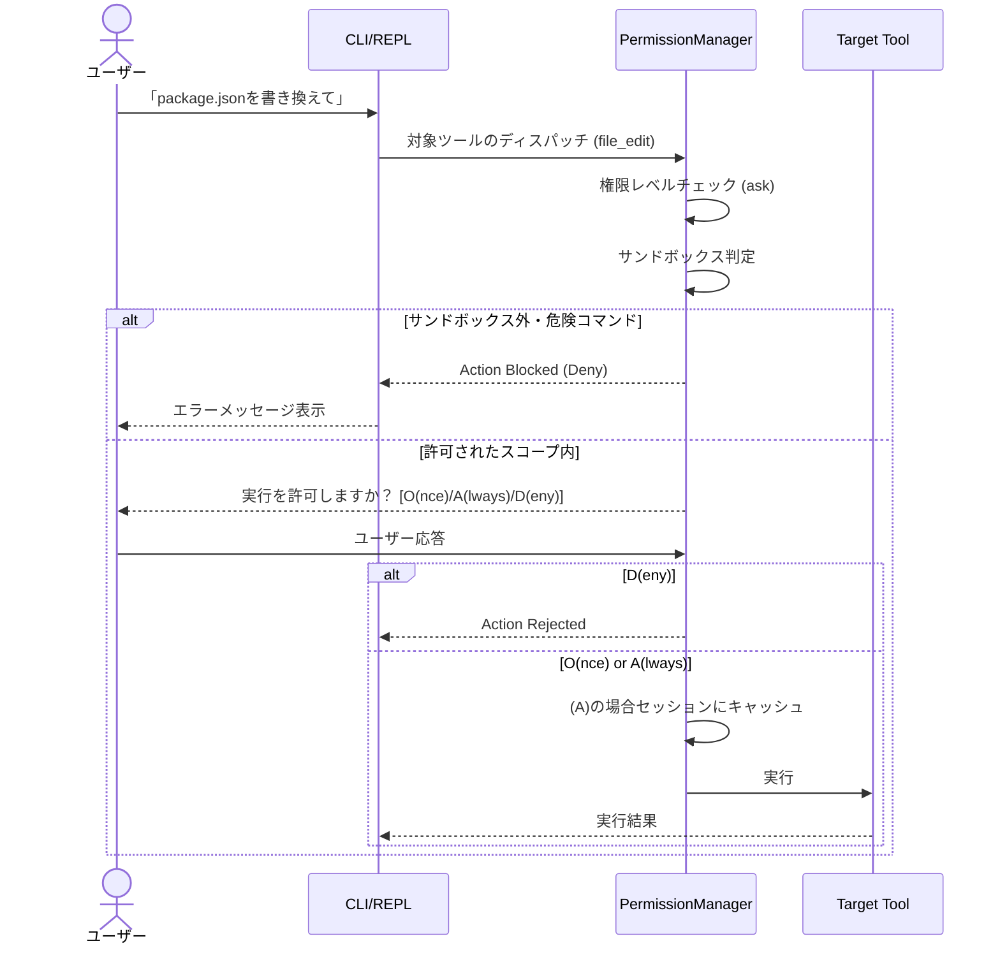

# 外部設計書 (External Design)

本ドキュメントでは、LocalLLM Agent の外部仕様（ユーザー向け機能・インターフェース・動作要件）について定義します。

## 1. システム概要

LocalLLM Agent は、ローカルで稼働するLLM（大規模言語モデル）を活用した**CLI型AIエージェント**です。ユーザーのPC上で自律的に動作し、ファイルの読み書き、Web検索、ブラウザ操作、コマンドの実行などを通じてタスクを遂行します。Claude Code にインスパイアされた対話型の REPL インターフェースを提供します。

### 1.1 主な特徴とユースケース



```mermaid
usecase
  %% ユーザーとエージェント間のインタラクション概要
  actor User as "ユーザー"
  
  package "LocalLLM Agent" {
    usecase "REPL対話" as UC1
    usecase "コマンド操作(/help等)" as UC2
    usecase "ファイル編集・検索" as UC3
    usecase "OSコマンド実行(bash)" as UC4
    usecase "Web操作(Playwright)" as UC5
    usecase "プランモード(タスク設計)" as UC6
  }
  
  User --> UC1
  User --> UC2
  User --> UC6
  
  UC1 ..> UC3 : "LLM自律判断"
  UC1 ..> UC4 : "LLM自律判断"
  UC1 ..> UC5 : "LLM自律判断"
  
  note right of UC4
    ※実行前にユーザーの承認(Ask)またはブロック(Deny)が発生
  end note
```

## 2. ユーザーインターフェース (UI)

### 2.1 REPL コマンドラインUI
エージェントはターミナル上で動作し、コマンドプロンプト形式でユーザーの自然言語入力を受け付けます。



### 2.2 スラッシュコマンド一覧

| コマンド | 説明 |
|----------|------|
| `/help` | ヘルプや使用可能なコマンド一覧を表示します |
| `/quit`, `/exit` | エージェントを終了します |
| `/clear` | 現在の会話履歴とコンテキストをクリアします |
| `/context` | 現在のコンテキスト（トークン）使用状況を表示します |
| `/compact` | コンテキストの手動圧縮を実行します |
| `/model` | 使用中のLLMモデルを変更します |
| `/plan` | タスクを事前に分析・設計する「プランモード」を手動で開始します |
| `/skills` | 追加ロードされているスキル（builtin含む）の一覧を表示します |
| `/status` | 全体の稼働ステータス（コンテキスト・タスク・エージェント）を一括表示します |
| `/todo` | 現在のTODOリストを表示します |
| `/sessions` | 保存されたセッション一覧を表示します |
| `/resume` | 過去のセッションを再開します |
| `/memory` | 永続メモリの内容を表示します |
| `/remember` | 指定した情報を永続メモリに記録します |
| `/diff` | 現在のセッションでの変更差分を表示します |
| `/mode` | コンテキストモード（dev/review/research）の表示・切替を行います |

※ `/setup` は REPL コマンドではなく、CLI起動時のフラグ `--setup` で実行します。

## 3. 提供機能とツール群

エージェントはLLMの推論結果に基づき、以下の **21種の機能（ツール）** を抽象化された関数(Function Calling)として呼び出します。


※緑色: 自動許可(`auto`)、黄色: 確認必須(`ask`)

デフォルトで `auto`（自動許可）に設定されているツール: `file_read`, `glob`, `grep`, `browser_snapshot`, `vision_analyze`。
その他のツールはすべて `ask`（実行前にユーザーの承認が必要）です。

## 4. セキュリティ・権限モデルのUXフロー



## 5. 設定と環境要件

- **要件**: Node.js 18+
- **LLM**: ローカルLLM環境（Ollama等）の起動
- **設定ロケーション**: `~/.localllm/config.json`
- **主要な設定値**:
  - `providerType`: `ollama`, `lmstudio`, `llamacpp`, `vllm` (4種のローカルLLMプロバイダ。内部的にはすべて OpenAI互換APIで通信)
  - `contextWindow`: トークン上限。これの80%(デフォルト)に達すると自動圧縮。
  - `allowedDirectories`: サンドボックスでアクセスを許可する追加のディレクトリリスト。
  - `autoApproveTools`: 自動承認するツールのリスト (デフォルト: `file_read`, `glob`, `grep`, `browser_snapshot`, `vision_analyze`)
  - `requireApprovalTools`: 承認が必要なツールのリスト

## 6. Hooksシステム

エージェントのツール実行やセッションのライフサイクルに対して、ユーザー定義のシェルコマンドを自動的にトリガーする拡張機構です。

### フックの種類

| フックタイプ | 発火タイミング | 用途例 |
|:---|:---|:---|
| `PreToolUse` | ツール実行の直前 | 特定のファイルパターンへの書き込みをブロック、lint実行 |
| `PostToolUse` | ツール実行の直後 | 自動フォーマット、通知送信 |
| `SessionStart` | エージェントセッションの開始時 | 環境変数の設定、ログ開始 |
| `SessionStop` | エージェントセッションの終了時 | クリーンアップ、レポート生成 |

### hooks.json ファイル形式

フックは `hooks.json` ファイルに JSON 形式で定義します。

```json
{
  "hooks": [
    {
      "type": "PreToolUse",
      "matcher": {
        "tool": "file_write",
        "filePattern": "src/**/*.ts"
      },
      "command": "echo 'Writing to TypeScript file'",
      "description": "TypeScript書き込みの事前チェック"
    },
    {
      "type": "PostToolUse",
      "matcher": {
        "tool": "file_edit"
      },
      "command": "npx prettier --write $FILE_PATH",
      "description": "編集後の自動フォーマット"
    },
    {
      "type": "SessionStart",
      "command": "echo 'Session started'",
      "description": "セッション開始通知"
    }
  ]
}
```

### フックのロードパス

以下の順序でフックファイルが読み込まれます（すべてのマッチするフックが実行順に結合されます）。

1. `.claude/hooks.json` （プロジェクトローカル）
2. `.localllm/hooks.json` （プロジェクトローカル）
3. `~/.localllm/hooks.json` （ユーザーグローバル）

### フックコマンドに渡される環境変数

| 環境変数 | 説明 | 対象フックタイプ |
|:---|:---|:---|
| `TOOL_NAME` | 実行されるツール名 | PreToolUse, PostToolUse |
| `FILE_PATH` | 対象ファイルのパス（推定可能な場合） | PreToolUse, PostToolUse |
| `TOOL_OUTPUT` | ツール実行結果の出力テキスト | PostToolUse |
| `TOOL_SUCCESS` | ツール実行の成否 (`"true"` / `"false"`) | PostToolUse |
| `TOOL_ERROR` | エラーメッセージ（失敗時のみ） | PostToolUse |
| `HOOK_TYPE` | `SessionStart` または `SessionStop` | SessionStart, SessionStop |

### PreToolUse のブロック機能

`PreToolUse` フックのコマンドが **非ゼロの終了コード** を返した場合、対象ツールの実行はブロックされます。stderr または stdout の内容がブロック理由としてLLMにフィードバックされます。

## 7. Rulesシステム（常時適用ルール）

エージェントの動作を規定する常時適用ルールを Markdown ファイルで定義・管理します。ルールはシステムプロンプトの一部として LLM に注入され、すべてのセッションで自動的に適用されます。

### 組み込みルール（3種）

| ルール名 | 内容 |
|:---|:---|
| `security` | 認証情報のハードコード禁止、入力バリデーション、SQLインジェクション防止、eval()禁止、OWASP Top 10チェック |
| `coding-style` | 既存ファイル編集優先、不要なコメント追加禁止、過度なエンジニアリング回避、既存コードパターンの踏襲 |
| `git-workflow` | 新規コミット作成（amend禁止）、force push禁止、pre-commit hook スキップ禁止、特定ファイルのステージング推奨 |

### ルールのロードパス

以下の順序でルールが読み込まれます（すべてのルールが結合されてシステムプロンプトに注入されます）。

1. `src/rules/builtin/` （組み込みルール: security.md, coding-style.md, git-workflow.md）
2. `~/.localllm/rules/` （ユーザーグローバル）
3. `.claude/rules/` （プロジェクトローカル）
4. `.localllm/rules/` （プロジェクトローカル）

### ルールファイル形式

各ルールは `.md` 拡張子の Markdown ファイルとして配置します。ファイル名（拡張子を除く）がルール名となります。

```markdown
# Custom Security Rules
- APIキーは環境変数から読み込むこと
- 外部APIへのリクエストにはタイムアウトを設定すること
```

## 8. コンテキストモード

エージェントの動作モードを切り替える機能です。モードごとに優先事項、振る舞い、推奨ツールが変わります。

### `/mode` コマンド

| 使い方 | 説明 |
|:---|:---|
| `/mode` | 現在のモード情報を表示 |
| `/mode dev` | 開発モードに切り替え |
| `/mode review` | コードレビューモードに切り替え |
| `/mode research` | リサーチモードに切り替え |

### モード定義

| モード | 名称 | 優先順位 | 振る舞い | 推奨ツール |
|:---|:---|:---|:---|:---|
| `dev` | Development | Work -> Correct -> Clean | コードを書いてからテスト、アトミックにコミット | file_write, file_edit, bash, task |
| `review` | Code Review | Critical > High > Medium > Low | 徹底的な分析、重要度ベースの優先付け、解決策の提示 | file_read, grep, glob |
| `research` | Research | Understand -> Verify -> Document | 広く探索・学習、発見事項の要約 | file_read, grep, glob, web_fetch, web_search |

デフォルトモードは `dev` です。モード情報はシステムプロンプトの一部として LLM に注入されます。

## 9. エージェント定義ファイル

サブエージェント（`task` ツール）の動作を定義する Markdown ファイルです。YAML フロントマターでメタデータを、本文でシステムプロンプトを記述します。

### ファイル形式

```markdown
---
name: explore
description: Fast codebase exploration (read-only)
tools: [file_read, glob, grep, web_fetch, web_search]
---
You are a codebase exploration specialist. Your job is to quickly find files, search code, and answer questions about the codebase.
- Use glob to find files by pattern
- Use grep to search content
- Use file_read to examine specific files
```

### YAML フロントマター属性

| 属性 | 型 | 説明 |
|:---|:---|:---|
| `name` | string (必須) | エージェント名。サブエージェントタイプと対応 |
| `description` | string | エージェントの説明 |
| `tools` | string[] | 使用可能なツールのリスト |
| `allowedTools` | string[] | 許可するツールのリスト（指定がなければ `tools` と同一） |

### 組み込みエージェント定義（4種）

| 名前 | 説明 | 使用可能ツール |
|:---|:---|:---|
| `explore` | コードベース探索（読取専用） | file_read, glob, grep, web_fetch, web_search |
| `plan` | 実装計画・アーキテクチャ設計（読取専用） | file_read, glob, grep, web_fetch, web_search |
| `general-purpose` | 全ツール使用可能な汎用エージェント | file_read, file_write, file_edit, glob, grep, bash, web_fetch, web_search, todo_write, ask_user |
| `code-reviewer` | コード品質・セキュリティレビュー | file_read, glob, grep, bash |

### エージェント定義のロードパス

以下の順序で読み込まれ、同名のエージェントは後のパスで上書きされます（project > user > builtin）。

1. `src/agents/builtin/` （組み込み定義）
2. `~/.localllm/agents/` （ユーザーグローバルオーバーライド）
3. `.localllm/agents/` （プロジェクトローカルオーバーライド）
