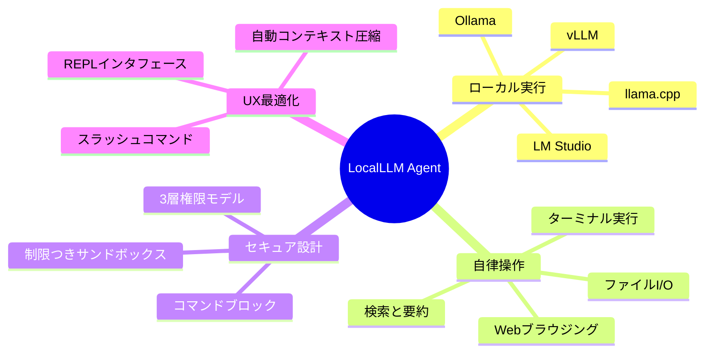
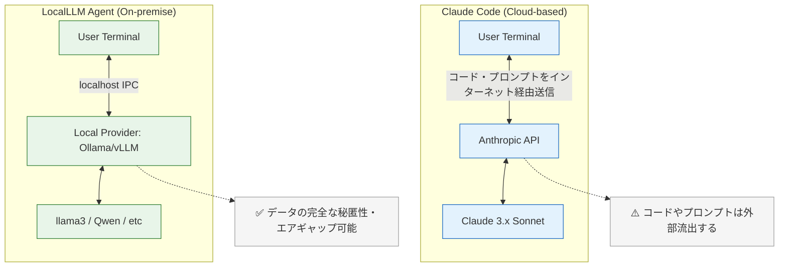
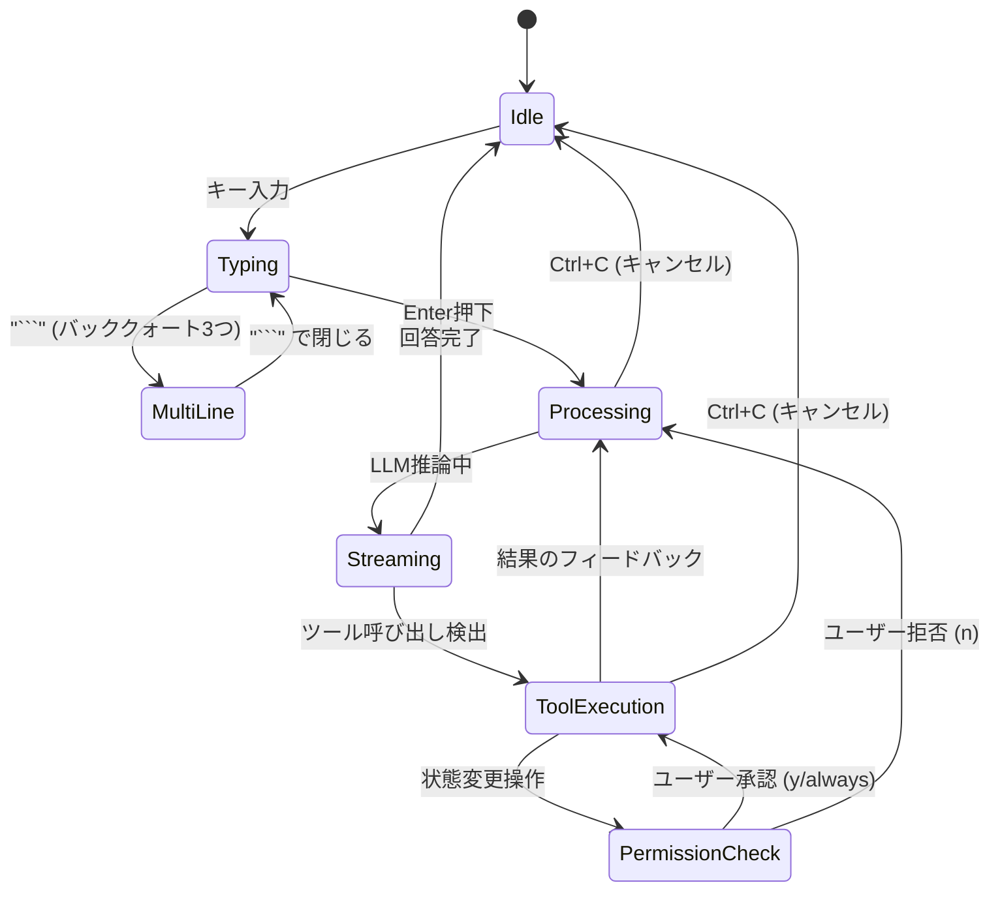
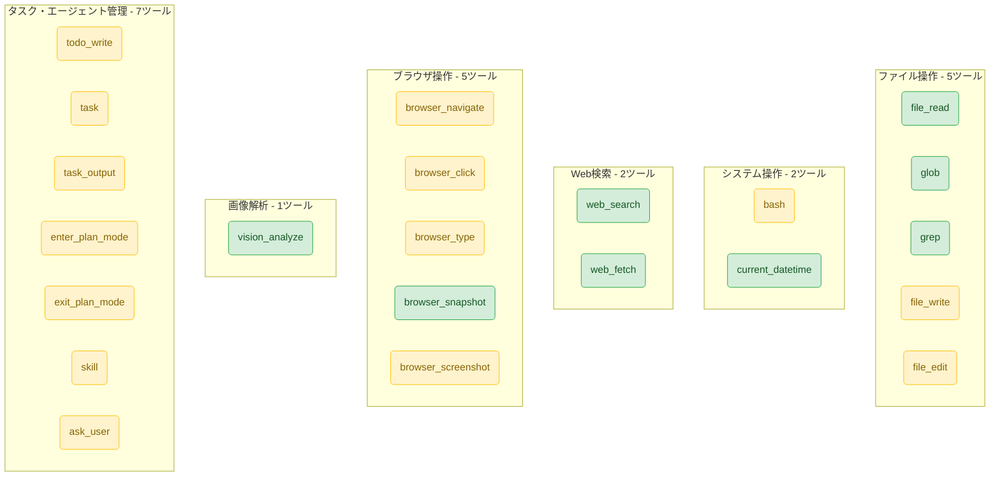
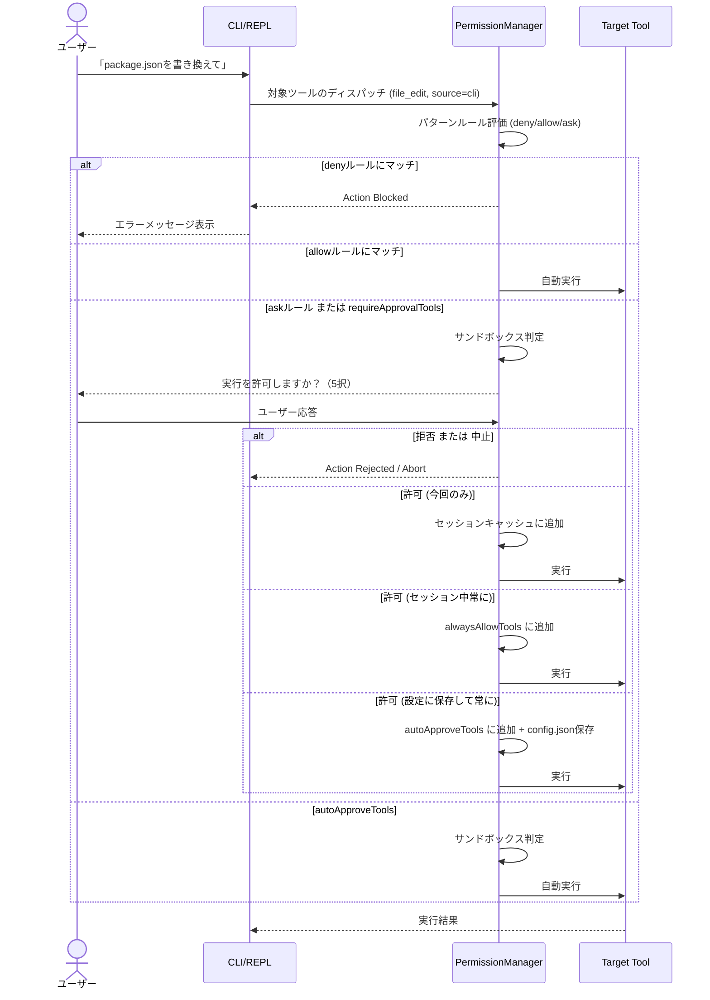

# 外部設計書 (External Design)

> **バージョン**: 統合版 (2026-03-15)
> **対象**: LocalLLM Agent v0.2.x 実装済み機能 + v0.3.0 設計中機能

本ドキュメントでは、LocalLLM Agent の外部仕様（ユーザー向け機能・インターフェース・動作要件）について定義します。

---

## 1. システム概要

LocalLLM Agent は、ローカルで稼働するLLM（大規模言語モデル）を活用した **CLI型AIエージェント** です。ユーザーのPC上で自律的に動作し、ファイルの読み書き、Web検索、ブラウザ操作、コマンドの実行などを通じてタスクを遂行します。Claude Code にインスパイアされた対話型の REPL インターフェースを提供します。

### 1.1 主な特徴とユースケース


```mermaid
mindmap
  root((LocalLLM Agent))
    ローカル実行
      Ollama
      LM Studio
      llama.cpp
      vLLM
    自律操作
      ファイルI/O
      ターミナル実行
      Webブラウジング
      検索と要約
    セキュア設計
      3層権限モデル
      コマンドブロック
      制限つきサンドボックス
    UX最適化
      REPLインタフェース
      スラッシュコマンド
      自動コンテキスト圧縮
```

### 1.2 Claude Code との比較

LocalLLM Agent は Claude Code の「シームレスなCLI体験」「自律的なツール実行」を踏襲しつつ、**データプライバシーの絶対的な保護** と **ランニングコストゼロ** を主な目的として開発されています。


```mermaid
graph TD
    classDef claude fill:#e3f2fd,stroke:#1565c0;
    classDef local fill:#e8f5e9,stroke:#2e7d32;
    classDef note fill:#f5f5f5,stroke:#9e9e9e;

    subgraph "Claude Code (Cloud-based)"
        User1[User Terminal]:::claude
        API[Anthropic API]:::claude
        Model1[Claude 3.x Sonnet]:::claude
        User1 <-->|コード・プロンプトをインターネット経由送信| API
        API <--> Model1
    end

    subgraph "LocalLLM Agent (On-premise)"
        User2[User Terminal]:::local
        Provider[Local Provider: Ollama/vLLM]:::local
        Model2[llama3 / Qwen / etc]:::local
        User2 <-->|localhost IPC| Provider
        Provider <--> Model2
    end

    NoteC["⚠️ コードやプロンプトは外部流出する"]:::note
    NoteL["✅ データの完全な秘匿性・エアギャップ可能"]:::note

    API -.-> NoteC
    Provider -.-> NoteL
```

| 比較項目 | Claude Code | LocalLLM Agent |
| :--- | :--- | :--- |
| **推論基盤** | クラウド (Claude 3.x 等) | **ローカルオンプレミス** (Ollama, LM Studio等) |
| **運用コスト** | 従量課金 (APIトークン消費) | **無料** (マシンの電気代のみ) |
| **プライバシー** | ソースコードが外部APIサーバに送信される | **完全オフライン動作可能** |
| **ツール数** | 30以上 | **22種** (§3参照) |
| **サブエージェント** | 4タイプ (Task tool) | **4タイプ** を独自実装 |
| **プランモード** | 組み込み | **組み込み** (idle→planning→awaiting_approval) |
| **スキルシステム** | Skill tool + `/command` | **対応** (builtin + ユーザー定義) |
| **コンテキスト管理** | 大容量コンテキスト (200K+) | **自動圧縮機能** (ローカルの制限に対応) |
| **ブラウザ操作** | 主にファイル操作・コマンド実行 | **Playwright統合** (クリック・入力・スクショ・a11yツリー) |

---

## 2. ユーザーインターフェース (UI)

### 2.1 REPL コマンドラインUI

エージェントはターミナル上で動作し、コマンドプロンプト形式でユーザーの自然言語入力を受け付けます。


```mermaid
stateDiagram-v2
    [*] --> Idle

    Idle --> Typing : キー入力
    Typing --> MultiLine : "```" (バッククォート3つ)
    MultiLine --> Typing : "```" で閉じる
    Typing --> Processing : Enter押下

    Processing --> Streaming : LLM推論中
    Streaming --> ToolExecution : ツール呼び出し検出
    ToolExecution --> PermissionCheck : 状態変更操作

    PermissionCheck --> ToolExecution : ユーザー承認 (y/always)
    PermissionCheck --> Processing : ユーザー拒否 (n)

    ToolExecution --> Processing : 結果のフィードバック
    Streaming --> Idle : 回答完了

    Processing --> Idle : Ctrl+C (キャンセル)
    ToolExecution --> Idle : Ctrl+C (キャンセル)
```

### 2.2 スラッシュコマンド一覧

| コマンド | 説明 |
|----------|------|
| `/help` | ヘルプや使用可能なコマンド一覧を表示します |
| `/quit`, `/exit` | エージェントを終了します |
| `/clear` | 現在の会話履歴とコンテキストをクリアします |
| `/context` | 現在のコンテキスト（トークン）使用状況を表示します |
| `/compact` | コンテキストの手動圧縮を実行します |
| `/model` | 使用中のLLMモデルを変更します |
| `/plan` | タスクを事前に分析・設計する「プランモード」を手動で開始します |
| `/skills` | 追加ロードされているスキル（builtin含む）の一覧を表示します |
| `/status` | 全体の稼働ステータス（コンテキスト・タスク・エージェント）を一括表示します |
| `/todo` | 現在のTODOリストを表示します |
| `/sessions` | 保存されたセッション一覧を表示します |
| `/resume` | 過去のセッションを再開します |
| `/memory` | 永続メモリの内容を表示します |
| `/remember` | 指定した情報を永続メモリに記録します |
| `/diff` | 現在のセッションでの変更差分を表示します |
| `/mode` | コンテキストモード（dev/review/research）の表示・切替を行います |
| `/discord` | Discord通知設定の確認・有効化・無効化・URL設定を行います |
| `/permission` | ツール実行権限の表示・変更を行います（サブコマンドあり） |
| `/second` | セカンドLLMの設定・状態確認を行います (v0.3.0) |
| `/cost` | セカンドLLMのトークン使用量とコストを表示します (v0.3.0) |

※ `/setup` は REPL コマンドではなく、CLI起動時のフラグ `--setup` で実行します。

#### `/permission` サブコマンド一覧

| サブコマンド | 説明 |
|---|---|
| `/permission list` | 現在の権限設定を一覧表示 |
| `/permission rules` | パターンルール（allow/deny/ask）一覧表示 |
| `/permission auto-add <tool>` | CLIの自動許可ツールに追加 |
| `/permission auto-remove <tool>` | CLIの自動許可ツールから削除 |
| `/permission require-add <tool>` | CLI確認必須ツールに追加 |
| `/permission require-remove <tool>` | CLI確認必須ツールから削除 |
| `/permission discord-add <tool>` | Discord自動許可ツールに追加 |
| `/permission discord-remove <tool>` | Discord自動許可ツールから削除 |
| `/permission rule-add allow <pattern>` | allowルールを追加（例: `bash(npm *)`） |
| `/permission rule-add deny <pattern>` | denyルールを追加（例: `bash(rm -rf *)`） |
| `/permission rule-add ask <pattern>` | askルールを追加（例: `bash(git push *)`） |
| `/permission rule-remove allow <pattern>` | allowルールを削除 |
| `/permission rule-remove deny <pattern>` | denyルールを削除 |
| `/permission rule-remove ask <pattern>` | askルールを削除 |

#### `/second` サブコマンド一覧（v0.3.0）

| サブコマンド | 説明 |
|---|---|
| `/second setup` | 対話式セカンドLLM設定ウィザードを起動 |
| `/second status` | 現在の設定と利用状況を表示 |
| `/second enable` | セカンドLLMを有効化 |
| `/second disable` | セカンドLLMを無効化 |
| `/second budget <金額>` | 予算上限を変更 (USD) |

---

## 3. 提供機能とツール群

エージェントはLLMの推論結果に基づき、以下の **22種の機能（ツール）** を抽象化された関数 (Function Calling) として呼び出します。


```mermaid
graph TD
    classDef safe fill:#d4edda,stroke:#28a745,color:#155724;
    classDef ask fill:#fff3cd,stroke:#ffc107,color:#856404;

    subgraph Filesystem [ファイル操作 - 5ツール]
        F1(file_read):::safe
        F2(glob):::safe
        F3(grep):::safe
        F4(file_write):::ask
        F5(file_edit):::ask
    end

    subgraph System [システム操作 - 2ツール]
        S1(bash):::ask
        S2(current_datetime):::safe
    end

    subgraph Web [Web検索 - 2ツール]
        W1(web_search):::safe
        W2(web_fetch):::safe
    end

    subgraph Browser [ブラウザ操作 - 5ツール]
        B1(browser_navigate):::ask
        B2(browser_click):::ask
        B3(browser_type):::ask
        B4(browser_snapshot):::safe
        B5(browser_screenshot):::ask
    end

    subgraph Vision [画像解析 - 1ツール]
        V1(vision_analyze):::safe
    end

    subgraph AgentTools [タスク・エージェント管理 - 7ツール]
        A1(todo_write):::ask
        A2(task):::ask
        A3(task_output):::ask
        A4(enter_plan_mode):::ask
        A5(exit_plan_mode):::ask
        A6(skill):::ask
        A7(ask_user):::ask
    end
```

※緑色: 自動許可 (`auto`)、黄色: 確認必須 (`ask`)

デフォルトで `auto`（自動許可）に設定されているツール: `file_read`, `glob`, `grep`, `browser_snapshot`, `vision_analyze`, `web_search`, `web_fetch`, `current_datetime`。その他のツールはすべて `ask`（実行前にユーザーの承認が必要）です。

### 3.1 ツール詳細仕様

| カテゴリ | ツール名 | 権限 | 機能詳細 |
| :--- | :--- | :--- | :--- |
| **ファイル取得** | `file_read` | auto | 指定ファイルのテキストを読み込みます。各行に **行番号を付与** して返却します。 |
| | `glob` | auto | 指定パターン（例: `src/**/*.ts`）に一致するファイル一覧を取得します。 |
| | `grep` | auto | 高速文字列検索。`ripgrep (rg)` があれば利用し、なければNode.jsネイティブ実装で検索します。 |
| **ファイル更新** | `file_write` | ask | ファイルを新規作成または全体上書きします。親ディレクトリが存在しない場合は **自動で `mkdir -p`** を実行します。 |
| | `file_edit` | ask | 既存ファイルの一部を書き換えます。`target_string` がファイル内に一意に存在する場合のみ `replacement_string` に置換します。 |
| **システム** | `bash` | ask | シェルコマンドを実行し、標準出力/標準エラーを取得します。タイムアウト標準120秒。 |
| | `current_datetime` | auto | 現在の日時を取得します。ISO 8601形式、ローカルタイムゾーン形式、タイムゾーンオフセット情報を返します。 |
| **Web** | `web_search` | auto | DuckDuckGo等の検索エンジンAPIでインターネット検索し、サマリーを取得します。 |
| | `web_fetch` | auto | 指定URLのWebページを取得し、HTMLからプレーンテキスト（Markdown等）を抽出して返します。 |
| **ブラウザ操作** | `browser_navigate` | ask | **Playwright** プロセスを起動し、指定URLに遷移します。 |
| | `browser_click` | ask | ブラウザのアクセシビリティツリーから要素をクリックします。 |
| | `browser_type` | ask | ブラウザの入力フィールドにテキストを入力します。 |
| | `browser_snapshot` | auto | ページのアクセシビリティツリー（テキスト形式）を取得します。Vision API不要で軽量。 |
| | `browser_screenshot` | ask | ページのスクリーンショットを取得します。`save_path` 指定時はローカルファイルへ直接保存し、`vision_analyze` と組み合わせた視覚的な状態確認に使用します。 |
| **画像解析** | `vision_analyze` | auto | スクリーンショットやローカル画像を、画像解析専用のサブLLM（OllamaのLlava等）に渡して状態を視覚的に説明させます。 |
| **タスク管理** | `todo_write` | ask | エージェント自身が行動計画を整理するためのTODOリストをワークスペースに作成・更新します。 |
| | `task` | ask | 独立したコンテキストを持つ **子エージェント（SubAgent）** を生成し、スコープを限定したタスクを並列で実行・委譲します。 |
| | `task_output` | ask | バックグラウンドで起動したサブエージェントの実行結果を取得します。 |
| | `enter_plan_mode` | ask | 破壊的なツール実行を封印し、システムの調査・設計のみを行う「プランモード」に入ります。 |
| | `exit_plan_mode` | ask | プランモードを終了し、計画内容を `~/.localllm/plans/` に保存してユーザー承認を待ちます。 |
| | `skill` | ask | ユーザーが配置した独自Markdownスキルを実行します。内蔵スキル（commit, pr-review, tdd, build-fix 等）も含みます。 |
| | `ask_user` | ask | エージェントが単独で判断できない問題が発生した場合、コンソール経由でユーザーに直接質問します。 |

---

## 4. セキュリティ・権限モデルのUXフロー

### 4.1 権限ソース（CLI / Discord）の分離

リクエストの発生元によって権限評価フローが異なります。

| 評価項目 | CLI（チャット） | Discord |
|---|---|---|
| パターンルール deny | ✅ 適用 | ✅ 適用（セキュリティ強制） |
| パターンルール allow | ✅ 適用 | ❌ 無視 |
| パターンルール ask | ✅ 確認ダイアログ表示 | ❌ 無視 |
| `autoApproveTools` | ✅ 自動許可 | ❌ 無視 |
| `discordAutoApproveTools` | ❌ 無視 | ✅ 自動許可 |
| `INHERENTLY_SAFE_TOOLS` | ✅ 常に自動許可 | ✅ 常に自動許可 |
| インタラクティブ確認ダイアログ | ✅ あり | ❌ なし（headless） |

Discord ではインタラクティブ確認が不可能なため、`discordAutoApproveTools` + `INHERENTLY_SAFE_TOOLS` に含まれるツールのみ実行可能です。許可されていないツールはLLMに提示されないため（フィルタリング）、Discord側で使えない旨をLLMがユーザーに伝えます。

### 4.2 パターンベース権限ルール

Claude Code 互換のパターンルールで、ツール名リストより高い優先度で評価されます。

**ルール評価順序: deny → allow → ask → ツール名リスト**

ルール形式:
```
bash(npm *)                   # bash ツール、コマンドが "npm *" にマッチ
file_write(./src/**)          # file_write ツール、パスが "./src/**" にマッチ
web_fetch(domain:github.com)  # web_fetch ツール、URLが github.com ドメイン
bash                          # bash ツール（引数問わず全マッチ）
```

Claude Code エイリアス対応: `Bash`→`bash`、`Read`→`file_read`、`Write`→`file_write`、`Edit`→`file_edit`、`WebFetch`→`web_fetch`

### 4.3 CLI権限確認ダイアログ（UXフロー）


```mermaid
sequenceDiagram
    actor U as ユーザー
    participant CLI as CLI/REPL
    participant PM as PermissionManager
    participant Tool as Target Tool

    U->>CLI: 「package.jsonを書き換えて」
    CLI->>PM: 対象ツールのディスパッチ (file_edit, source=cli)

    PM->>PM: パターンルール評価 (deny/allow/ask)
    alt denyルールにマッチ
        PM-->>CLI: Action Blocked
        CLI-->>U: エラーメッセージ表示
    else allowルールにマッチ
        PM->>Tool: 自動実行
    else askルール または requireApprovalTools
        PM->>PM: サンドボックス判定
        PM-->>U: 実行を許可しますか？（5択）
        U->>PM: ユーザー応答
        alt 拒否 または 中止
            PM-->>CLI: Action Rejected / Abort
        else 許可 (今回のみ)
            PM->>PM: セッションキャッシュに追加
            PM->>Tool: 実行
        else 許可 (セッション中常に)
            PM->>PM: alwaysAllowTools に追加
            PM->>Tool: 実行
        else 許可 (設定に保存して常に)
            PM->>PM: autoApproveTools に追加 + config.json保存
            PM->>Tool: 実行
        end
    else autoApproveTools
        PM->>PM: サンドボックス判定
        PM->>Tool: 自動実行
    end
    Tool-->>CLI: 実行結果
```

---

## 5. 設定と環境要件

- **要件**: Node.js 18+
- **LLM**: ローカルLLM環境（Ollama等）の起動
- **設定ロケーション**: `~/.localllm/config.json`

### 5.1 主要な設定値

| 設定キー | 説明 |
|---|---|
| `providerType` | `ollama`, `lmstudio`, `llamacpp`, `vllm`（4種のローカルLLMプロバイダ、すべてOpenAI互換APIで通信）|
| `contextWindow` | トークン上限。この80%（デフォルト）に達すると自動圧縮 |
| `allowedDirectories` | サンドボックスでアクセスを許可する追加のディレクトリリスト |
| `autoApproveTools` | CLI経由で自動許可するツールのリスト |
| `requireApprovalTools` | CLI経由で確認必須なツールのリスト |
| `discordAutoApproveTools` | Discord経由で自動許可するツールのリスト（インタラクティブ確認なし）|
| `rules` | パターンベース権限ルール（`allow` / `deny` / `ask` の3種） |
| `discord` | Discord連携の設定（`enabled` フラグと `webhookUrl`）|
| `secondLLM` | セカンドLLM設定（v0.3.0、§12参照）|

> **設定の自動マージ**: バージョンアップで新しいデフォルトツールが追加された場合、既存の `config.json` と新デフォルトの和集合が使用されるため、再設定は不要です。

### 5.2 Discord Webhook URL の取得と設定手順

DiscordのWebhookを用いて、エージェントからの応答を任意のチャンネルへ送信できます。

1. **Webhookの作成**: Discordの該当サーバーで、通知先チャンネルの「チャンネルの編集」→「連携サービス」→「ウェブフックを見る/作成」を開き、新しいWebhookを作成します。
2. **URLの取得**: 作成したWebhookの「ウェブフックURLをコピー」をクリックしてURLを取得します。
3. **設定の反映**: `~/.localllm/config.json` 内の `"discord"` ブロックに対し、`"enabled": true` とし、`"webhookUrl": "取得したURL"` を設定します。

> **注意**: Webhook URLは `https://discord.com/api/webhooks/<id>/<token>` 形式である必要があります。招待URL（`discord.gg/...`）は使用できません。`/discord test` コマンドで送信テストが可能です。

---

## 6. Hooksシステム

エージェントのツール実行やセッションのライフサイクルに対して、ユーザー定義のシェルコマンドを自動的にトリガーする拡張機構です。

### フックの種類

| フックタイプ | 発火タイミング | 用途例 |
|:---|:---|:---|
| `PreToolUse` | ツール実行の直前 | 特定のファイルパターンへの書き込みをブロック、lint実行 |
| `PostToolUse` | ツール実行の直後 | 自動フォーマット、通知送信 |
| `SessionStart` | エージェントセッションの開始時 | 環境変数の設定、ログ開始 |
| `SessionStop` | エージェントセッションの終了時 | クリーンアップ、レポート生成 |

### hooks.json ファイル形式

フックは `hooks.json` ファイルに JSON 形式で定義します。

```json
{
  "hooks": [
    {
      "type": "PreToolUse",
      "matcher": {
        "tool": "file_write",
        "filePattern": "src/**/*.ts"
      },
      "command": "echo 'Writing to TypeScript file'",
      "description": "TypeScript書き込みの事前チェック"
    },
    {
      "type": "PostToolUse",
      "matcher": {
        "tool": "file_edit"
      },
      "command": "npx prettier --write $FILE_PATH",
      "description": "編集後の自動フォーマット"
    },
    {
      "type": "SessionStart",
      "command": "echo 'Session started'",
      "description": "セッション開始通知"
    }
  ]
}
```

### フックのロードパス

以下の順序でフックファイルが読み込まれます（すべてのマッチするフックが実行順に結合されます）。

1. `.claude/hooks.json` （プロジェクトローカル）
2. `.localllm/hooks.json` （プロジェクトローカル）
3. `~/.localllm/hooks.json` （ユーザーグローバル）

### フックコマンドに渡される環境変数

| 環境変数 | 説明 | 対象フックタイプ |
|:---|:---|:---|
| `TOOL_NAME` | 実行されるツール名 | PreToolUse, PostToolUse |
| `FILE_PATH` | 対象ファイルのパス（推定可能な場合） | PreToolUse, PostToolUse |
| `TOOL_OUTPUT` | ツール実行結果の出力テキスト | PostToolUse |
| `TOOL_SUCCESS` | ツール実行の成否 (`"true"` / `"false"`) | PostToolUse |
| `TOOL_ERROR` | エラーメッセージ（失敗時のみ） | PostToolUse |
| `HOOK_TYPE` | `SessionStart` または `SessionStop` | SessionStart, SessionStop |

### PreToolUse のブロック機能

`PreToolUse` フックのコマンドが **非ゼロの終了コード** を返した場合、対象ツールの実行はブロックされます。stderr または stdout の内容がブロック理由としてLLMにフィードバックされます。

---

## 7. Rulesシステム（常時適用ルール）

エージェントの動作を規定する常時適用ルールを Markdown ファイルで定義・管理します。ルールはシステムプロンプトの一部として LLM に注入され、すべてのセッションで自動的に適用されます。

### 組み込みルール（3種）

| ルール名 | 内容 |
|:---|:---|
| `security` | 認証情報のハードコード禁止、入力バリデーション、SQLインジェクション防止、eval()禁止、OWASP Top 10チェック |
| `coding-style` | 既存ファイル編集優先、不要なコメント追加禁止、過度なエンジニアリング回避、既存コードパターンの踏襲 |
| `git-workflow` | 新規コミット作成（amend禁止）、force push禁止、pre-commit hook スキップ禁止、特定ファイルのステージング推奨 |

### ルールのロードパス

以下の順序でルールが読み込まれます（すべてのルールが結合されてシステムプロンプトに注入されます）。

1. `src/rules/builtin/` （組み込みルール: security.md, coding-style.md, git-workflow.md）
2. `~/.localllm/rules/` （ユーザーグローバル）
3. `.claude/rules/` （プロジェクトローカル）
4. `.localllm/rules/` （プロジェクトローカル）

### ルールファイル形式

各ルールは `.md` 拡張子の Markdown ファイルとして配置します。ファイル名（拡張子を除く）がルール名となります。

```markdown
# Custom Security Rules
- APIキーは環境変数から読み込むこと
- 外部APIへのリクエストにはタイムアウトを設定すること
```

---

## 8. コンテキストモード

エージェントの動作モードを切り替える機能です。モードごとに優先事項、振る舞い、推奨ツールが変わります。

### `/mode` コマンド

| 使い方 | 説明 |
|:---|:---|
| `/mode` | 現在のモード情報を表示 |
| `/mode dev` | 開発モードに切り替え |
| `/mode review` | コードレビューモードに切り替え |
| `/mode research` | リサーチモードに切り替え |

### モード定義

| モード | 名称 | 優先順位 | 振る舞い | 推奨ツール |
|:---|:---|:---|:---|:---|
| `dev` | Development | Work -> Correct -> Clean | コードを書いてからテスト、アトミックにコミット | file_write, file_edit, bash, task |
| `review` | Code Review | Critical > High > Medium > Low | 徹底的な分析、重要度ベースの優先付け、解決策の提示 | file_read, grep, glob |
| `research` | Research | Understand -> Verify -> Document | 広く探索・学習、発見事項の要約 | file_read, grep, glob, web_fetch, web_search |

デフォルトモードは `dev` です。モード情報はシステムプロンプトの一部として LLM に注入されます。

---

## 9. エージェント定義ファイル

サブエージェント（`task` ツール）の動作を定義する Markdown ファイルです。YAML フロントマターでメタデータを、本文でシステムプロンプトを記述します。

### ファイル形式

```markdown
---
name: explore
description: Fast codebase exploration (read-only)
tools: [file_read, glob, grep, web_fetch, web_search]
---
You are a codebase exploration specialist. Your job is to quickly find files, search code, and answer questions about the codebase.
```

### YAML フロントマター属性

| 属性 | 型 | 説明 |
|:---|:---|:---|
| `name` | string (必須) | エージェント名。サブエージェントタイプと対応 |
| `description` | string | エージェントの説明 |
| `tools` | string[] | 使用可能なツールのリスト |
| `allowedTools` | string[] | 許可するツールのリスト（指定がなければ `tools` と同一） |

### 組み込みエージェント定義（4種）

| 名前 | 説明 | 使用可能ツール |
|:---|:---|:---|
| `explore` | コードベース探索（読取専用） | file_read, glob, grep, web_fetch, web_search |
| `plan` | 実装計画・アーキテクチャ設計（読取専用） | file_read, glob, grep, web_fetch, web_search |
| `general-purpose` | 全ツール使用可能な汎用エージェント | file_read, file_write, file_edit, glob, grep, bash, web_fetch, web_search, todo_write, ask_user |
| `code-reviewer` | コード品質・セキュリティレビュー | file_read, glob, grep, bash |

### エージェント定義のロードパス

以下の順序で読み込まれ、同名のエージェントは後のパスで上書きされます（project > user > builtin）。

1. `src/agents/builtin/` （組み込み定義）
2. `~/.localllm/agents/` （ユーザーグローバルオーバーライド）
3. `.localllm/agents/` （プロジェクトローカルオーバーライド）

---

## 10. スキルシステム

スキルは Markdown 形式のプロンプトファイルで定義され、`/skill-name` スラッシュコマンドとしてトリガーされる **事前定義された操作フロー** です。

### 10.1 スキルファイル形式 (SKILL.md)

各スキルはサブディレクトリ単位で管理します。エントリポイントは `SKILL.md` です。

```text
<skill-name>/
  ├── SKILL.md       (必須: YAMLフロントマター + Markdown本文)
  ├── scripts/       (推奨: 決定論的処理を行うスクリプト)
  ├── references/    (任意: スキーマ・API仕様・フロー詳細などの分割Markdown)
  └── assets/        (任意: ひな形ファイルや画像などの静的ファイル)
```

**SKILL.md フロントマター仕様:**

```yaml
---
name: skill-name     # 必須: スキル名 (/skill-name コマンドとして機能)
description: ...     # 必須: スキルの説明とトリガー条件
---
```

### 10.2 スキルのロードパスと優先順位

後からロードされるものが同名スキルを上書きします。

| 優先順位 | パス | 用途 |
|----------|------|------|
| 1（低） | `src/skills/builtin/` | アプリ同梱の基本スキル |
| 2 | `builtin/` (プロジェクトルート) | `.skill` パッケージとしてインストールされたスキル |
| 3 | `~/.localllm/skills/` | ユーザーグローバルスキル |
| 4 | `.claude/skills/` (CWD) | プロジェクト固有スキル |
| 5（高） | `.localllm/skills/` (CWD) | プロジェクト固有スキル（代替パス） |

### 10.3 スクリプトエンジンの選択基準（ハイブリッド設計）

スキル内の `scripts/` ディレクトリには、用途に応じて言語を使い分けます。

| 言語 | 適用ケース |
|---|---|
| **Python (`.py`)** | データパース、検証バリデーション、テキスト処理など標準ライブラリで堅牢に書けるCLI処理 |
| **Node.js (`.js`, `.ts`)** | Playwright等のブラウザ操作、npmエコシステムとの統合が必要な場合 |

### 10.4 組み込みスキル一覧

| スキル名 | 説明 |
|---|---|
| `commit` | Gitコミットメッセージ作成・コミット実行 |
| `pr-review` | プルリクエストのレビュー |
| `tdd` | テスト駆動開発フロー |
| `build-fix` | ビルドエラーの修正 |
| `skill-creator` | 新規スキルの雛形生成・バリデーション |

---

## 11. MCP（Model Context Protocol）対応

MCPは外部ツールサーバーと通信するためのJSON-RPC 2.0ベースのプロトコルです。サードパーティ製のツール（データベース、API、ファイルシステム拡張等）を動的に統合できます。

### 11.1 MCP設定ファイル

`mcp-servers.json` にMCPサーバー定義を記述します。以下の順序で読み込まれ、同名サーバーは後のパスで上書きされます。

| 優先度 | パス | スコープ |
|:---|:---|:---|
| 1 | `~/.localllm/mcp-servers.json` | ユーザーグローバル |
| 2 | `.localllm/mcp-servers.json` | プロジェクトローカル |
| 3 | `.claude/mcp-servers.json` | Claude Code互換 |

### 11.2 設定ファイル形式

```json
{
  "mcpServers": {
    "filesystem": {
      "name": "filesystem",
      "transport": "stdio",
      "command": "npx",
      "args": ["-y", "@modelcontextprotocol/server-filesystem", "/path/to/dir"],
      "env": {}
    },
    "remote-db": {
      "name": "remote-db",
      "transport": "sse",
      "url": "http://localhost:3001/sse"
    }
  }
}
```

### 11.3 トランスポート

| トランスポート | 説明 | 必須設定 |
|:---|:---|:---|
| `stdio` | 子プロセスのstdin/stdoutでJSON-RPCメッセージを送受信 | `command`, `args`(任意), `env`(任意) |
| `sse` | HTTP SSE接続でイベント受信、POSTでリクエスト送信 | `url` |

### 11.4 MCPツールの利用

MCPサーバーが提供するツールは起動時に自動検出され、`mcp__<サーバー名>__<ツール名>` の命名規則でLLMに提示されます。既存のパーミッションシステム・フックシステムと統合されるため、MCP経由のツールにも同じセキュリティポリシーが適用されます。

### 11.5 ライフサイクル

```
アプリ起動
  → mcp-servers.json 読み込み
  → 各MCPサーバーに接続 (initialize → tools/list)
  → 発見されたツールをToolRegistryに登録
  → LLMがツールを使用 (tools/call)
  → アプリ終了時に全MCPサーバーを切断
```

---

## 12. セカンドLLM機能（v0.3.0 設計中）

> **ステータス**: 設計フェーズ。未実装。実装完了後にこのノートを削除すること。

メインLLM（ローカルLLM）を補完する **セカンドLLM** として、別のローカルLLMまたはクラウドLLM（Vertex AI / Azure AI）を利用可能にします。

### 12.1 基本方針

| 項目 | 方針 |
|---|---|
| メインLLM | **ローカルLLMのみ**。変更なし |
| セカンドLLM | **ローカルLLM または クラウドLLM**。オプション機能 |
| 起動条件 | セカンドLLM設定が有効 **かつ** ユーザーが明示的に利用を指示 |
| 動作モード | ① メインLLMへの相談（consult） ② サブエージェントとしてタスク実行（agent） |
| コスト管理 | クラウドLLM: トークン使用量を記録し、予算上限で自動停止。ローカルLLM: 予算不要 |

### 12.2 対応プロバイダ

| プラットフォーム | 利用可能モデル | 認証方式 |
|---|---|---|
| **Vertex AI** | Gemini (3 Pro, 3 Flash, 2.5系), Claude (Opus, Sonnet, Haiku) | Google Cloud サービスアカウント / ADC |
| **Azure OpenAI** | GPT (5.x系, 4o系) | API Key / Azure AD |
| **Azure AI Foundry** | Claude (Opus, Sonnet, Haiku) | API Key |
| **Ollama / LM Studio 等** | 任意のローカルモデル | なし |

### 12.3 セカンドLLMの呼び出し方法

ユーザーは `@second` プレフィックスを使ってセカンドLLMへのタスク委任を指示します。

```
@second この関数のアルゴリズムを改善してください
```

詳細設計は `v030_second_llm_design.md` を参照してください。
