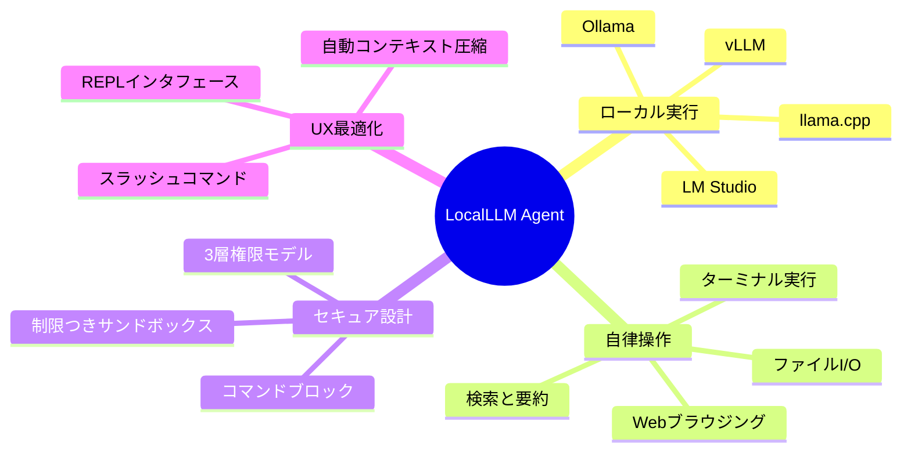
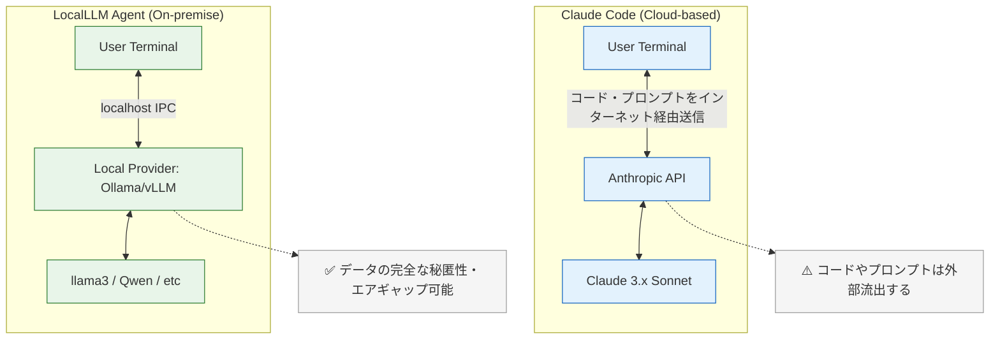
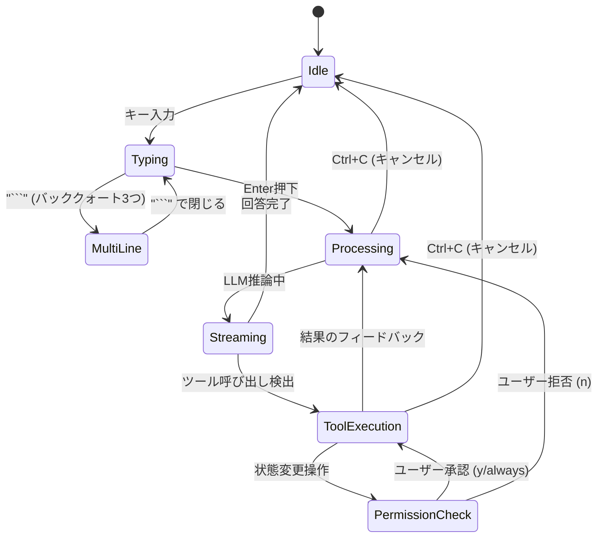
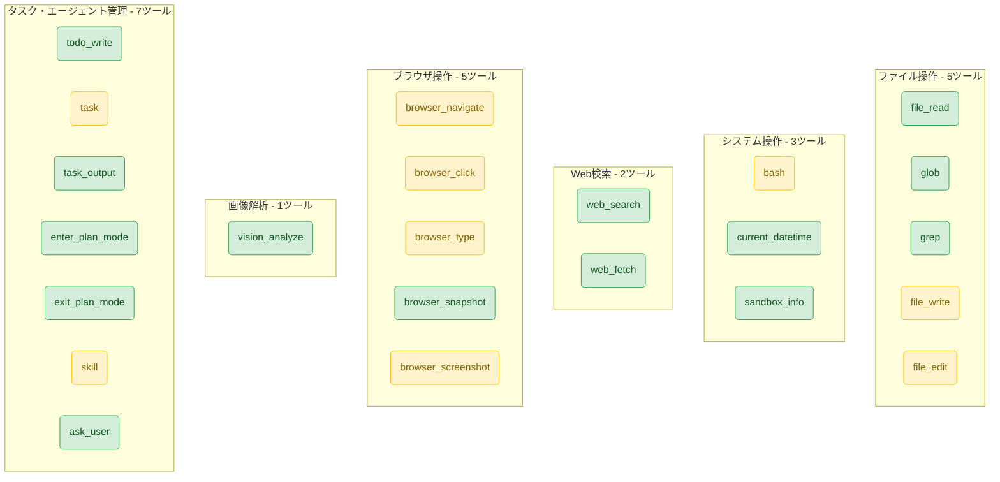
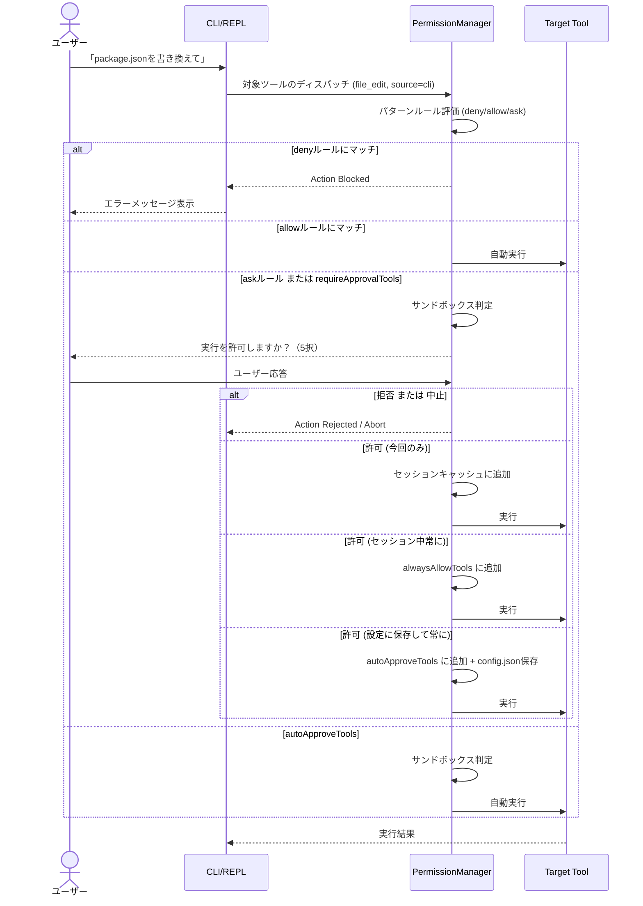

# 外部設計書 (External Design)

> **バージョン**: 統合版 (2026-03-15)
> **対象**: LocalLLM Agent v0.2.x 実装済み機能 + v0.3.0 設計中機能

本ドキュメントでは、LocalLLM Agent の外部仕様（ユーザー向け機能・インターフェース・動作要件）について定義します。

---

## 1. システム概要

LocalLLM Agent は、ローカルで稼働するLLM（大規模言語モデル）を活用した **CLI型AIエージェント** です。ユーザーのPC上で自律的に動作し、ファイルの読み書き、Web検索、ブラウザ操作、コマンドの実行などを通じてタスクを遂行します。Claude Code にインスパイアされた対話型の REPL インターフェースを提供します。

### 1.1 主な特徴とユースケース


```mermaid
mindmap
  root((LocalLLM Agent))
    ローカル実行
      Ollama
      LM Studio
      llama.cpp
      vLLM
    自律操作
      ファイルI/O
      ターミナル実行
      Webブラウジング
      検索と要約
    セキュア設計
      3層権限モデル
      コマンドブロック
      制限つきサンドボックス
    UX最適化
      REPLインタフェース
      スラッシュコマンド
      自動コンテキスト圧縮
```

### 1.2 Claude Code との比較

LocalLLM Agent は Claude Code の「シームレスなCLI体験」「自律的なツール実行」を踏襲しつつ、**データプライバシーの絶対的な保護** と **ランニングコストゼロ** を主な目的として開発されています。


```mermaid
graph TD
    classDef claude fill:#e3f2fd,stroke:#1565c0;
    classDef local fill:#e8f5e9,stroke:#2e7d32;
    classDef note fill:#f5f5f5,stroke:#9e9e9e;

    subgraph "Claude Code (Cloud-based)"
        User1[User Terminal]:::claude
        API[Anthropic API]:::claude
        Model1[Claude 3.x Sonnet]:::claude
        User1 <-->|コード・プロンプトをインターネット経由送信| API
        API <--> Model1
    end

    subgraph "LocalLLM Agent (On-premise)"
        User2[User Terminal]:::local
        Provider[Local Provider: Ollama/vLLM]:::local
        Model2[llama3 / Qwen / etc]:::local
        User2 <-->|localhost IPC| Provider
        Provider <--> Model2
    end

    NoteC["⚠️ コードやプロンプトは外部流出する"]:::note
    NoteL["✅ データの完全な秘匿性・エアギャップ可能"]:::note

    API -.-> NoteC
    Provider -.-> NoteL
```

| 比較項目 | Claude Code | LocalLLM Agent |
| :--- | :--- | :--- |
| **推論基盤** | クラウド (Claude 3.x 等) | **ローカルオンプレミス** (Ollama, LM Studio等) |
| **運用コスト** | 従量課金 (APIトークン消費) | **無料** (マシンの電気代のみ) |
| **プライバシー** | ソースコードが外部APIサーバに送信される | **完全オフライン動作可能** |
| **ツール数** | 30以上 | **22種** (§3参照) |
| **サブエージェント** | 4タイプ (Task tool) | **4タイプ** を独自実装 |
| **プランモード** | 組み込み | **組み込み** (idle→planning→awaiting_approval) |
| **スキルシステム** | Skill tool + `/command` | **対応** (builtin + ユーザー定義) |
| **コンテキスト管理** | 大容量コンテキスト (200K+) | **自動圧縮機能** (ローカルの制限に対応) |
| **ブラウザ操作** | 主にファイル操作・コマンド実行 | **Playwright統合** (クリック・入力・スクショ・a11yツリー) |

---

## 2. ユーザーインターフェース (UI)

### 2.1 REPL コマンドラインUI

エージェントはターミナル上で動作し、コマンドプロンプト形式でユーザーの自然言語入力を受け付けます。


```mermaid
stateDiagram-v2
    [*] --> Idle

    Idle --> Typing : キー入力
    Typing --> MultiLine : "```" (バッククォート3つ)
    MultiLine --> Typing : "```" で閉じる
    Typing --> Processing : Enter押下

    Processing --> Streaming : LLM推論中
    Streaming --> ToolExecution : ツール呼び出し検出
    ToolExecution --> PermissionCheck : 状態変更操作

    PermissionCheck --> ToolExecution : ユーザー承認 (y/always)
    PermissionCheck --> Processing : ユーザー拒否 (n)

    ToolExecution --> Processing : 結果のフィードバック
    Streaming --> Idle : 回答完了

    Processing --> Idle : Ctrl+C (キャンセル)
    ToolExecution --> Idle : Ctrl+C (キャンセル)
```

### 2.2 スラッシュコマンド一覧

| コマンド | 説明 |
|----------|------|
| `/help` | ヘルプや使用可能なコマンド一覧を表示します |
| `/quit`, `/exit` | エージェントを終了します |
| `/clear` | 現在の会話履歴とコンテキストをクリアします |
| `/context` | 現在のコンテキスト（トークン）使用状況を表示します |
| `/compact` | コンテキストの手動圧縮を実行します |
| `/model` | 現在のスロット (main / second / vision) 状況を表示します。 編集は `/models` (登録レジストリ) または `/model <slot> <verb>` |
| `/models` | 登録モデルの一覧 → アクション (Set as main/second/vision / Edit / Duplicate / Delete / Add new) |
| `/swap` | main ⇔ second のスロット入れ替え |
| `/plan` | タスクを事前に分析・設計する「プランモード」を手動で開始します |
| `/skills` | 追加ロードされているスキル（builtin含む）の一覧を表示します |
| `/status` | セッション全体の状態を 1 画面で表示 (slot / context / capability / metrics / cost / tasks) |
| `/todo` | 現在のTODOリストを表示します |
| `/resume` | セッション復元 (引数なしで picker / `latest` で最新 / `list` で一覧) |
| `/memory` | 永続メモリの内容を表示します |
| `/remember` | 指定した情報を永続メモリに記録します |
| `/diff` | 現在のセッションでの変更差分を表示します |
| `/integrations` | 外部統合 (Discord / Slack / Chatlog / Search) を 1 画面で設定 |
| `/permission` | ツール実行権限を picker で編集 (Pattern rules / Auto / Require / Discord / Slack) |
| `/stream` | 表示モード (ストリーミング / スピナー+Markdown) を toggle |
| `/loop` | プロンプトを定期実行 (例: `/loop 5m /pr-review`)。 一覧 + 停止は `/loop status` |
| `/autorun` | 自律実行モードの toggle |

※ `/setup` は REPL コマンドではなく、 CLI 起動時のフラグ `--setup` で実行します。
※ 旧コマンドの alias は dispatcher 互換のため動作しますが、 補完候補からは外れています:
  - `/sessions` → `/resume list`、 `/continue` → `/resume latest`
  - `/second xxx` → `/model second xxx`
  - `/profiles` → `/models`
  - `/discord` `/slack` `/chatlog` `/search` の各サブ → `/integrations` 配下
  - `/metrics` `/cost` `/capability` → `/status` に集約 (完全削除)

#### `/models` (Model Registry) — main / second / vision 統合管理

詳細: `docs/model-registry.md`

| サブコマンド | 説明 |
|---|---|
| `/models` | 登録モデル一覧 → エントリ選択 → Set as main / Set as second / Set as vision / Edit / Duplicate / Delete / Add new... |
| `/models list` | 一覧のみ表示 (操作なし) |
| `/models help` | 使い方表示 |

#### `/model <slot>` — スロット別操作

| サブコマンド | 説明 |
|---|---|
| `/model` | main / second / vision の状態を 1 画面で表示 |
| `/model list` | main slot の利用可能モデル一覧から選択 |
| `/model context <値>` | main slot のコンテキスト長を変更 (例: `128k`) |
| `/model setup` | main slot の新規セットアップ wizard |
| `/model second <sub>` | second slot 操作 (`status` / `enable` / `disable` / `setup` / `list` / `context` / `description`) |
| `/model vision <sub>` | vision slot 操作 (`status` / `setup` / `list` / `context` / `description` / `clear`) |

#### `/integrations` — 外部統合の集約 (Discord / Slack / Chatlog / Search)

`/integrations` (短縮: `/intg`) で 4 系統の状態を一覧表示し、 picker で対象を選択 → そのプロバイダの設定画面に入る。 内部的には旧 `/discord ...` 等の dispatcher が再利用されるため、 旧コマンドはそのまま動作する (補完候補からは除外)。

#### `/permission` — 権限設定 picker

引数なしで対話 picker:

| カテゴリ | 内容 |
|---|---|
| Pattern rules | `allow` / `deny` / `ask` パターン (例: `bash(npm *)` / `bash(rm -rf *)` / `bash(git push *)`) |
| Auto-approve tools (CLI) | CLI 経由で自動承認するツール |
| Require-approval tools (CLI) | CLI 経由で常に確認するツール |
| Discord auto-approve tools | Discord 経由のリクエストで自動承認するツール |
| Slack auto-approve tools | Slack 経由のリクエストで自動承認するツール |

各カテゴリ → Add / Remove のサブ picker → ツール picker。 引数付きの旧形式 (`/permission auto-add <tool>` / `/permission rule-add allow <pattern>` 等) も dispatcher 互換で利用可能 (スクリプト用途向け)。

---

## 3. 提供機能とツール群

エージェントはLLMの推論結果に基づき、以下の **23種の機能（ツール）** を抽象化された関数 (Function Calling) として呼び出します。


```mermaid
graph TD
    classDef safe fill:#d4edda,stroke:#28a745,color:#155724;
    classDef ask fill:#fff3cd,stroke:#ffc107,color:#856404;

    subgraph Filesystem [ファイル操作 - 5ツール]
        F1(file_read):::safe
        F2(glob):::safe
        F3(grep):::safe
        F4(file_write):::ask
        F5(file_edit):::ask
    end

    subgraph System [システム操作 - 3ツール]
        S1(bash):::ask
        S2(current_datetime):::safe
        S3(sandbox_info):::safe
    end

    subgraph Web [Web検索 - 2ツール]
        W1(web_search):::safe
        W2(web_fetch):::safe
    end

    subgraph Browser [ブラウザ操作 - 5ツール]
        B1(browser_navigate):::ask
        B2(browser_click):::ask
        B3(browser_type):::ask
        B4(browser_snapshot):::safe
        B5(browser_screenshot):::ask
    end

    subgraph Vision [画像解析 - 1ツール]
        V1(vision_analyze):::safe
    end

    subgraph AgentTools [タスク・エージェント管理 - 7ツール]
        A1(todo_write):::safe
        A2(task):::ask
        A3(task_output):::safe
        A4(enter_plan_mode):::safe
        A5(exit_plan_mode):::safe
        A6(skill):::ask
        A7(ask_user):::safe
    end
```

※緑色: 自動許可 (`auto`)、黄色: 確認必須 (`ask`)

ツールの権限は2種類あります。

- **`auto`（自動許可）**: 常にユーザー確認なしで実行されます。以下の2層で決定されます。
  - `INHERENTLY_SAFE_TOOLS`（コード定数）: `ask_user`, `todo_write`, `enter_plan_mode`, `exit_plan_mode`, `task_output`, `current_datetime`, `sandbox_info` — 設定に関わらず **常に** auto
  - `autoApproveTools`（設定ファイル）: デフォルトは `file_read`, `glob`, `grep`, `browser_snapshot`, `vision_analyze`, `web_search`, `web_fetch`
- **`ask`（要確認）**: 実行前にインタラクティブな承認ダイアログを表示します。明示的に指定されていないツールはすべて `ask` にフォールバックします。

### 3.1 ツール詳細仕様

| カテゴリ | ツール名 | 権限 | 機能詳細 |
| :--- | :--- | :--- | :--- |
| **ファイル取得** | `file_read` | auto | 指定ファイルのテキストを読み込みます。各行に **行番号を付与** して返却します。 |
| | `glob` | auto | 指定パターン（例: `src/**/*.ts`）に一致するファイル一覧を取得します。 |
| | `grep` | auto | 高速文字列検索。`ripgrep (rg)` があれば利用し、なければNode.jsネイティブ実装で検索します。 |
| **ファイル更新** | `file_write` | ask | ファイルを新規作成または全体上書きします。親ディレクトリが存在しない場合は **自動で `mkdir -p`** を実行します。 |
| | `file_edit` | ask | 既存ファイルの一部を書き換えます。`target_string` がファイル内に一意に存在する場合のみ `replacement_string` に置換します。 |
| **システム** | `bash` | ask | シェルコマンドを実行し、標準出力/標準エラーを取得します。タイムアウト標準120秒。 |
| | `current_datetime` | auto (常時) | 現在の日時を取得します。ISO 8601形式、ローカルタイムゾーン形式、タイムゾーンオフセット情報を返します。 |
| | `sandbox_info` | auto (常時) | 現在のサンドボックス設定（許可ディレクトリ、ブロックコマンド等）を返します。 |
| **Web** | `web_search` | auto | DuckDuckGo等の検索エンジンAPIでインターネット検索し、サマリーを取得します。 |
| | `web_fetch` | auto | 指定URLのWebページを取得し、HTMLからプレーンテキスト（Markdown等）を抽出して返します。`http://` / `https://` のみ許可。 |
| **ブラウザ操作** | `browser_navigate` | ask | **Playwright** プロセスを起動し、指定URLに遷移します。 |
| | `browser_click` | ask | ブラウザのアクセシビリティツリーから要素をクリックします。 |
| | `browser_type` | ask | ブラウザの入力フィールドにテキストを入力します。 |
| | `browser_snapshot` | auto | ページのアクセシビリティツリー（テキスト形式）を取得します。Vision API不要で軽量。 |
| | `browser_screenshot` | ask | ページのスクリーンショットを取得します。`save_path` 指定時はサンドボックス内のパスに保存し、`vision_analyze` と組み合わせた視覚的な状態確認に使用します。 |
| **画像解析** | `vision_analyze` | auto | スクリーンショットやローカル画像を、画像解析専用のサブLLM（OllamaのLlava等）に渡して状態を視覚的に説明させます。 |
| **タスク管理** | `todo_write` | auto (常時) | エージェント自身が行動計画を整理するためのTODOリストをワークスペースに作成・更新します。 |
| | `task` | ask | 独立したコンテキストを持つ **子エージェント（SubAgent）** を生成し、スコープを限定したタスクを並列で実行・委譲します。 |
| | `task_output` | auto (常時) | バックグラウンドで起動したサブエージェントの実行結果を取得します。 |
| | `enter_plan_mode` | auto (常時) | 破壊的なツール実行を封印し、システムの調査・設計のみを行う「プランモード」に入ります。 |
| | `exit_plan_mode` | auto (常時) | プランモードを終了し、計画内容を `~/.localllm/plans/` に保存してユーザー承認を待ちます。 |
| | `skill` | ask | ユーザーが配置した独自Markdownスキルを実行します。内蔵スキル（commit, pr-review, tdd, build-fix 等）も含みます。 |
| | `ask_user` | auto (常時) | エージェントが単独で判断できない問題が発生した場合、コンソール経由でユーザーに直接質問します。 |

---

## 4. セキュリティ・権限モデルのUXフロー

### 4.1 権限ソース（CLI / Discord）の分離

リクエストの発生元によって権限評価フローが異なります。

| 評価項目 | CLI（チャット） | Discord |
|---|---|---|
| パターンルール deny | ✅ 適用 | ✅ 適用（セキュリティ強制） |
| パターンルール allow | ✅ 適用 | ❌ 無視 |
| パターンルール ask | ✅ 確認ダイアログ表示 | ❌ 無視 |
| `autoApproveTools` | ✅ 自動許可 | ❌ 無視 |
| `discordAutoApproveTools` | ❌ 無視 | ✅ 自動許可 |
| `INHERENTLY_SAFE_TOOLS` | ✅ 常に自動許可 | ✅ 常に自動許可 |
| インタラクティブ確認ダイアログ | ✅ あり | ❌ なし（headless） |

Discord ではインタラクティブ確認が不可能なため、`discordAutoApproveTools` + `INHERENTLY_SAFE_TOOLS` に含まれるツールのみ実行可能です。許可されていないツールはLLMに提示されないため（フィルタリング）、Discord側で使えない旨をLLMがユーザーに伝えます。

### 4.2 パターンベース権限ルール

Claude Code 互換のパターンルールで、ツール名リストより高い優先度で評価されます。

**ルール評価順序: deny → allow → ask → ツール名リスト**

ルール形式:
```
bash(npm *)                   # bash ツール、コマンドが "npm *" にマッチ
file_write(./src/**)          # file_write ツール、パスが "./src/**" にマッチ
web_fetch(domain:github.com)  # web_fetch ツール、URLが github.com ドメイン
bash                          # bash ツール（引数問わず全マッチ）
```

Claude Code エイリアス対応: `Bash`→`bash`、`Read`→`file_read`、`Write`→`file_write`、`Edit`→`file_edit`、`WebFetch`→`web_fetch`

### 4.3 CLI権限確認ダイアログ（UXフロー）


```mermaid
sequenceDiagram
    actor U as ユーザー
    participant CLI as CLI/REPL
    participant PM as PermissionManager
    participant Tool as Target Tool

    U->>CLI: 「package.jsonを書き換えて」
    CLI->>PM: 対象ツールのディスパッチ (file_edit, source=cli)

    PM->>PM: パターンルール評価 (deny/allow/ask)
    alt denyルールにマッチ
        PM-->>CLI: Action Blocked
        CLI-->>U: エラーメッセージ表示
    else allowルールにマッチ
        PM->>Tool: 自動実行
    else askルール または requireApprovalTools
        PM->>PM: サンドボックス判定
        PM-->>U: 実行を許可しますか？（5択）
        U->>PM: ユーザー応答
        alt 拒否 または 中止
            PM-->>CLI: Action Rejected / Abort
        else 許可 (今回のみ)
            PM->>PM: セッションキャッシュに追加
            PM->>Tool: 実行
        else 許可 (セッション中常に)
            PM->>PM: alwaysAllowTools に追加
            PM->>Tool: 実行
        else 許可 (設定に保存して常に)
            PM->>PM: autoApproveTools に追加 + config.json保存
            PM->>Tool: 実行
        end
    else autoApproveTools
        PM->>PM: サンドボックス判定
        PM->>Tool: 自動実行
    end
    Tool-->>CLI: 実行結果
```

---

## 5. 設定と環境要件

- **要件**: Node.js 20+（SEA ビルド `npm run build:exe` の前提。`@types/node` も 22 系で揃え、`engines.node` も `>=20.0.0`）
- **LLM**: ローカルLLM環境（Ollama等）の起動
- **設定ロケーション**: `~/.localllm/config.json`

### 5.1 主要な設定値

| 設定キー | 説明 |
|---|---|
| `providerType` | `ollama`, `lmstudio`, `llamacpp`, `vllm`（4種のローカルLLMプロバイダ、すべてOpenAI互換APIで通信）。各プロバイダーのセットアップ要件は §5.2 を参照 |
| `contextWindow` | トークン上限。この80%（デフォルト）に達すると自動圧縮 |
| `allowedDirectories` | サンドボックスでアクセスを許可する追加のディレクトリリスト |
| `autoApproveTools` | CLI経由で自動許可するツールのリスト |
| `requireApprovalTools` | CLI経由で確認必須なツールのリスト |
| `discordAutoApproveTools` | Discord経由で自動許可するツールのリスト（インタラクティブ確認なし）|
| `rules` | パターンベース権限ルール（`allow` / `deny` / `ask` の3種） |
| `discord` | Discord連携の設定（`enabled` フラグと `webhookUrl`）|
| `secondLLM` | セカンドLLM設定（v0.3.0、§12参照）|

> **設定の自動マージ**: バージョンアップで新しいデフォルトツールが追加された場合、既存の `config.json` と新デフォルトの和集合が使用されるため、再設定は不要です。

### 5.2 プロバイダー別セットアップ要件

#### vLLM

LocalLLM Agent はエージェント機能のためにツールコール（`tool_choice: "auto"`）を使用します。vLLM はデフォルト設定ではこれをサポートしないため、以下のオプションを**必ず**指定して起動してください:

```bash
vllm serve <モデル名> \
  --enable-auto-tool-choice \
  --tool-call-parser hermes   # モデルに応じて: hermes / mistral / llama3_json / pythonic
```

| モデル系統 | 推奨パーサー |
|---|---|
| Qwen2.5 / Qwen3 系 | `hermes` |
| Mistral 系 | `mistral` |
| Llama3 系 | `llama3_json` |

これらのオプションなしで起動した場合、ツールコールに失敗しエージェントとして動作しません。

**thinking コンテンツのフィルタリング**: Qwen3 等の reasoning モデルは内部思考プロセスを `content` フィールドに含めて出力します（`--enable-reasoning` 未設定時）。LocalLLM Agent は `</think>` タグを検出して thinking コンテンツをフィルタリングし、ユーザーには表示しません。

#### Ollama

Ollama はモデルによってツールコールの対応状況が異なります。ツールコールをサポートしないモデル（例: gemma3）を使用した場合、エラーが発生しエージェント機能が動作しません。ツールコール対応モデル（`llama3.1`・`qwen2.5` 等）を使用してください。

#### LM Studio / llama.cpp

多くのモデルでツールコールがサポートされています。ツールコール非対応のモデルを使用した場合はエラーが発生します。

### 5.3 Discord Webhook URL の取得と設定手順

DiscordのWebhookを用いて、エージェントからの応答を任意のチャンネルへ送信できます。

1. **Webhookの作成**: Discordの該当サーバーで、通知先チャンネルの「チャンネルの編集」→「連携サービス」→「ウェブフックを見る/作成」を開き、新しいWebhookを作成します。
2. **URLの取得**: 作成したWebhookの「ウェブフックURLをコピー」をクリックしてURLを取得します。
3. **設定の反映**: `~/.localllm/config.json` 内の `"discord"` ブロックに対し、`"enabled": true` とし、`"webhookUrl": "取得したURL"` を設定します。

> **注意**: Webhook URLは `https://discord.com/api/webhooks/<id>/<token>` 形式である必要があります。招待URL（`discord.gg/...`）は使用できません。`/integrations` → Discord → "Test webhook" で送信テストが可能です (旧 `/discord test` も alias で動作)。

---

## 6. Hooksシステム

エージェントのツール実行やセッションのライフサイクルに対して、ユーザー定義のシェルコマンドを自動的にトリガーする拡張機構です。

### フックの種類

| フックタイプ | 発火タイミング | 用途例 |
|:---|:---|:---|
| `PreToolUse` | ツール実行の直前 | 特定のファイルパターンへの書き込みをブロック、lint実行 |
| `PostToolUse` | ツール実行の直後 | 自動フォーマット、通知送信 |
| `SessionStart` | エージェントセッションの開始時 | 環境変数の設定、ログ開始 |
| `SessionStop` | エージェントセッションの終了時 | クリーンアップ、レポート生成 |

### hooks.json ファイル形式

フックは `hooks.json` ファイルに JSON 形式で定義します。

```json
{
  "hooks": [
    {
      "type": "PreToolUse",
      "matcher": {
        "tool": "file_write",
        "filePattern": "src/**/*.ts"
      },
      "command": "echo 'Writing to TypeScript file'",
      "description": "TypeScript書き込みの事前チェック"
    },
    {
      "type": "PostToolUse",
      "matcher": {
        "tool": "file_edit"
      },
      "command": "npx prettier --write $FILE_PATH",
      "description": "編集後の自動フォーマット"
    },
    {
      "type": "SessionStart",
      "command": "echo 'Session started'",
      "description": "セッション開始通知"
    }
  ]
}
```

### フックのロードパス

以下の順序でフックファイルが読み込まれます（すべてのマッチするフックが実行順に結合されます）。

1. `.claude/hooks.json` （プロジェクトローカル）
2. `.localllm/hooks.json` （プロジェクトローカル）
3. `~/.localllm/hooks.json` （ユーザーグローバル）

### フックコマンドに渡される環境変数

| 環境変数 | 説明 | 対象フックタイプ |
|:---|:---|:---|
| `TOOL_NAME` | 実行されるツール名 | PreToolUse, PostToolUse |
| `FILE_PATH` | 対象ファイルのパス（推定可能な場合） | PreToolUse, PostToolUse |
| `TOOL_OUTPUT` | ツール実行結果の出力テキスト | PostToolUse |
| `TOOL_SUCCESS` | ツール実行の成否 (`"true"` / `"false"`) | PostToolUse |
| `TOOL_ERROR` | エラーメッセージ（失敗時のみ） | PostToolUse |
| `HOOK_TYPE` | `SessionStart` または `SessionStop` | SessionStart, SessionStop |

### PreToolUse のブロック機能

`PreToolUse` フックのコマンドが **非ゼロの終了コード** を返した場合、対象ツールの実行はブロックされます。stderr または stdout の内容がブロック理由としてLLMにフィードバックされます。

---

## 7. Rulesシステム（常時適用ルール）

エージェントの動作を規定する常時適用ルールを Markdown ファイルで定義・管理します。ルールはシステムプロンプトの一部として LLM に注入され、すべてのセッションで自動的に適用されます。

### 組み込みルール（3種）

| ルール名 | 内容 |
|:---|:---|
| `security` | 認証情報のハードコード禁止、入力バリデーション、SQLインジェクション防止、eval()禁止、OWASP Top 10チェック |
| `coding-style` | 既存ファイル編集優先、不要なコメント追加禁止、過度なエンジニアリング回避、既存コードパターンの踏襲 |
| `git-workflow` | 新規コミット作成（amend禁止）、force push禁止、pre-commit hook スキップ禁止、特定ファイルのステージング推奨 |

### ルールのロードパス

以下の順序でルールが読み込まれます（すべてのルールが結合されてシステムプロンプトに注入されます）。

1. `src/rules/builtin/` （組み込みルール: security.md, coding-style.md, git-workflow.md）
2. `~/.localllm/rules/` （ユーザーグローバル）
3. `.claude/rules/` （プロジェクトローカル）
4. `.localllm/rules/` （プロジェクトローカル）

### ルールファイル形式

各ルールは `.md` 拡張子の Markdown ファイルとして配置します。ファイル名（拡張子を除く）がルール名となります。

```markdown
# Custom Security Rules
- APIキーは環境変数から読み込むこと
- 外部APIへのリクエストにはタイムアウトを設定すること
```

---

## 8. ワークフロースキル

旧コンテキストモード（dev/review/research）は2026-04-14に廃止され、スキルに移行しました。
LLMが必要に応じてスキルを選択する形式です。

| スキル | 説明 |
|:---|:---|
| `dev-workflow` | 開発ワークフロー（ツール選択原則、エラー回復戦略） |
| `code-review` | コードレビュー手順（重要度分類、観点リスト） |
| `research` | 調査・探索手順（理解→検証→文書化） |

詳細: `docs/context-intelligence.md` の「コンテキストモード廃止とスキル化」を参照。

---

## 9. エージェント定義ファイル

サブエージェント（`task` ツール）の動作を定義する Markdown ファイルです。YAML フロントマターでメタデータを、本文でシステムプロンプトを記述します。

### ファイル形式

```markdown
---
name: explore
description: Fast codebase exploration (read-only)
tools: [file_read, glob, grep, web_fetch, web_search]
---
You are a codebase exploration specialist. Your job is to quickly find files, search code, and answer questions about the codebase.
```

### YAML フロントマター属性

| 属性 | 型 | 説明 |
|:---|:---|:---|
| `name` | string (必須) | エージェント名。サブエージェントタイプと対応 |
| `description` | string | エージェントの説明 |
| `tools` | string[] | 使用可能なツールのリスト |
| `allowedTools` | string[] | 許可するツールのリスト（指定がなければ `tools` と同一） |

### 組み込みエージェント定義（4種）

| 名前 | 説明 | 使用可能ツール |
|:---|:---|:---|
| `explore` | コードベース探索（読取専用） | file_read, glob, grep, web_fetch, web_search |
| `plan` | 実装計画・アーキテクチャ設計（読取専用） | file_read, glob, grep, web_fetch, web_search |
| `general-purpose` | 全ツール使用可能な汎用エージェント | file_read, file_write, file_edit, glob, grep, bash, web_fetch, web_search, todo_write, ask_user |
| `code-reviewer` | コード品質・セキュリティレビュー | file_read, glob, grep, bash |

### エージェント定義のロードパス

以下の順序で読み込まれ、同名のエージェントは後のパスで上書きされます（project > user > builtin）。

1. `src/agents/builtin/` （組み込み定義）
2. `~/.localllm/agents/` （ユーザーグローバルオーバーライド）
3. `.localllm/agents/` （プロジェクトローカルオーバーライド）

---

## 10. スキルシステム

スキルは Markdown 形式のプロンプトファイルで定義され、`/skill-name` スラッシュコマンドとしてトリガーされる **事前定義された操作フロー** です。

### 10.1 スキルファイル形式 (SKILL.md)

各スキルはサブディレクトリ単位で管理します。エントリポイントは `SKILL.md` です。

```text
<skill-name>/
  ├── SKILL.md       (必須: YAMLフロントマター + Markdown本文)
  ├── scripts/       (推奨: 決定論的処理を行うスクリプト)
  ├── references/    (任意: スキーマ・API仕様・フロー詳細などの分割Markdown)
  └── assets/        (任意: ひな形ファイルや画像などの静的ファイル)
```

**SKILL.md フロントマター仕様:**

```yaml
---
name: skill-name     # 必須: スキル名 (/skill-name コマンドとして機能)
description: ...     # 必須: スキルの説明とトリガー条件
context: fork        # 任意: "fork" を指定するとフォークコンテキストで実行
tools: [bash, file_read, glob, grep]  # 任意: context:fork 時に許可するツール（未指定時は全ツール）
---
```

**`context: fork` について:**

`context: fork` を指定したスキルは、メインの会話コンテキストとは独立した **フォークコンテキスト（SubAgent）** で実行されます。

| モード | 動作 | 用途 |
|--------|------|------|
| デフォルト（インライン） | スキル指示をメインLLMへの命令として返す | シンプルなワークフロー、対話が必要なタスク |
| `context: fork` | 独立したSubAgentでスキルを実行し、結果のみ返す | 長時間処理、メインコンテキストを汚さない調査・レビュー系タスク |

フォーク実行時のSubAgentは、スキルの `content`（Markdown本文）をシステムプロンプトとして使用し、`tools` フィールドで許可するツールを制限できます。

### 10.2 スキルのロードパスと優先順位

後からロードされるものが同名スキルを上書きします。

| 優先順位 | パス | 用途 |
|----------|------|------|
| 1（低） | `src/skills/builtin/` | アプリ同梱の基本スキル |
| 2 | `builtin/` (プロジェクトルート) | `.skill` パッケージとしてインストールされたスキル |
| 3 | `~/.localllm/skills/` | ユーザーグローバルスキル |
| 4 | `.claude/skills/` (CWD) | プロジェクト固有スキル |
| 5（高） | `.localllm/skills/` (CWD) | プロジェクト固有スキル（代替パス） |

### 10.3 スクリプトエンジンの選択基準（ハイブリッド設計）

スキル内の `scripts/` ディレクトリには、用途に応じて言語を使い分けます。

| 言語 | 適用ケース |
|---|---|
| **Python (`.py`)** | データパース、検証バリデーション、テキスト処理など標準ライブラリで堅牢に書けるCLI処理 |
| **Node.js (`.js`, `.ts`)** | Playwright等のブラウザ操作、npmエコシステムとの統合が必要な場合 |

### 10.4 組み込みスキル一覧

| スキル名 | 説明 | context |
|---|---|---|
| `commit` | Gitコミットメッセージ作成・コミット実行 | インライン |
| `pr-review` | プルリクエストのレビュー | **fork** |
| `tdd` | テスト駆動開発フロー | インライン |
| `build-fix` | ビルドエラーの修正 | インライン |
| `skill-creator` | 新規スキルの雛形生成・バリデーション | インライン |
| `code-stats` | コードベースの統計情報収集・報告 | **fork** |

---

## 11. MCP（Model Context Protocol）対応

MCPは外部ツールサーバーと通信するためのJSON-RPC 2.0ベースのプロトコルです。サードパーティ製のツール（データベース、API、ファイルシステム拡張等）を動的に統合できます。

### 11.1 MCP設定ファイル

`mcp-servers.json` にMCPサーバー定義を記述します。以下の順序で読み込まれ、同名サーバーは後のパスで上書きされます。

| 優先度 | パス | スコープ |
|:---|:---|:---|
| 1 | `~/.localllm/mcp-servers.json` | ユーザーグローバル |
| 2 | `.localllm/mcp-servers.json` | プロジェクトローカル |
| 3 | `.claude/mcp-servers.json` | Claude Code互換 |

### 11.2 設定ファイル形式

```json
{
  "mcpServers": {
    "filesystem": {
      "name": "filesystem",
      "transport": "stdio",
      "command": "npx",
      "args": ["-y", "@modelcontextprotocol/server-filesystem", "/path/to/dir"],
      "env": {}
    },
    "remote-db": {
      "name": "remote-db",
      "transport": "sse",
      "url": "http://localhost:3001/sse"
    }
  }
}
```

### 11.3 トランスポート

| トランスポート | 説明 | 必須設定 |
|:---|:---|:---|
| `stdio` | 子プロセスのstdin/stdoutでJSON-RPCメッセージを送受信 | `command`, `args`(任意), `env`(任意) |
| `sse` | HTTP SSE接続でイベント受信、POSTでリクエスト送信 | `url` |

### 11.4 MCPツールの利用

MCPサーバーが提供するツールは起動時に自動検出され、`mcp__<サーバー名>__<ツール名>` の命名規則でLLMに提示されます。既存のパーミッションシステム・フックシステムと統合されるため、MCP経由のツールにも同じセキュリティポリシーが適用されます。

### 11.5 ライフサイクル

```
アプリ起動
  → mcp-servers.json 読み込み
  → 各MCPサーバーに接続 (initialize → tools/list)
  → 発見されたツールをToolRegistryに登録
  → LLMがツールを使用 (tools/call)
  → アプリ終了時に全MCPサーバーを切断
```

---

## 12. セカンドLLM機能（v0.3.0 設計中）

> **ステータス**: 設計フェーズ。未実装。実装完了後にこのノートを削除すること。

メインLLM（ローカルLLM）を補完する **セカンドLLM** として、別のローカルLLMまたはクラウドLLM（Vertex AI / Azure AI）を利用可能にします。

### 12.1 基本方針

| 項目 | 方針 |
|---|---|
| メインLLM | **ローカルLLMのみ**。変更なし |
| セカンドLLM | **ローカルLLM または クラウドLLM**。オプション機能 |
| 起動条件 | セカンドLLM設定が有効 **かつ** ユーザーが明示的に利用を指示 |
| 動作モード | ① メインLLMへの相談（consult） ② サブエージェントとしてタスク実行（agent） |
| コスト管理 | クラウドLLM: トークン使用量を記録し、予算上限で自動停止。ローカルLLM: 予算不要 |

### 12.2 対応プロバイダ

| プラットフォーム | 利用可能モデル | 認証方式 |
|---|---|---|
| **Vertex AI** | Gemini (3 Pro, 3 Flash, 2.5系), Claude (Opus, Sonnet, Haiku) | Google Cloud サービスアカウント / ADC |
| **Azure OpenAI** | GPT (5.x系, 4o系) | API Key / Azure AD |
| **Azure AI Foundry** | Claude (Opus, Sonnet, Haiku) | API Key |
| **Ollama / LM Studio 等** | 任意のローカルモデル | なし |

### 12.3 セカンドLLMの呼び出し方法

ユーザーは `@second` プレフィックスを使ってセカンドLLMへのタスク委任を指示します。

```
@second この関数のアルゴリズムを改善してください
```

詳細設計は `v030_second_llm_design.md` を参照してください。

---

## 13. 試行錯誤モード（Tenacious Runner）

### 13.1 概要

複雑なタスク（ゲーム作成・マルチファイル実装など）を、自動的に評価・フィードバックを繰り返しながら品質が合格ラインに達するまで試行錯誤するモードです。

**設計参考**:
- [Karpathy/autoresearch](https://github.com/karpathy/autoresearch): 固定試行予算、スコアによる保持/破棄
- [Anthropic harness design](https://www.anthropic.com/engineering/harness-design-long-running-apps): Generator/Evaluator分離、コンテキストリセット

### 13.2 コマンド

```
/try [最大試行数] <プロンプト>
```

| 例 | 説明 |
|---|---|
| `/try テトリスを作って` | 最大3回（デフォルト）試行 |
| `/try 5 output/games/tetrisにパーティクル付きテトリスを作って` | 最大5回試行 |

### 13.3 実行フロー

```
① Planner（サブエージェント）
   → 「完成の定義」と評価チェックリストを生成
   → 例: "index.htmlが存在すること", "ゲームが動作すること" など

② Generator（サブエージェント、毎回新鮮なコンテキスト）
   → タスクを実装
   → 2回目以降は前回のフィードバックを受け取って改善

③ Evaluator（サブエージェント、Generatorとは独立）
   → 実際のファイルをglobで確認
   → 各成功基準を 0-10 でスコアリング
   → TOTAL_SCORE を出力

④ TOTAL_SCORE >= 7 → 完了
   TOTAL_SCORE < 7  → フィードバックを②に渡して繰り返す

⑤ 最大試行数に達したら最終結果を報告
```

### 13.4 コンテキストリセットの効果

各サブエージェントは独立したコンテキストで起動するため:
- Generator は前回の失敗パターンに引きずられない
- Evaluator は Generator の自己評価バイアスなしに客観評価できる
- 前回のフィードバックは明示的にプロンプトに渡すことで引き継ぎ
