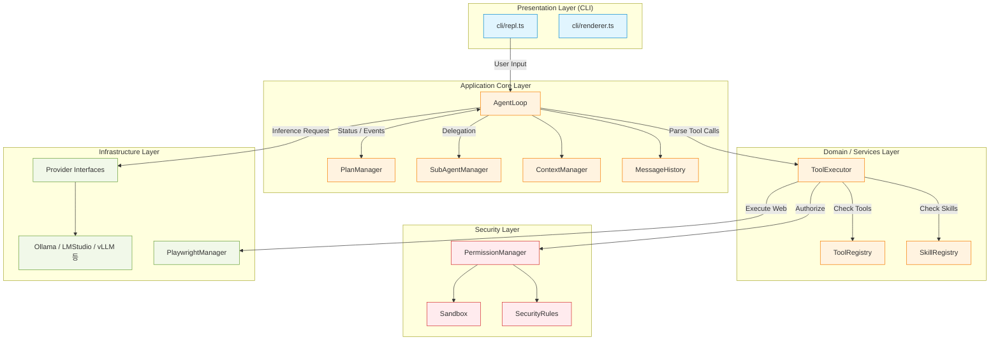
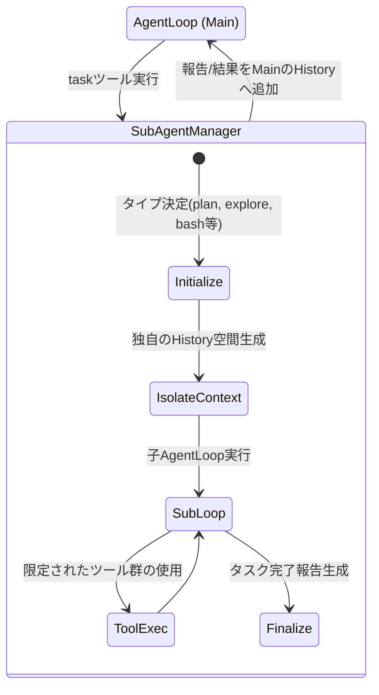
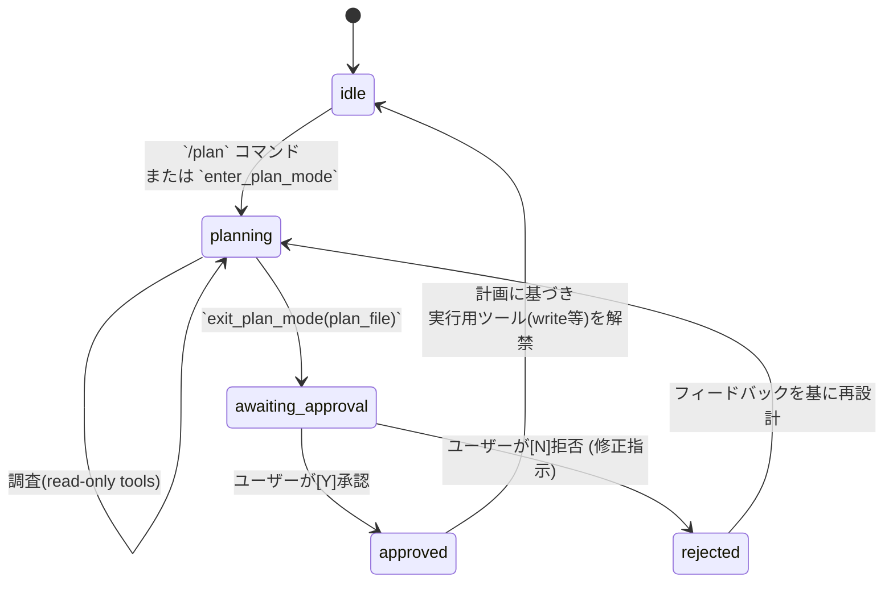
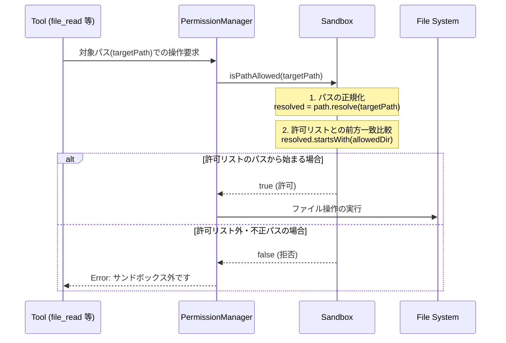
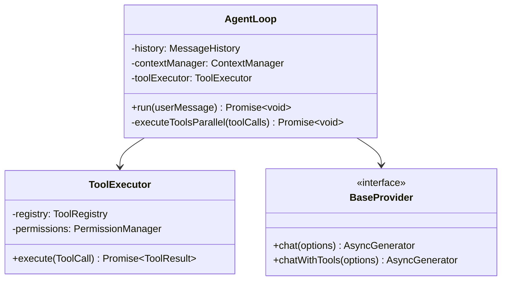

# 内部設計書 (Internal Design)

本ドキュメントでは、LocalLLM Agent の内部アーキテクチャ、コンポーネント間の連携構造、モジュール設計、データの流れについて定義します。

## 1. ソフトウェア・アーキテクチャ

システムは、CLIフロントエンドからLLMプロバイダまで、責務ごとにモジュール化されたレイヤードアーキテクチャを採用しています。



## 2. コンポーネント詳細・内部ロジック

### 2.1 AgentLoop の実行フロー
メインとなる思考ループ（推論とツール実行のサイクル）のフローを以下に示します。
特筆すべきは、LLMからの複数のTool Callsを `Promise.allSettled` で**並列処理**している点です。

```mermaid
sequenceDiagram
    participant User
    participant Loop as AgentLoop
    participant Context as ContextManager
    participant LLM as Provider (LLM)
    participant Exec as ToolExecutor

    User->>Loop: メッセージ入力
    Loop->>Loop: Historyに追加
    
    Loop->>Context: shouldCompress() ?
    alt 要圧縮
        Context->>LLM: 圧縮用プロンプト実行
        LLM-->>Context: 要約結果
        Context->>Loop: Historyの圧縮置換
    end

    loop Max Iterations (50)
        Loop->>LLM: chatWithTools(History)
        LLM-->>Loop: Stream Response (Text + ToolCalls)
        
        alt ToolCallsあり
            Loop->>Exec: execute(ToolCall 1) (Parallel)
            Loop->>Exec: execute(ToolCall 2) (Parallel)
            Exec-->>Loop: 実行結果 1 & 2
            Loop->>Loop: Historyに結果を追加 -> (次ループへ)
        else ToolCallsなし (完了)
            Loop-->>User: 最終回答の出力
            break Loop終了
        end
    end
```

### 2.2 サブエージェントのライフサイクル (`SubAgentManager`)
複雑なタスクを分割処理するために、独立した内部エージェントを生成します。



### 2.3 プランモード (`PlanManager`) による状態制御
「計画なしに破壊的変更を行うこと」を防ぐため、プラン（設計）フェーズにモードを分離しています。



## 3. サンドボックスの内部アーキテクチャ詳細

本システムのサンドボックス機構は、OSレベルの仮想化（コンテナ等）ではなく、アプリケーション層（Node.js）での「パスの文字列評価」によるシンプルなアーキテクチャを採用しています。



### 3.1 許可ディレクトリの初期化
システム起動時、`Sandbox` クラスは以下の領域を安全なディレクトリリスト(`allowedDirs`)としてメモリ上に保持します。
1. `process.cwd()` : エージェントを起動した現在の作業ディレクトリ
2. `os.homedir() + "/.localllm"` : エージェントの挙動を管理する設定領域
3. `config.json` の `allowedDirectories` パラメータで指定された追加パス

### 3.2 評価ロジックと制約
実際のパス解決は `path.resolve()` により相対パス表記（`../`など）を排除した絶対パス文字列を生成し、それが許可リストと前方一致（`startsWith`）するかで判定します。
この「文字列ベースの検査機構」に依存している仕様が原因となり、OS特有のファイルシステム挙動（WindowsのショートパスやUNCパス、Linux/Macのシンボリックリンク等）に対する技術的制約やバイパスリスクを抱えています。リスクの詳細は『セキュリティ評価書 (`security_assessment.md`)』に明記しています。

## 4. インターフェース設計 (クラス構造例)


