# 内部設計書 (Internal Design)

本ドキュメントでは、LocalLLM Agent の内部アーキテクチャ、コンポーネント間の連携構造、モジュール設計、データの流れについて定義します。

## 1. ソフトウェア・アーキテクチャ

システムは、CLIフロントエンドからLLMプロバイダまで、責務ごとにモジュール化されたレイヤードアーキテクチャを採用しています。

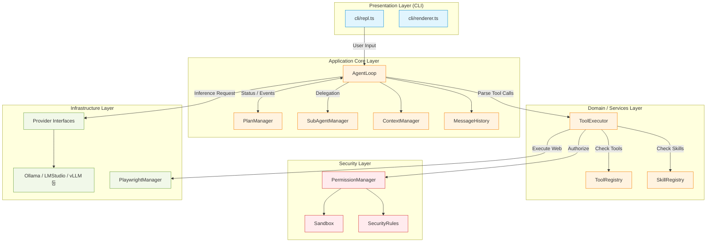

## 2. コンポーネント詳細・内部ロジック

### 2.1 AgentLoop の実行フロー
メインとなる思考ループ（推論とツール実行のサイクル）のフローを以下に示します。
特筆すべきは、LLMからの複数のTool Callsを `Promise.allSettled` で**並列処理**している点です。

```mermaid
sequenceDiagram
    participant User
    participant Loop as AgentLoop
    participant Context as ContextManager
    participant LLM as Provider (LLM)
    participant Exec as ToolExecutor

    User->>Loop: メッセージ入力
    Loop->>Loop: Historyに追加
    
    Loop->>Context: shouldCompress() ?
    alt 要圧縮
        Context->>LLM: 圧縮用プロンプト実行
        LLM-->>Context: 要約結果
        Context->>Loop: Historyの圧縮置換
    end

    loop Max Iterations (50)
        Loop->>LLM: chatWithTools(History)
        LLM-->>Loop: Stream Response (Text + ToolCalls)
        
        alt ToolCallsあり
            Loop->>Exec: execute(ToolCall 1) (Parallel)
            Loop->>Exec: execute(ToolCall 2) (Parallel)
            Exec-->>Loop: 実行結果 1 & 2
            Loop->>Loop: Historyに結果を追加 -> (次ループへ)
        else ToolCallsなし (完了)
            Loop-->>User: 最終回答の出力
            break Loop終了
        end
    end
```

### 2.2 サブエージェントのライフサイクル (`SubAgentManager`)
複雑なタスクを分割処理するために、独立した内部エージェントを生成します。

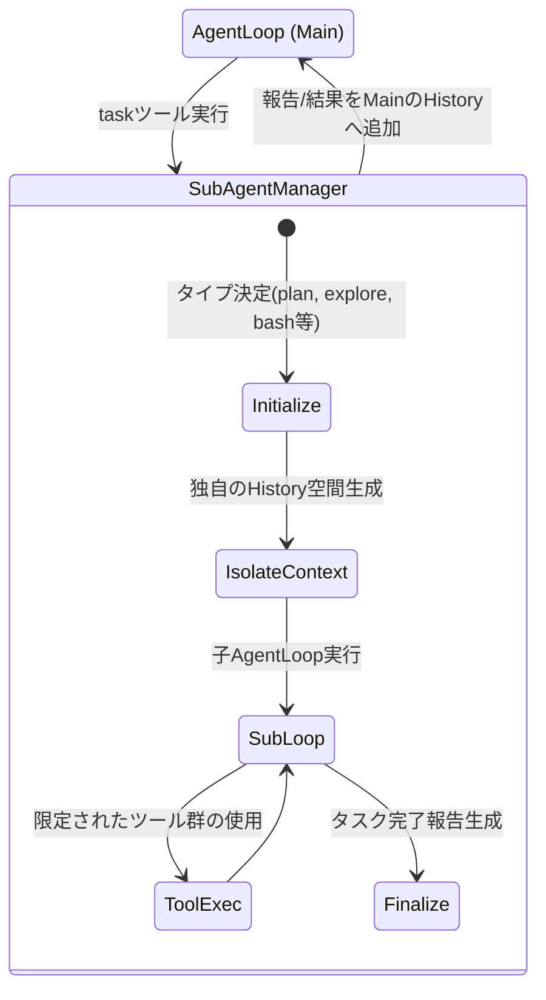

### 2.3 プランモード (`PlanManager`) による状態制御
「計画なしに破壊的変更を行うこと」を防ぐため、プラン（設計）フェーズにモードを分離しています。

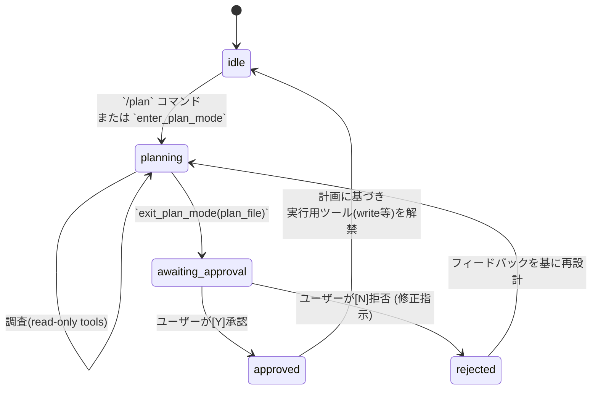

### 2.4 Agent Core のその他の主要コンポーネント
- **ContextManager (自動コンテキスト圧縮機能)**
  セッション中のトークン使用量を監視し、`compressionThreshold` (デフォルト80%) を超えた際に動作します。古いメッセージ群をLLM自身に「簡潔に要約」させ、システムプロンプトの直後に『要約された過去の文脈』として挿入することで、無限に続く会話でもコンテキスト上限をオーバーしない仕組みを提供します。
- **SessionManager (セッション永続化)**
  LLMのプロバイダ情報や会話履歴（Tool executionの結果含む）を JSON 形式で `~/.localllm/sessions/` 配下に自動保存・復元し、ターミナルを再起動しても前回の続きから作業を再開できるライフサイクルを管理します。
- **ProjectContext (CLAUDE.md 対応)**
  ワークスペースのルートに `CLAUDE.md` ファイルが存在する場合、それを自動的に検出し、System Promptの一部としてLLMにインジェクションします。これによりプロジェクト固有のコーディング規約や方針をエージェントに遵守させます。
- **Memory (自動記憶機能)**
  会話コンテキストとは独立した永続記憶 (`~/.localllm/memory/MEMORY.md`) を操作します。エージェント自身が必要と判断した知識やユーザーの好みを永続化します。

### 2.5 ツール群の詳細仕様 (Tool Definitions)
本システムには、LLMが自律的に呼び出せる**21種類**の機能(Function Calling)群が実装されています。

| カテゴリ | ツール名 | 権限 | 機能詳細と動作ロジック |
| :--- | :--- | :--- | :--- |
| **ファイル取得** | `file_read` | auto | 指定されたファイルのテキストを読み込みます。LLMが修正箇所を特定しやすいよう、出力テキストの各行には**行番号を付与**して返却されます。 |
| | `glob` | auto | 指定されたパターン(例:`src/**/*.ts`)に一致するファイル一覧を取得します。ディレクトリ構造の初期探索に用いられます。 |
| | `grep` | auto | 高速な文字列検索を行います。(システムに `ripgrep (rg)` がインストールされていればフォールバックして利用し、なければNode.jsネイティブ実装で検索します) |
| **ファイル更新** | `file_write` | ask | ファイルを新規作成、または全体を上書きします。対象の親ディレクトリが存在しない場合は**自動で `mkdir -p` を実行**します。 |
| | `file_edit` | ask | 既存ファイルの一部分を書き換えます。LLMから渡された `target_string` がファイル内に「一意に存在するか」を厳密にチェックし、合致した場合のみ `replacement_string` に置換します。 |
| **システム** | `bash` | ask | シェルコマンドを実行し、標準出力/標準エラー出力を取得します。無限ループ等のタイムアウト(標準120秒)が設けられています。 |
| **Web検索** | `web_search` | ask | DuckDuckGo等の検索エンジンAPIを用いて、インターネットから最新情報を検索しサマリーを取得します。 |
| | `web_fetch` | ask | 指定されたURLのWebページをダウンロードし、HTMLからプレーンテキスト(Markdown等)を抽出して読み取りやすく整形した結果を返却します。 |
| **ブラウザ操作** | `browser_navigate` | ask | **Playwright**プロセスを起動し、指定されたURLに遷移します。 |
| | `browser_click` | ask | ブラウザ上のアクセシビリティツリーから特定の要素をクリックします。 |
| | `browser_type` | ask | ブラウザ上の入力フィールドにテキストを入力します。 |
| | `browser_snapshot` | auto | ページのアクセシビリティツリー（テキスト形式）を取得します。Vision APIが不要なため軽量です。 |
| | `browser_screenshot` | ask | ページのスクリーンショット（base64画像）を取得します。`vision_analyze` と組み合わせて視覚的な状態確認に使用します。 |
| **画像解析** | `vision_analyze` | auto | ブラウザ操作で取得したスクリーンショットやローカル画像を、画像解析専用のサブLLM(OllamaのLlava等)に渡して状態を視覚的に説明させます。 |
| **タスク・補助** | `todo_write` | ask | エージェント自身が行動計画を整理するためのTODOリストをワークスペースに作成・更新します。 |
| | `task` | ask | 自身とは別の独立したコンテキストを持つ**子エージェント (SubAgent)** を生成し、「調査専門」や「コマンド実行専門」などスコープを限定したタスクを裏側(並列)で実行・委譲します。 |
| | `task_output` | ask | バックグラウンドで起動したサブエージェントの実行結果を取得します。 |
| | `enter_plan_mode` | ask | 破壊的なツール実行を封印し、システムの調査・設計のみを行う「プランモード」に入ります。 |
| | `exit_plan_mode` | ask | プランモードを終了し、計画内容を `~/.localllm/plans/` に保存してユーザー承認を待ちます。 |
| | `skill` | ask | ユーザーが `~/.localllm/skills/`、`.claude/skills/`、`.localllm/skills/` に配置した独自Markdown形式のスキル（例: git commit, pr review 等の一連の事前定義された操作フロー）を実行します。内蔵スキル (commit, pr-review, tdd, build-fix) も含みます。 |
| | `ask_user` | ask | エージェント単独で判断できない問題や、致命的なエラーが発生した場合にコンソール経由でユーザーに直接質問を投げかけ回答を待ちます。 |

※ **権限のデフォルト設定**: `auto`（自動許可）は `file_read`, `glob`, `grep`, `browser_snapshot`, `vision_analyze` の5ツールのみ。その他はすべて `ask`（要ユーザー承認）。

本システムのサンドボックス機構は、OSレベルの仮想化（コンテナ等）ではなく、アプリケーション層（Node.js）での「パスの文字列評価」によるシンプルなアーキテクチャを採用しています。

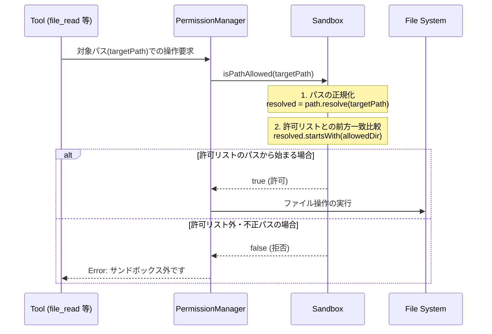

### 3.1 許可ディレクトリの初期化
システム起動時、`Sandbox` クラスは以下の領域を安全なディレクトリリスト(`allowedDirs`)としてメモリ上に保持します。
1. `process.cwd()` : エージェントを起動した現在の作業ディレクトリ
2. `os.homedir() + "/.localllm"` : エージェントの挙動を管理する設定領域
3. `config.json` の `allowedDirectories` パラメータで指定された追加パス

### 3.2 評価ロジックと制約
実際のパス解決は `path.resolve()` により相対パス表記（`../`など）を排除した絶対パス文字列を生成し、それが許可リストと前方一致（`startsWith`）するかで判定します。
この「文字列ベースの検査機構」に依存している仕様が原因となり、OS特有のファイルシステム挙動（WindowsのショートパスやUNCパス、Linux/Macのシンボリックリンク等）に対する技術的制約やバイパスリスクを抱えています。リスクの詳細は『セキュリティ評価書 (`security_assessment.md`)』に明記しています。

## 4. インターフェース設計 (クラス構造)

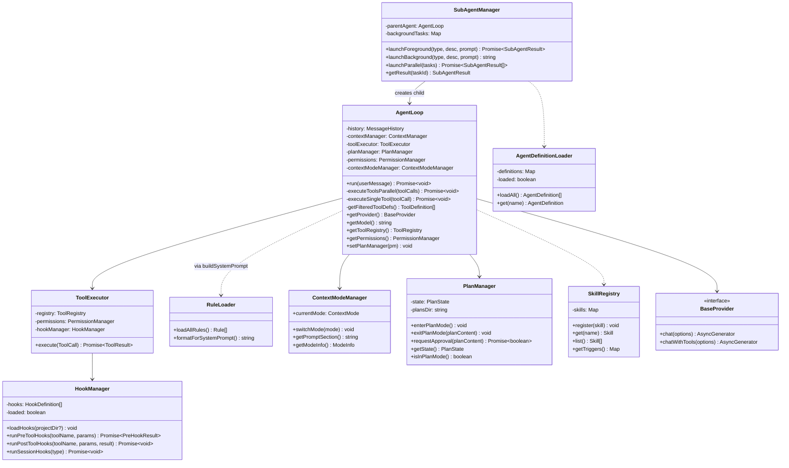

## 5. HookManager アーキテクチャ

### 概要
`HookManager`（`src/hooks/hook-manager.ts`）は、ツール実行のライフサイクルとセッションのライフサイクルにユーザー定義のシェルコマンドを差し込む機構です。`ToolExecutor` に注入され、ツール実行の前後にフックコマンドを実行します。

### クラス構造

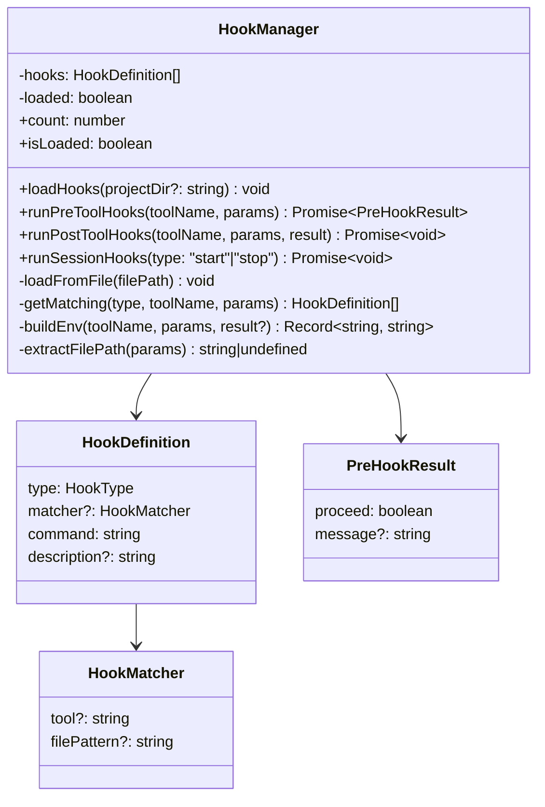

### ToolExecutor との統合

`ToolExecutor`（`src/tools/tool-executor.ts`）のコンストラクタにオプショナルな `hookManager` パラメータが渡されます。`execute()` メソッド内で以下の順序で処理が行われます。

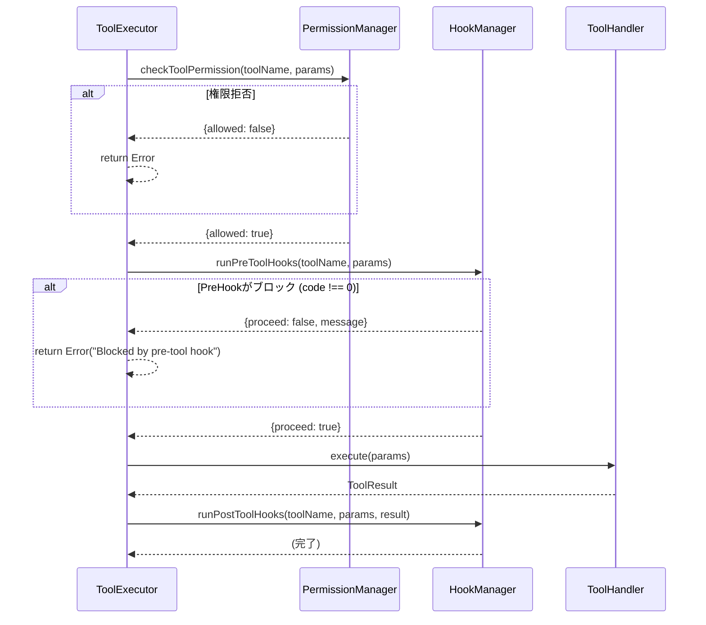

### 環境変数の構築 (`buildEnv`)

`buildEnv` メソッドは、ツールのパラメータから環境変数を構築します。
- `TOOL_NAME`: 常に設定
- `FILE_PATH`: `params.file_path ?? params.path ?? params.pattern ?? params.command` から抽出（`extractFilePath` メソッド）
- `TOOL_OUTPUT`, `TOOL_SUCCESS`, `TOOL_ERROR`: PostToolUse 時のみ `ToolResult` から設定

### フックのロード順序

`loadHooks(projectDir)` メソッドは以下の順序でファイルを読み込み、すべてのフックを `this.hooks` 配列に追加します。

1. `{projectDir}/.claude/hooks.json`
2. `{projectDir}/.localllm/hooks.json`
3. `~/.localllm/hooks.json`

### マッチングロジック (`getMatching`)

`matcher` が未指定のフックは、同じ `type` のすべてのツール実行にマッチします。
`matcher.tool` が指定されている場合はツール名の完全一致、`matcher.filePattern` が指定されている場合は glob パターンマッチ（`*` と `**` をサポート）で判定します。

### index.ts での初期化

```typescript
const hookManager = new HookManager();
hookManager.loadHooks(process.cwd());

// AgentLoop コンストラクタに渡される
const agent = new AgentLoop(
  provider, model, toolRegistry, permissions,
  contextWindow, compressionThreshold,
  contextModeManager, hookManager
);

// セッションフックの実行
await hookManager.runSessionHooks("start");
// ... REPL実行 ...
await hookManager.runSessionHooks("stop");
```

## 6. RuleLoader アーキテクチャ

### 概要
`RuleLoader`（`src/rules/rule-loader.ts`）は、Markdown 形式のルールファイルを複数のソースから読み込み、システムプロンプトに注入する機構です。

### クラス構造

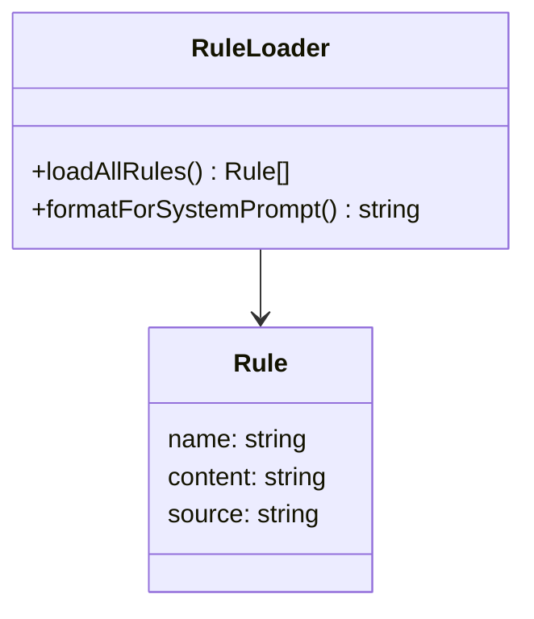

### ロード順序

`loadAllRules()` メソッドは以下の順序でルールを読み込みます。すべてのルールが結合されます（上書きではなく追加）。

1. **builtin** (`src/rules/builtin/`): `import.meta.url` から相対パスで解決。組み込み3種（security.md, coding-style.md, git-workflow.md）
2. **user** (`~/.localllm/rules/`): `os.homedir()` ベース
3. **project** (`.claude/rules/`): `process.cwd()` ベース
4. **project** (`.localllm/rules/`): `process.cwd()` ベース

各ディレクトリから `.md` 拡張子のファイルのみを読み込み、ファイル名（拡張子除く）を `name`、ファイル内容を `content`、ソース種別（`"builtin"`, `"user"`, `"project"`）を `source` として `Rule` オブジェクトを生成します。

### システムプロンプトへの注入

`formatForSystemPrompt()` メソッドは `loadAllRules()` を呼び出し、結果を以下の形式で文字列化します。

```
# ルール
以下のルールに常に従ってください。

{rule1.content}

{rule2.content}
...
```

この文字列は `buildSystemPrompt()`（`src/agent/system-prompt.ts`）の中で呼び出され、システムプロンプトの末尾付近に追加されます。

## 7. ContextModeManager アーキテクチャ

### 概要
`ContextModeManager`（`src/context/context-mode.ts`）は、エージェントの動作モード（dev/review/research）を管理し、モードに応じたシステムプロンプトセクションを生成します。

### クラス構造

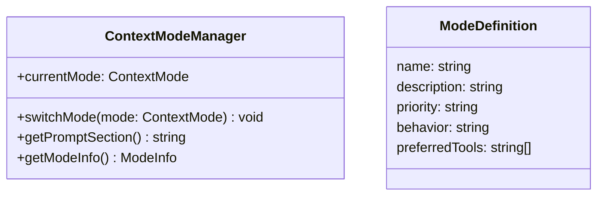

### モード定義（`MODE_DEFINITIONS`）

`ContextMode` 型は `"dev" | "review" | "research"` のユニオン型です。各モードは `ModeDefinition` インターフェースで定義されています。

| フィールド | dev | review | research |
|:---|:---|:---|:---|
| `name` | Development | Code Review | Research |
| `description` | Active development mode | Code review mode | Research and exploration mode |
| `priority` | Work -> Correct -> Clean | Critical > High > Medium > Low | Understand -> Verify -> Document |
| `behavior` | Write code first, test after, commit atomically | Thorough analysis, severity-based prioritization, provide solutions | Explore and learn, read broadly, summarize findings |
| `preferredTools` | file_write, file_edit, bash, task | file_read, grep, glob | file_read, grep, glob, web_fetch, web_search |

### 状態管理

- `currentMode` プロパティでパブリックに現在のモードを保持（デフォルト: `"dev"`）
- `switchMode()` で切り替え
- REPL の `/mode` コマンドから `switchMode()` が呼ばれる

### システムプロンプトセクション

`getPromptSection()` は以下の形式の文字列を返し、`buildSystemPrompt()` 内でシステムプロンプトの末尾に追加されます。

```
# Context Mode: {def.name}
- Priority: {def.priority}
- Behavior: {def.behavior}
- Preferred tools: {def.preferredTools.join(", ")}
```

## 8. AgentDefinitionLoader アーキテクチャ

### 概要
`AgentDefinitionLoader`（`src/agents/agent-loader.ts`）は、Markdown + YAML フロントマター形式のエージェント定義ファイルを読み込み、サブエージェントの設定を提供します。

### クラス構造

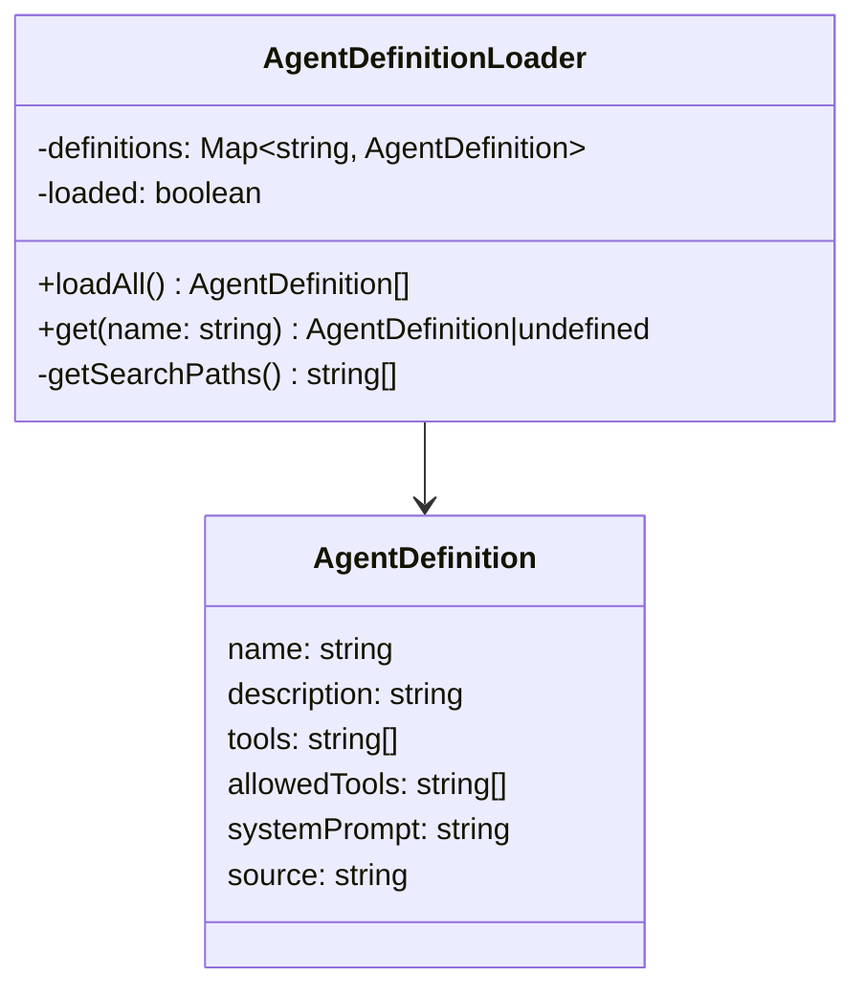

### ロードの仕組み

#### 遅延ロード（Lazy Loading）
`get(name)` メソッドは内部で `this.loaded` フラグをチェックし、未ロードの場合は `loadAll()` を自動的に呼び出します。`loadAll()` も `this.loaded` が true の場合はキャッシュを返却します。

#### ロード順序とオーバーライド
`getSearchPaths()` が返すパスの順序で読み込み、**同名のエージェントは後のパスで上書き**されます（`Map.set()` による上書き）。

1. `src/agents/builtin/` （`import.meta.url` から `fileURLToPath` で解決 + `"builtin"` ディレクトリ）
2. `~/.localllm/agents/` （`getHomedir()` ベース）
3. `.localllm/agents/` （`path.resolve` = CWD相対）

#### フロントマターの解析（`parseFrontmatter`）
独自の簡易 YAML パーサーで以下をサポートします。
- 文字列値（クォート有無どちらも対応）
- フロースタイル配列: `[a, b, c]`
- `---` で囲まれたフロントマターブロック
- 本文はフロントマター以降のテキスト全体が `systemPrompt` として使用

#### AgentDefinition の属性
- `name`: フロントマターの `name`（必須。未指定の場合はスキップ）
- `description`: フロントマターの `description`（デフォルト: `""`）
- `tools`: フロントマターの `tools`（デフォルト: `[]`）
- `allowedTools`: フロントマターの `allowedTools`（未指定の場合は `tools` と同一）
- `systemPrompt`: フロントマター以降の本文
- `source`: ファイルの絶対パス

### 組み込みエージェント（4種）

| ファイル | name | tools |
|:---|:---|:---|
| `explore.md` | explore | file_read, glob, grep, web_fetch, web_search |
| `plan.md` | plan | file_read, glob, grep, web_fetch, web_search |
| `general-purpose.md` | general-purpose | file_read, file_write, file_edit, glob, grep, bash, web_fetch, web_search, todo_write, ask_user |
| `code-reviewer.md` | code-reviewer | file_read, glob, grep, bash |

## 9. MCPManager アーキテクチャ

`MCPManager`（`src/mcp/mcp-manager.ts`）は、MCP（Model Context Protocol）サーバーのライフサイクル管理と、発見されたツールの `ToolRegistry` への統合を担います。

### クラス図

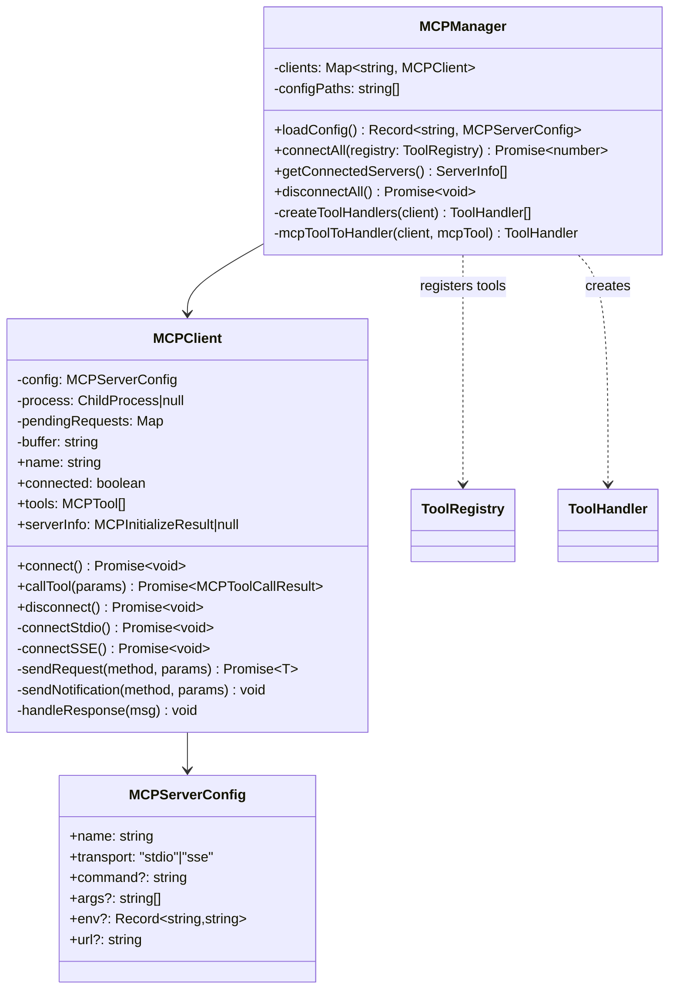

### 通信シーケンス（stdio トランスポート）

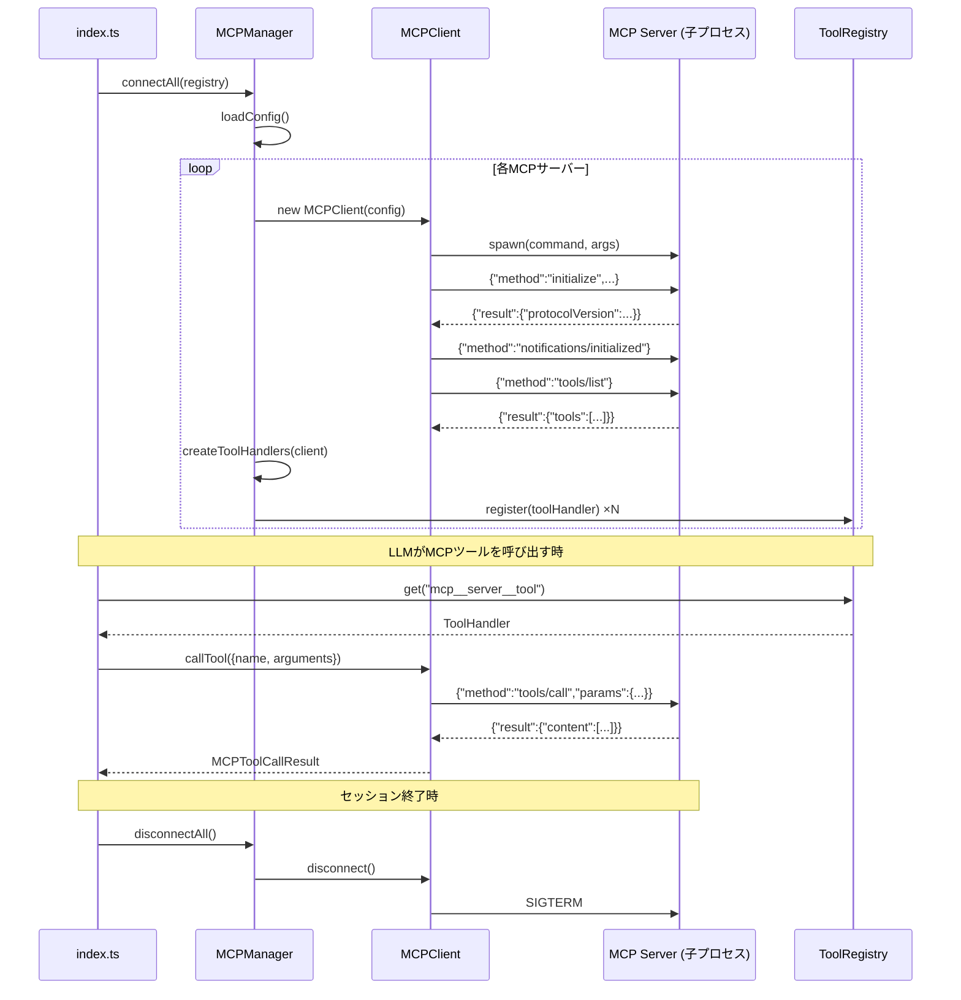

### 設定ファイルの読み込み順序

`loadConfig()` メソッドは以下の順序でファイルを読み込み、同名サーバーは後のパスで上書きされます。

1. `~/.localllm/mcp-servers.json`（ユーザーグローバル）
2. `{projectDir}/.localllm/mcp-servers.json`（プロジェクトローカル）
3. `{projectDir}/.claude/mcp-servers.json`（Claude Code互換）

### ツール命名規則と変換

MCPサーバーから取得したツールは `mcp__<サーバー名>__<ツール名>` の形式で `ToolHandler` に変換されます。LLMにはプレフィックス付きの名前で提示され、MCPサーバーへの呼び出し時にはオリジナルのツール名が使用されます。

```
MCPTool { name: "read_file", inputSchema: {...} }
  ↓ mcpToolToHandler()
ToolHandler { name: "mcp__filesystem__read_file", definition: {...}, execute: async (params) => ... }
```

### index.ts での統合

```typescript
// 起動時
const mcpManager = new MCPManager(process.cwd());
await mcpManager.connectAll(toolRegistry);

// 終了時
await mcpManager.disconnectAll();
```

## 10. HTTP通信レイヤーのタイムアウト戦略

### 概要

`src/utils/http-client.ts` は、すべてのLLMプロバイダーおよびWeb系ツールが使用するHTTP通信の基盤モジュールです。
ローカルLLMは応答に数分〜数十分を要するため、一般的なWebアプリケーションとは異なるタイムアウト設計が必要です。

### タイムアウト設計

本システムでは、用途に応じて3つのタイムアウト値を使い分けています。

| 関数 | 用途 | デフォルト | 説明 |
|:---|:---|:---|:---|
| `httpGet` | 接続確認（モデル一覧等） | 10秒 | サーバー起動確認のみなので短い |
| `httpPost` | 非ストリーミングPOST | 5分 | モデル情報クエリ等 |
| `httpPostStream` (接続) | ストリーミング接続確立 | 1時間 | `fetch()`〜レスポンスヘッダー受信まで |
| `httpPostStream` (アイドル) | ストリーム読み取り | 10分 | チャンク間の最大無通信時間 |

### ストリーミングのタイムアウトアーキテクチャ

ストリーミング応答（LLMチャット）のタイムアウトは、以下の3層で構成されています。

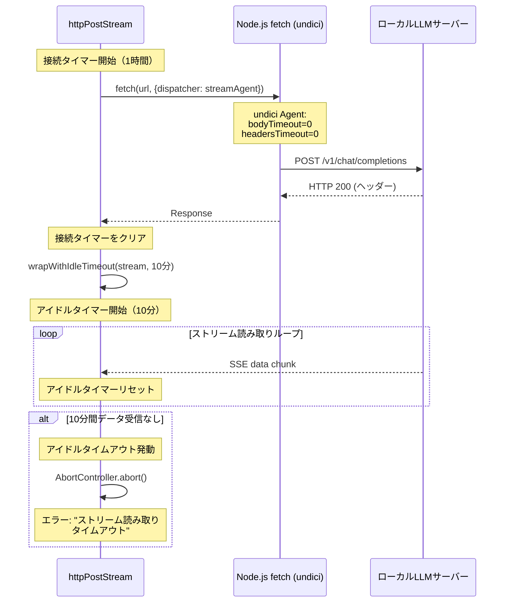

#### 第1層: undici bodyTimeout の無効化

Node.js の `fetch()` は内部で `undici` ライブラリを使用しており、デフォルトで `bodyTimeout: 300_000`（5分）が設定されています。
この内部タイムアウトはアプリケーション側から直接制御できないため、カスタム `Agent` インスタンスを `dispatcher` オプション経由で注入し、`bodyTimeout: 0` / `headersTimeout: 0` で無効化しています。

```typescript
const streamAgent = new Agent({
  bodyTimeout: 0,
  headersTimeout: 0,
});
```

#### 第2層: 接続タイムアウト

`fetch()` 呼び出しからレスポンスヘッダー受信までの最大待機時間（デフォルト1時間）。
`AbortController` + `setTimeout` で実装し、レスポンスヘッダー受信後にタイマーをクリアします。

#### 第3層: アイドルタイムアウト

`wrapWithIdleTimeout()` 関数が `ReadableStream` をラップし、チャンク受信ごとにタイマーをリセットします。
一定時間（デフォルト10分）データが一切受信されない場合にのみストリームを中断します。

- **LLMが推論中**（最初のトークン生成待ち）の場合でもタイムアウトしない設計ではない点に注意。10分以内に最初のトークンが到着しなければタイムアウトする。
- 完全なハング（サーバーダウン等）の検出が主目的。

### エラーハンドリング

`openai-compat.ts` の `doChat` メソッドにおいて、ストリーム読み取り中のエラーを以下のように分類して処理します。

| エラー種別 | 判定条件 | ユーザーへのメッセージ |
|:---|:---|:---|
| アイドルタイムアウト | `AbortError` or `message.includes("abort")` | 「ストリーム読み取りタイムアウト: LLMサーバーから一定時間データが受信できませんでした」 |
| その他のエラー | 上記以外 | エラーメッセージをそのまま表示 |

### 設計判断の根拠

| 判断 | 理由 |
|:---|:---|
| アイドルタイムアウト10分 | 大型モデル（27B+）の最初のトークン生成に数分かかることがある。余裕を持たせつつ、完全なハングを検出 |
| 全体タイムアウトではなくアイドル | ストリーミング中はデータが断続的に到着する。全体時間で制限すると長い応答が途中で切れる |
| undici Agent をシングルトン化 | リクエストごとにAgentを生成すると接続プールが無駄になるため |
| bodyTimeout=0 で無効化 | undiciのデフォルト300秒がローカルLLMの応答時間と合わず、早期切断の原因になっていた |
