# 内部設計書 (Internal Design)

> **バージョン**: 統合版 (2026-03-15)

本ドキュメントでは、LocalLLM Agent の内部アーキテクチャ、コンポーネント間の連携構造、モジュール設計、データの流れについて定義します。

---

## 1. ソフトウェア・アーキテクチャ

システムは、CLIフロントエンドからLLMプロバイダまで、責務ごとにモジュール化されたレイヤードアーキテクチャを採用しています。

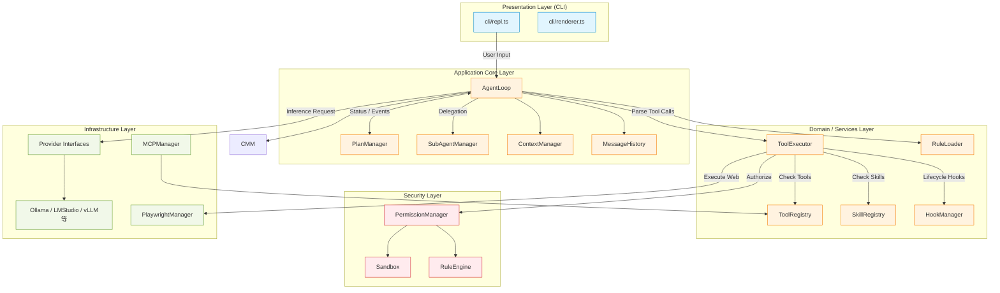
```mermaid
graph TD
    classDef ui fill:#e1f5fe,stroke:#0288d1;
    classDef core fill:#fff3e0,stroke:#f57c00;
    classDef infra fill:#f1f8e9,stroke:#689f38;
    classDef sec fill:#ffebee,stroke:#d32f2f;

    subgraph "Presentation Layer (CLI)"
        REPL[cli/repl.ts]:::ui
        Renderer[cli/renderer.ts]:::ui
    end

    subgraph "Application Core Layer"
        AL[AgentLoop]:::core
        PM[PlanManager]:::core
        SM[SubAgentManager]:::core
        CM[ContextManager]:::core
        Mem[MessageHistory]:::core
    end

    subgraph "Domain / Services Layer"
        TR[ToolRegistry]:::core
        TE[ToolExecutor]:::core
        SR[SkillRegistry]:::core
        HM[HookManager]:::core
        RL[RuleLoader]:::core
    end

    subgraph "Security Layer"
        Perm[PermissionManager]:::sec
        Sand[Sandbox]:::sec
        RE[RuleEngine]:::sec
    end

    subgraph "Infrastructure Layer"
        Prov[Provider Interfaces]:::infra
        Clients[Ollama / LMStudio / vLLM等]:::infra
        Play[PlaywrightManager]:::infra
        MCP[MCPManager]:::infra
    end

    REPL --> |User Input| AL
    AL --> Mem
    AL --> CM
    AL <--> |Status / Events| PM
    AL --> |Delegation| SM
    AL --> |Inference Request| Prov
    Prov --> Clients

    AL --> |Parse Tool Calls| TE
    TE --> |Check Tools| TR
    TE --> |Check Skills| SR
    TE --> |Authorize| Perm
    TE --> |Lifecycle Hooks| HM

    Perm --> Sand
    Perm --> RE

    TE --> |Execute Web| Play

    AL --> RL
    AL --> CMM
    MCP --> TR
```

### 1.1 ディレクトリ構成

```
src/
├── agent/          - AgentLoop, PlanManager, ContextManager, MessageHistory, SystemPrompt
├── agents/         - エージェント定義ファイル (.md) とローダー
├── tools/          - ToolRegistry, ToolExecutor, 23ツール定義
├── providers/      - LLMプロバイダ (Ollama, LMStudio, llama.cpp, vLLM)
├── cli/            - REPL, レンダラー, 補完 (completer)
├── hooks/          - HookManager (Pre/PostToolUse, Session lifecycle)
├── rules/          - RuleLoader + builtin rules (security, coding-style, git-workflow)
├── skills/         - SkillRegistry + builtin skills (dev-workflow, code-review, research 等)
├── security/       - PermissionManager, Sandbox, RuleEngine
├── config/         - ConfigManager, セットアップウィザード
├── browser/        - PlaywrightManager
├── mcp/            - MCPManager, MCPClient
├── tenacious/      - TenaciousRunner（試行錯誤モード: /try コマンド）
├── utils/          - http-client, discord, non-tty-reader, platform
└── index.ts        - エントリポイント・初期化
```

---

## 2. コンポーネント詳細・内部ロジック

### 2.1 AgentLoop の実行フロー

メインとなる思考ループ（推論とツール実行のサイクル）のフローを以下に示します。LLMからの複数のTool Callsを `Promise.allSettled` で **並列処理** している点が特徴です。

**最大イテレーション数 (`MAX_TOOL_ITERATIONS = 50`) の設計根拠:**

| 観点 | 理由 |
|---|---|
| **無限ループ防止** | LLMがツール呼び出しを繰り返してループ状態になった場合に強制終了するセーフガード |
| **実用的な上限** | 一般的なエージェントタスク（コード変更・調査・デバッグ）で50回を超えることは稀 |
| **応答時間の保証** | ローカルLLM（27B等）では1イテレーションに数十秒かかる場合があり、上限がないと数時間動き続ける可能性がある |
| **ユーザーによる設定変更** | 現在は定数のため設定ファイルから変更不可。複雑タスクが多い場合は `src/agent/agent-loop.ts` の `MAX_TOOL_ITERATIONS` を直接変更してください |

```mermaid
sequenceDiagram
    participant User
    participant Loop as AgentLoop
    participant Context as ContextManager
    participant LLM as Provider (LLM)
    participant Exec as ToolExecutor

    User->>Loop: メッセージ入力
    Loop->>Loop: Historyに追加

    Loop->>Context: shouldCompress() ?
    alt 要圧縮
        Context->>LLM: 圧縮用プロンプト実行
        LLM-->>Context: 要約結果
        Context->>Loop: Historyの圧縮置換
    end

    loop Max Iterations (50)
        Note over Loop: 🔄 LLM待機スピナー開始
        Loop->>LLM: chatWithTools(History)
        LLM-->>Loop: Stream Response (Text + ToolCalls)
        Note over Loop: ✔ スピナー停止

        alt ToolCallsあり
            Loop->>Exec: execute(ToolCall 1) (Parallel)
            Loop->>Exec: execute(ToolCall 2) (Parallel)
            Exec-->>Loop: 実行結果 1 & 2
            Loop->>Loop: Historyに結果を追加 -> (次ループへ)
        else ToolCallsなし (完了)
            Loop-->>User: 最終回答の出力
            break Loop終了
        end
    end
```

### 2.2 サブエージェントのライフサイクル (`SubAgentManager`)

複雑なタスクを分割処理するために、独立した内部エージェントを生成します。

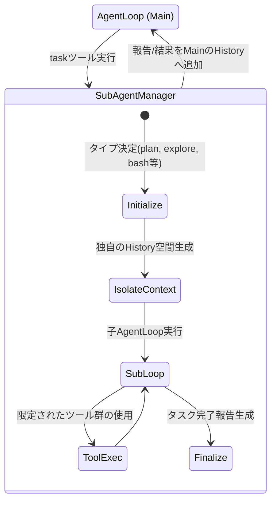
```mermaid
stateDiagram-v2
    state "AgentLoop (Main)" as Main
    state "SubAgentManager" as SAM

    Main --> SAM : taskツール実行

    state SAM {
        [*] --> Initialize: タイプ決定(plan, explore, bash等)
        Initialize --> IsolateContext: 独自のHistory空間生成
        IsolateContext --> SubLoop: 子AgentLoop実行
        SubLoop --> ToolExec: 限定されたツール群の使用
        ToolExec --> SubLoop
        SubLoop --> Finalize: タスク完了報告生成
    }

    SAM --> Main : 報告/結果をMainのHistoryへ追加
```

### 2.3 プランモード (`PlanManager`) による状態制御

「計画なしに破壊的変更を行うこと」を防ぐため、プラン（設計）フェーズにモードを分離しています。

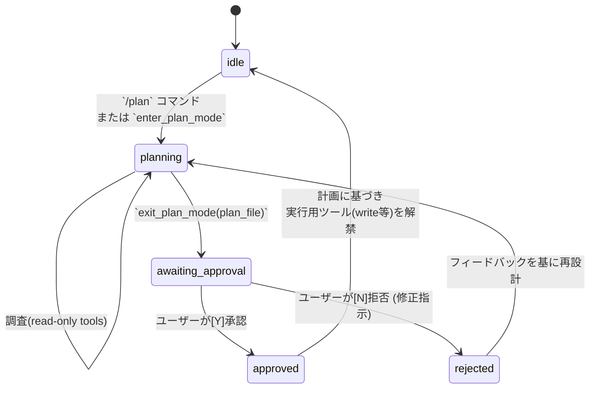
```mermaid
stateDiagram-v2
    [*] --> idle

    idle --> planning : `/plan` コマンド<br>または `enter_plan_mode`

    planning --> planning : 調査(read-only tools)
    planning --> awaiting_approval : `exit_plan_mode(plan_file)`

    awaiting_approval --> approved : ユーザーが[Y]承認
    awaiting_approval --> rejected : ユーザーが[N]拒否 (修正指示)

    rejected --> planning : フィードバックを基に再設計
    approved --> idle : 計画に基づき<br>実行用ツール(write等)を解禁
```

### 2.4 Agent Core のその他の主要コンポーネント

- **ContextManager（自動コンテキスト圧縮機能）**
  セッション中のトークン使用量を監視し、`compressionThreshold`（デフォルト80%）を超えた際に動作します。古いメッセージ群をLLM自身に「簡潔に要約」させ、システムプロンプトの直後に『要約された過去の文脈』として挿入することで、無限に続く会話でもコンテキスト上限をオーバーしない仕組みを提供します。

- **SessionManager（セッション永続化）**
  LLMのプロバイダ情報や会話履歴（Tool executionの結果含む）を JSON 形式で `~/.localllm/sessions/` 配下に自動保存・復元し、ターミナルを再起動しても前回の続きから作業を再開できるライフサイクルを管理します。

- **ProjectContext（CLAUDE.md 対応）**
  ワークスペースのルートに `CLAUDE.md` ファイルが存在する場合、それを自動的に検出し、System Promptの一部としてLLMにインジェクションします。これによりプロジェクト固有のコーディング規約や方針をエージェントに遵守させます。

- **Memory（自動記憶機能）**
  会話コンテキストとは独立した永続記憶（`~/.localllm/memory/MEMORY.md`）を操作します。エージェント自身が必要と判断した知識やユーザーの好みを永続化します。

---

## 3. セキュリティ層：サンドボックス

本システムのサンドボックス機構は、OSレベルの仮想化（コンテナ等）ではなく、アプリケーション層（Node.js）での「パスの文字列評価」によるシンプルなアーキテクチャを採用しています。

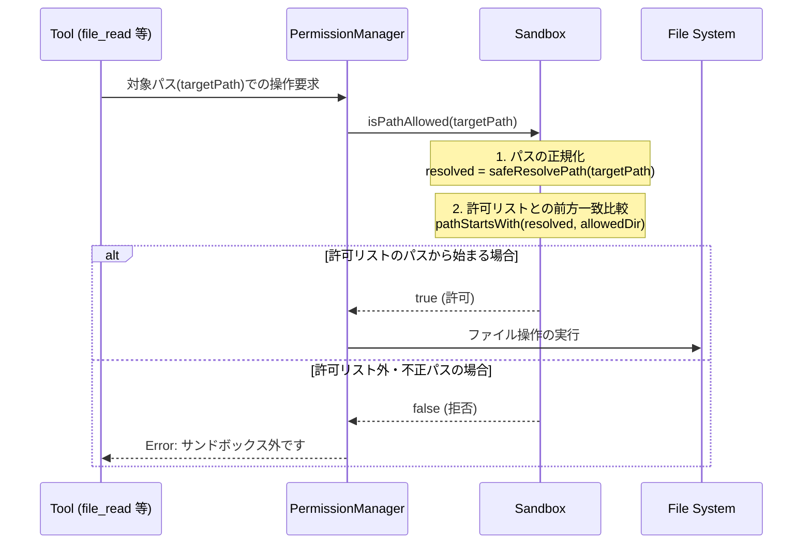
```mermaid
sequenceDiagram
    participant Tool as Tool (file_read 等)
    participant PM as PermissionManager
    participant Sandbox as Sandbox
    participant OS as File System

    Tool->>PM: 対象パス(targetPath)での操作要求
    PM->>Sandbox: isPathAllowed(targetPath)

    Note over Sandbox: 1. パスの正規化<br/>resolved = safeResolvePath(targetPath)
    Note over Sandbox: 2. 許可リストとの前方一致比較<br/>pathStartsWith(resolved, allowedDir)

    alt 許可リストのパスから始まる場合
        Sandbox-->>PM: true (許可)
        PM->>OS: ファイル操作の実行
    else 許可リスト外・不正パスの場合
        Sandbox-->>PM: false (拒否)
        PM-->>Tool: Error: サンドボックス外です
    end
```

### 3.1 許可ディレクトリの初期化

システム起動時、`Sandbox` クラスは以下の領域を安全なディレクトリリスト (`allowedDirs`) としてメモリ上に保持します。

1. `process.cwd()` : エージェントを起動した現在の作業ディレクトリ
2. `os.homedir() + "/.localllm"` : エージェントの挙動を管理する設定領域
3. `config.json` の `allowedDirectories` パラメータで指定された追加パス

### 3.2 評価ロジックと制約

`safeResolvePath()`（`src/utils/platform.ts`）により `path.resolve()` + `fs.realpathSync()` を組み合わせて相対パス・シンボリックリンクを解決し、許可リストと前方一致（`pathStartsWith()`）で判定します。

- **Windows対応**: `normalizeWindowsPath()` によりパスの大文字・小文字統一、8.3短縮パス解決、UNCパス正規化を実施
- **Linux/macOS対応**: `fs.realpathSync()` によりシンボリックリンクを実体パスに解決
- **テストカバレッジ**: `tests/security/sandbox.test.ts` に20テスト

---

## 4. インターフェース設計（クラス構造）

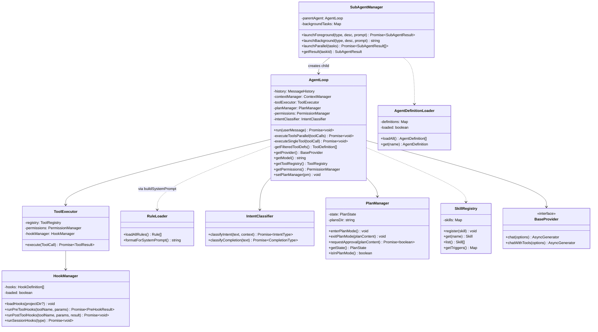
```mermaid
classDiagram
    class AgentLoop {
        -history: MessageHistory
        -contextManager: ContextManager
        -toolExecutor: ToolExecutor
        -planManager: PlanManager
        -permissions: PermissionManager
        -intentClassifier: IntentClassifier
        +run(userMessage) Promise~void~
        -executeToolsParallel(toolCalls) Promise~void~
        -executeSingleTool(toolCall) Promise~void~
        -getFilteredToolDefs() ToolDefinition[]
        +getProvider() BaseProvider
        +getModel() string
        +getToolRegistry() ToolRegistry
        +getPermissions() PermissionManager
        +setPlanManager(pm) void
    }

    class ToolExecutor {
        -registry: ToolRegistry
        -permissions: PermissionManager
        -hookManager: HookManager
        +execute(ToolCall) Promise~ToolResult~
    }

    class HookManager {
        -hooks: HookDefinition[]
        -loaded: boolean
        +loadHooks(projectDir?) void
        +runPreToolHooks(toolName, params) Promise~PreHookResult~
        +runPostToolHooks(toolName, params, result) Promise~void~
        +runSessionHooks(type) Promise~void~
    }

    class RuleLoader {
        +loadAllRules() Rule[]
        +formatForSystemPrompt() string
    }

    class IntentClassifier {
        +classifyIntent(text, context) Promise~IntentType~
        +classifyCompletion(text) Promise~CompletionType~
    }

    class AgentDefinitionLoader {
        -definitions: Map
        -loaded: boolean
        +loadAll() AgentDefinition[]
        +get(name) AgentDefinition
    }

    class SubAgentManager {
        -parentAgent: AgentLoop
        -backgroundTasks: Map
        +launchForeground(type, desc, prompt) Promise~SubAgentResult~
        +launchBackground(type, desc, prompt) string
        +launchParallel(tasks) Promise~SubAgentResult[]~
        +getResult(taskId) SubAgentResult
    }

    class PlanManager {
        -state: PlanState
        -plansDir: string
        +enterPlanMode() void
        +exitPlanMode(planContent) void
        +requestApproval(planContent) Promise~boolean~
        +getState() PlanState
        +isInPlanMode() boolean
    }

    class SkillRegistry {
        -skills: Map
        +register(skill) void
        +get(name) Skill
        +list() Skill[]
        +getTriggers() Map
    }

    class BaseProvider {
        <<interface>>
        +chat(options) AsyncGenerator
        +chatWithTools(options) AsyncGenerator
    }

    AgentLoop --> ToolExecutor
    AgentLoop --> BaseProvider
    AgentLoop --> PlanManager
    AgentLoop --> IntentClassifier
    ToolExecutor --> HookManager
    SubAgentManager --> AgentLoop : creates child
    AgentLoop ..> SkillRegistry
    AgentLoop ..> RuleLoader : via buildSystemPrompt
    SubAgentManager ..> AgentDefinitionLoader
```

---

## 5. HookManager アーキテクチャ

### 概要

`HookManager`（`src/hooks/hook-manager.ts`）は、ツール実行のライフサイクルとセッションのライフサイクルにユーザー定義のシェルコマンドを差し込む機構です。`ToolExecutor` に注入され、ツール実行の前後にフックコマンドを実行します。

### クラス構造

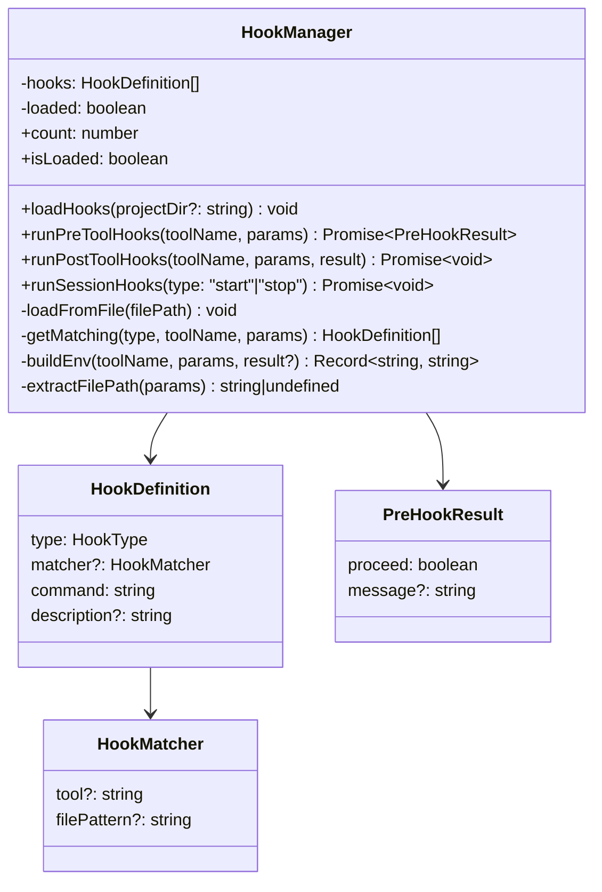
```mermaid
classDiagram
    class HookManager {
        -hooks: HookDefinition[]
        -loaded: boolean
        +loadHooks(projectDir?: string) void
        +runPreToolHooks(toolName, params) Promise~PreHookResult~
        +runPostToolHooks(toolName, params, result) Promise~void~
        +runSessionHooks(type: "start"|"stop") Promise~void~
        +count: number
        +isLoaded: boolean
        -loadFromFile(filePath) void
        -getMatching(type, toolName, params) HookDefinition[]
        -buildEnv(toolName, params, result?) Record~string, string~
        -extractFilePath(params) string|undefined
    }

    class HookDefinition {
        type: HookType
        matcher?: HookMatcher
        command: string
        description?: string
    }

    class HookMatcher {
        tool?: string
        filePattern?: string
    }

    class PreHookResult {
        proceed: boolean
        message?: string
    }

    HookManager --> HookDefinition
    HookDefinition --> HookMatcher
    HookManager --> PreHookResult
```

### ToolExecutor との統合

`ToolExecutor`（`src/tools/tool-executor.ts`）の `execute()` メソッド内で以下の順序で処理が行われます。

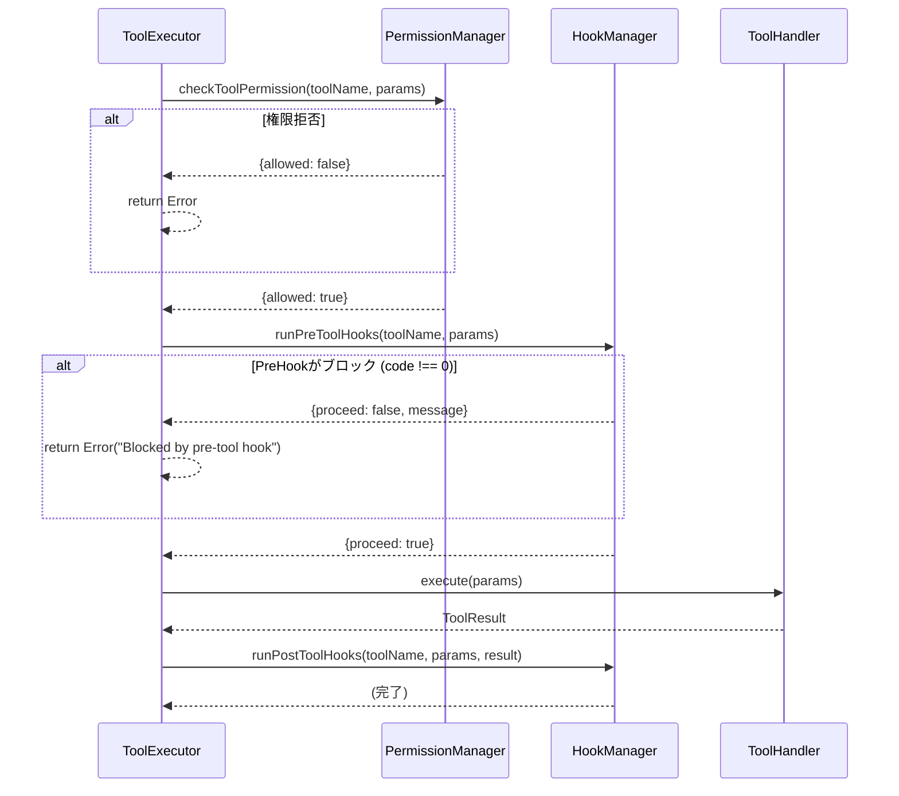
```mermaid
sequenceDiagram
    participant TE as ToolExecutor
    participant PM as PermissionManager
    participant HM as HookManager
    participant Tool as ToolHandler

    TE->>PM: checkToolPermission(toolName, params)
    alt 権限拒否
        PM-->>TE: {allowed: false}
        TE-->>TE: return Error
    end
    PM-->>TE: {allowed: true}

    TE->>HM: runPreToolHooks(toolName, params)
    alt PreHookがブロック (code !== 0)
        HM-->>TE: {proceed: false, message}
        TE-->>TE: return Error("Blocked by pre-tool hook")
    end
    HM-->>TE: {proceed: true}

    TE->>Tool: execute(params)
    Tool-->>TE: ToolResult

    TE->>HM: runPostToolHooks(toolName, params, result)
    HM-->>TE: (完了)
```

### 環境変数の構築 (`buildEnv`)

- `TOOL_NAME`: 常に設定
- `FILE_PATH`: `params.file_path ?? params.path ?? params.pattern ?? params.command` から抽出
- `TOOL_OUTPUT`, `TOOL_SUCCESS`, `TOOL_ERROR`: PostToolUse 時のみ `ToolResult` から設定

### フックのロード順序とマッチングロジック

`loadHooks(projectDir)` メソッドは以下の順序でファイルを読み込みます。

1. `{projectDir}/.claude/hooks.json`
2. `{projectDir}/.localllm/hooks.json`
3. `~/.localllm/hooks.json`

`matcher` が未指定のフックは、同じ `type` のすべてのツール実行にマッチします。`matcher.tool` が指定されている場合はツール名の完全一致、`matcher.filePattern` が指定されている場合は glob パターンマッチ（`*` と `**` をサポート）で判定します。

### index.ts での初期化

```typescript
const hookManager = new HookManager();
hookManager.loadHooks(process.cwd());

const agent = new AgentLoop(
  provider, model, toolRegistry, permissions,
  contextWindow, compressionThreshold,
  hookManager
);

await hookManager.runSessionHooks("start");
// ... REPL実行 ...
await hookManager.runSessionHooks("stop");
```

---

## 6. RuleLoader アーキテクチャ

### 概要

`RuleLoader`（`src/rules/rule-loader.ts`）は、Markdown 形式のルールファイルを複数のソースから読み込み、システムプロンプトに注入する機構です。

### クラス構造

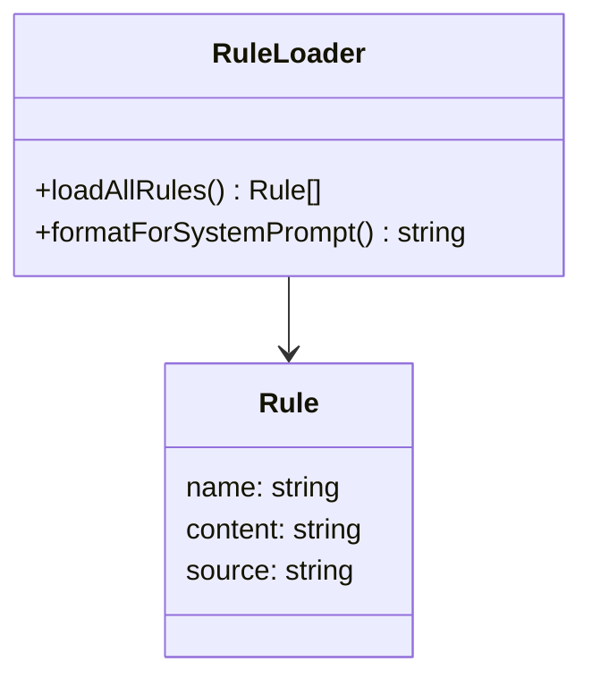
```mermaid
classDiagram
    class RuleLoader {
        +loadAllRules() Rule[]
        +formatForSystemPrompt() string
    }

    class Rule {
        name: string
        content: string
        source: string
    }

    RuleLoader --> Rule
```

### ロード順序

`loadAllRules()` メソッドは以下の順序でルールを読み込みます（すべてのルールが結合されます）。

1. **builtin** (`src/rules/builtin/`): `import.meta.url` から相対パスで解決。組み込み3種（security.md, coding-style.md, git-workflow.md）
2. **user** (`~/.localllm/rules/`): `os.homedir()` ベース
3. **project** (`.claude/rules/`): `process.cwd()` ベース
4. **project** (`.localllm/rules/`): `process.cwd()` ベース

### システムプロンプトへの注入

`formatForSystemPrompt()` メソッドが以下の形式で文字列化し、`buildSystemPrompt()`（`src/agent/system-prompt.ts`）の中でシステムプロンプトの末尾付近に追加されます。

```
# ルール
以下のルールに常に従ってください。

{rule1.content}

{rule2.content}
...
```

---

## 7. IntentClassifier / HierarchicalCompressor（2026-04-14 追加）

旧 ContextModeManager は廃止。代わりに以下を導入:

- **IntentClassifier** (`src/agent/intent-classifier.ts`): ユーザーメッセージの意図分類（task/question/conversation）とAI応答の完了判定。ヒューリスティック→LLM判定の2段構え。
- **HierarchicalCompressor** (`src/agent/hierarchical-compressor.ts`): 3層階層的コンテキスト圧縮（Layer 0: 生データ → Layer 1: ブロック要約 → Layer 2: キーワード圧縮）。

詳細: `docs/context-intelligence.md` を参照。

---

## 8. AgentDefinitionLoader アーキテクチャ

### 概要

`AgentDefinitionLoader`（`src/agents/agent-loader.ts`）は、Markdown + YAML フロントマター形式のエージェント定義ファイルを読み込み、サブエージェントの設定を提供します。

### クラス構造

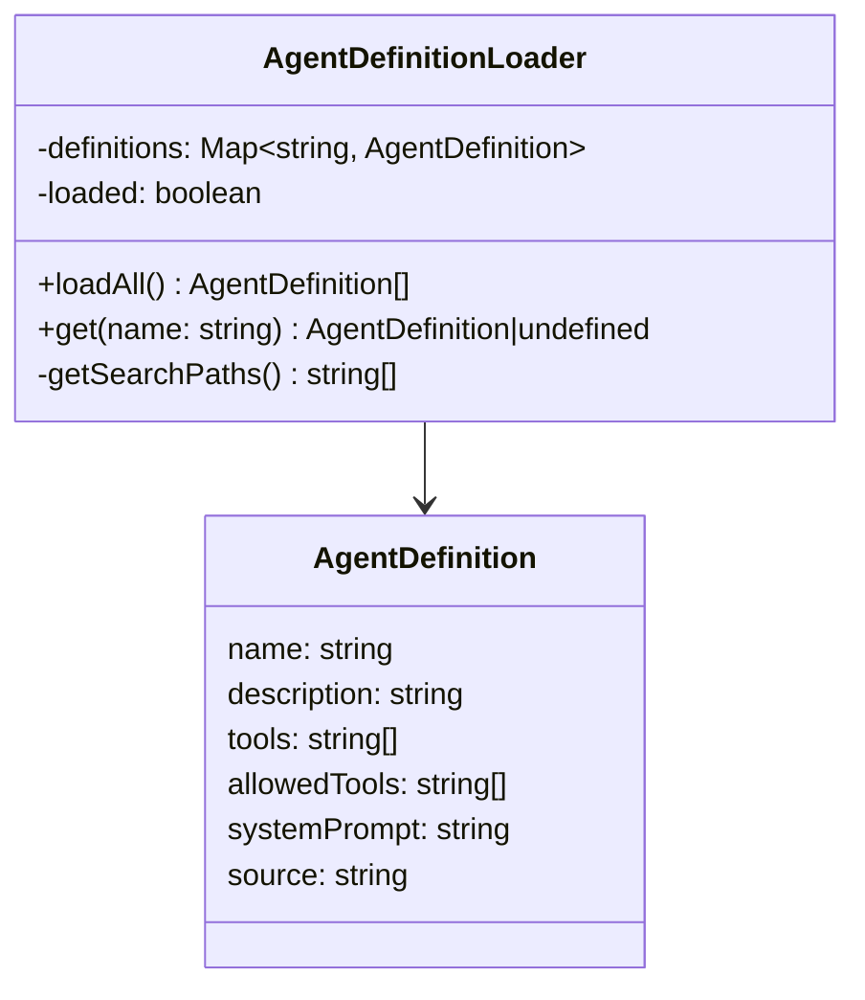
```mermaid
classDiagram
    class AgentDefinitionLoader {
        -definitions: Map~string, AgentDefinition~
        -loaded: boolean
        +loadAll() AgentDefinition[]
        +get(name: string) AgentDefinition|undefined
        -getSearchPaths() string[]
    }

    class AgentDefinition {
        name: string
        description: string
        tools: string[]
        allowedTools: string[]
        systemPrompt: string
        source: string
    }

    AgentDefinitionLoader --> AgentDefinition
```

### ロードの仕組み

- **遅延ロード（Lazy Loading）**: `get(name)` メソッドは内部で `this.loaded` フラグをチェックし、未ロードの場合は `loadAll()` を自動的に呼び出します。
- **ロード順序とオーバーライド**: `getSearchPaths()` が返すパスの順序で読み込み、**同名のエージェントは後のパスで上書き** されます（`Map.set()` による上書き）。

1. `src/agents/builtin/` （`import.meta.url` から `fileURLToPath` で解決）
2. `~/.localllm/agents/` （`getHomedir()` ベース）
3. `.localllm/agents/` （`path.resolve` = CWD相対）

- **フロントマターの解析 (`parseFrontmatter`)**: 独自の簡易 YAML パーサーで文字列値（クォート有無どちらも対応）とフロースタイル配列 `[a, b, c]` をサポート。

### 組み込みエージェント（4種）

| ファイル | name | tools |
|:---|:---|:---|
| `explore.md` | explore | file_read, glob, grep, web_fetch, web_search |
| `plan.md` | plan | file_read, glob, grep, web_fetch, web_search |
| `general-purpose.md` | general-purpose | file_read, file_write, file_edit, glob, grep, bash, web_fetch, web_search, todo_write, ask_user |
| `code-reviewer.md` | code-reviewer | file_read, glob, grep, bash |

---

## 9. MCPManager アーキテクチャ

`MCPManager`（`src/mcp/mcp-manager.ts`）は、MCP（Model Context Protocol）サーバーのライフサイクル管理と、発見されたツールの `ToolRegistry` への統合を担います。

### クラス図

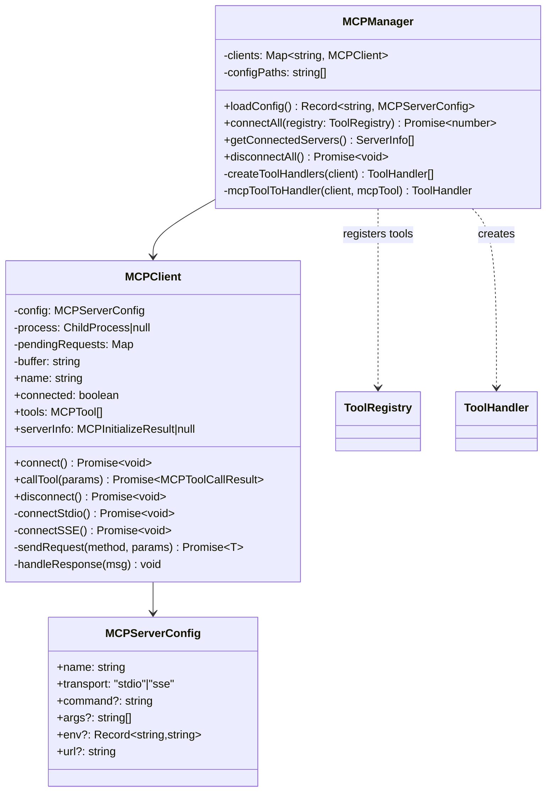
```mermaid
classDiagram
    class MCPManager {
        -clients: Map~string, MCPClient~
        -configPaths: string[]
        +loadConfig() Record~string, MCPServerConfig~
        +connectAll(registry: ToolRegistry) Promise~number~
        +getConnectedServers() ServerInfo[]
        +disconnectAll() Promise~void~
        -createToolHandlers(client) ToolHandler[]
        -mcpToolToHandler(client, mcpTool) ToolHandler
    }

    class MCPClient {
        -config: MCPServerConfig
        -process: ChildProcess|null
        -pendingRequests: Map
        -buffer: string
        +name: string
        +connected: boolean
        +tools: MCPTool[]
        +serverInfo: MCPInitializeResult|null
        +connect() Promise~void~
        +callTool(params) Promise~MCPToolCallResult~
        +disconnect() Promise~void~
        -connectStdio() Promise~void~
        -connectSSE() Promise~void~
        -sendRequest(method, params) Promise~T~
        -handleResponse(msg) void
    }

    class MCPServerConfig {
        +name: string
        +transport: "stdio"|"sse"
        +command?: string
        +args?: string[]
        +env?: Record~string,string~
        +url?: string
    }

    MCPManager --> MCPClient
    MCPClient --> MCPServerConfig
    MCPManager ..> ToolRegistry : registers tools
    MCPManager ..> ToolHandler : creates
```

### 通信シーケンス（stdio トランスポート）

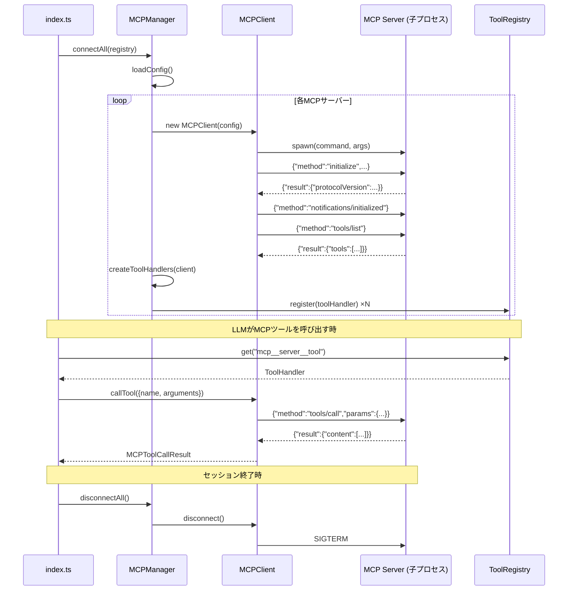
```mermaid
sequenceDiagram
    participant App as index.ts
    participant MM as MCPManager
    participant MC as MCPClient
    participant SP as MCP Server (子プロセス)
    participant TR as ToolRegistry

    App->>MM: connectAll(registry)
    MM->>MM: loadConfig()

    loop 各MCPサーバー
        MM->>MC: new MCPClient(config)
        MC->>SP: spawn(command, args)
        MC->>SP: {"method":"initialize",...}
        SP-->>MC: {"result":{"protocolVersion":...}}
        MC->>SP: {"method":"notifications/initialized"}
        MC->>SP: {"method":"tools/list"}
        SP-->>MC: {"result":{"tools":[...]}}
        MM->>MM: createToolHandlers(client)
        MM->>TR: register(toolHandler) ×N
    end

    Note over App,TR: LLMがMCPツールを呼び出す時

    App->>TR: get("mcp__server__tool")
    TR-->>App: ToolHandler
    App->>MC: callTool({name, arguments})
    MC->>SP: {"method":"tools/call","params":{...}}
    SP-->>MC: {"result":{"content":[...]}}
    MC-->>App: MCPToolCallResult

    Note over App,SP: セッション終了時
    App->>MM: disconnectAll()
    MM->>MC: disconnect()
    MC->>SP: SIGTERM
```

### 設定ファイルの読み込み順序

`loadConfig()` メソッドは以下の順序でファイルを読み込み、同名サーバーは後のパスで上書きされます。

1. `~/.localllm/mcp-servers.json`（ユーザーグローバル）
2. `{projectDir}/.localllm/mcp-servers.json`（プロジェクトローカル）
3. `{projectDir}/.claude/mcp-servers.json`（Claude Code互換）

### ツール命名規則

```
MCPTool { name: "read_file" }
  ↓ mcpToolToHandler()
ToolHandler { name: "mcp__filesystem__read_file" }
```

---

## 10. HTTP通信レイヤーのタイムアウト戦略

### 概要

`src/utils/http-client.ts` は、すべてのLLMプロバイダーおよびWeb系ツールが使用するHTTP通信の基盤モジュールです。ローカルLLMは応答に数分〜数十分を要するため、一般的なWebアプリケーションとは異なるタイムアウト設計が必要です。

### タイムアウト設計

| 関数 | 用途 | デフォルト |
|:---|:---|:---|
| `httpGet` | 接続確認（モデル一覧等） | 10秒 |
| `httpPost` | 非ストリーミングPOST | 5分 |
| `httpPostStream` (接続) | ストリーミング接続確立 | 1時間 |
| `httpPostStream` (アイドル) | ストリーム読み取り | 60分 |

### ストリーミングのタイムアウトアーキテクチャ

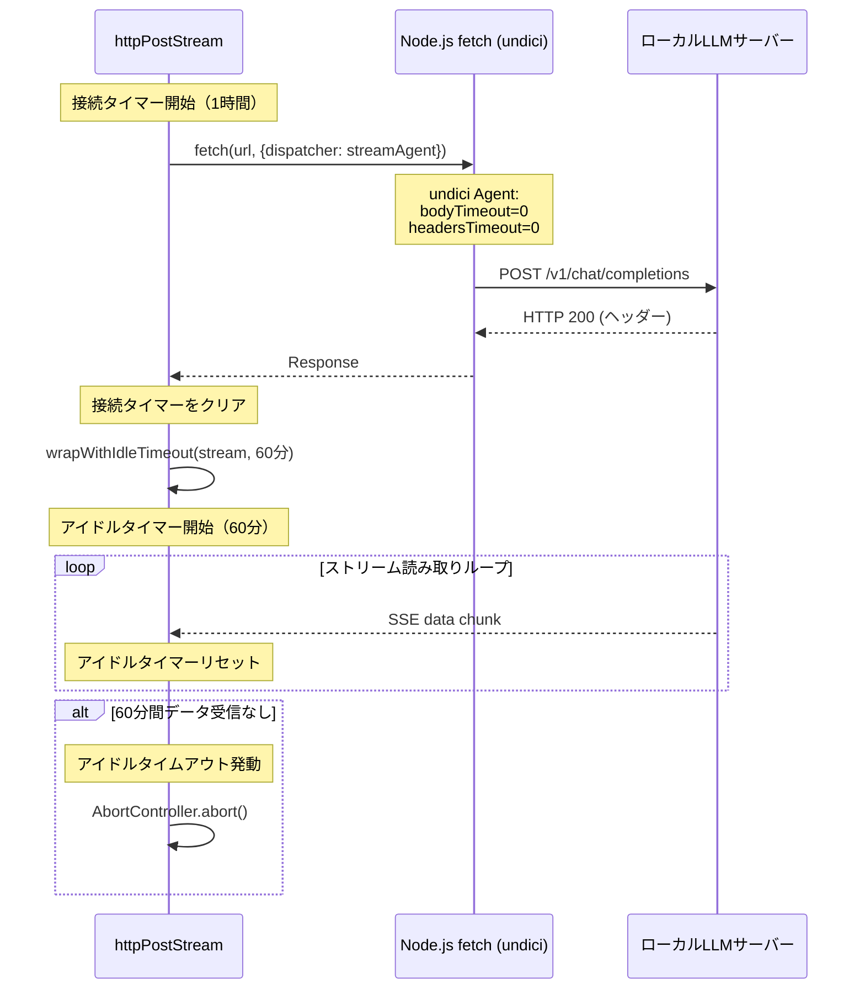
```mermaid
sequenceDiagram
    participant App as httpPostStream
    participant Undici as Node.js fetch (undici)
    participant LLM as ローカルLLMサーバー

    Note over App: 接続タイマー開始（1時間）
    App->>Undici: fetch(url, {dispatcher: streamAgent})
    Note over Undici: undici Agent:<br/>bodyTimeout=0<br/>headersTimeout=0
    Undici->>LLM: POST /v1/chat/completions
    LLM-->>Undici: HTTP 200 (ヘッダー)
    Undici-->>App: Response
    Note over App: 接続タイマーをクリア

    App->>App: wrapWithIdleTimeout(stream, 60分)
    Note over App: アイドルタイマー開始（60分）

    loop ストリーム読み取りループ
        LLM-->>App: SSE data chunk
        Note over App: アイドルタイマーリセット
    end

    alt 60分間データ受信なし
        Note over App: アイドルタイムアウト発動
        App->>App: AbortController.abort()
    end
```

**3層アーキテクチャ:**
1. **undici bodyTimeout の無効化**: `bodyTimeout: 0` / `headersTimeout: 0` のカスタム `Agent` を `dispatcher` として注入し、undici のデフォルト5分タイムアウトを無効化
2. **接続タイムアウト**: `fetch()` からレスポンスヘッダー受信までの最大待機時間（デフォルト1時間）
3. **アイドルタイムアウト**: `wrapWithIdleTimeout()` がチャンク受信ごとにタイマーをリセット。60分間データが受信されない場合のみ中断

| 設計判断 | 理由 |
|:---|:---|
| アイドルタイムアウト60分 | 大型モデル（27B+）の最初のトークン生成に数分〜数十分かかることがある |
| 全体タイムアウトではなくアイドル | ストリーミング中はデータが断続的に到着する。全体時間制限では長い応答が途中で切れる |
| undici Agent をシングルトン化 | リクエストごとにAgentを生成すると接続プールが無駄になるため |

---

## 11. Discord通知統合

### 概要

LLMの応答生成完了時に、応答内容を自動的にDiscordへ通知する機能です。ユーザーはターミナルを監視し続けることなく、別作業をしながら応答結果を受け取れます。

### アーキテクチャ

通知処理は、エージェントループが完了してREPLに制御が戻るタイミング（`src/cli/repl.ts`）で実行されます。これにより、AgentCoreやProviderに影響を与えず、オプショナルな機能として疎結合に保たれています。

```mermaid
sequenceDiagram
    participant User
    participant REPL as CLI (repl.ts)
    participant Loop as AgentLoop
    participant Config as ConfigManager
    participant Discord as Discord Webhook

    User->>REPL: メッセージを入力
    REPL->>Loop: run(userMessage)
    Loop-->>REPL: 実行完了 (History 更新)

    REPL->>Config: Discord設定の確認 (enabled && webhookUrl)
    alt 設定有効
        REPL->>REPL: Historyから最後のAssistantメッセージを抽出
        REPL->>Discord: sendDiscordNotification() HTTP POST
    end
```

### Discord 2000文字制限への対応

Discordの1リクエストあたり2000文字制限に対し、`src/utils/discord.ts` 内の `sendDiscordNotification` が自動的に文字列をチャンクに分割し、複数回の POST リクエストとして順次送信します。分割時はなるべくキリの良い場所（改行など）で区切ります。

---

## 12. 非TTYモード対応と stdin 共有設計

### 背景・問題

パイプ入力（`printf "..." | npm run start`）のような非TTY環境で実行した際に、2つのバグが発生していました。

**バグ1: 並列ツール実行時の権限確認競合**
LLMが複数のツールを `Promise.allSettled` で並列実行すると、各ツールが同時に `inquirer.prompt` を呼び出します。非TTY時は stdin が閉じた瞬間に全インスタンスが `ExitPromptError: User force closed the prompt with 0 null` を投げてクラッシュしていました。

**バグ2: readline が stdin バッファを消費・破棄する問題**
REPL の `fallbackQuestion` が `readline.createInterface` を毎回作成し、`rl.close()` 時に readline の内部バッファに残っていた行データが失われていました。

### 解決策

#### NonTTYReader シングルトン (`src/utils/non-tty-reader.ts`)

readline インスタンスを **1つだけ** 作成し、REPL と PermissionManager で共有します。

```
stdin (pipe)
    │
    ▼
readline.Interface (1インスタンス, terminal: false)
    │
    ├─ "line" イベント
    │       ├─ waiters がある → 即時 resolve
    │       └─ waiters なし  → lineQueue に積む
    │
    └─ "close" イベント → 全 waiters を "" で resolve
```

`lineQueue`（先読みキュー）と `waiters`（待ちリスト）を使い、どちらが先に来ても正しく行データを受け渡します。

#### REPL fallbackQuestion の変更 (`src/cli/interactive-input.ts`)

```typescript
// 変更後
private fallbackQuestion(prefix: string): Promise<string> {
  process.stdout.write(prefix);
  return nonTTYReader.readLine();  // 共有シングルトンから読む
}
```

#### PermissionManager の修正 (`src/security/permission-manager.ts`)

```typescript
// 追加フィールド
private _permissionQueue: Promise<void> = Promise.resolve();

// askUserWithScope: 並列実行を直列化
private async askUserWithScope(...) {
  let resolveQueue!: () => void;
  const prev = this._permissionQueue;
  this._permissionQueue = new Promise<void>((r) => { resolveQueue = r; });
  await prev;  // 前の確認が終わるまで待つ

  try {
    if (!process.stdin.isTTY) {
      return await this.askUserNonTTY(toolName, cacheKey);  // 非TTY: テキストメニュー
    }
    // TTY: inquirer (変更なし) + ExitPromptError キャッチ追加
  } finally {
    resolveQueue();  // 次の確認を解放
  }
}
```

### 非TTY時の権限確認 UI

```
  [bash] $ node .../capture.js 1001
  1: 許可 (今回のみ)
  2: 許可 (bash をセッション中常に許可)
  3: 許可 (bash を設定に保存して常に許可)
  4: 拒否
  5: 中止
選択 [1-5]:
```

**重要**: パイプで数値を送ることで選択できます。**3は config.json を永続変更するため、テスト時は使用禁止。**

### 非TTYモードの適用範囲と制限

| 検証できること | 検証できないこと |
|---|---|
| ファイル生成・保存の成否 | Q→A対話の品質（応答が質問に対応しているか） |
| ツール権限確認の動作 | REPL入力フローのUX（補完・マルチライン等） |
| エラーハンドリング（非TTY経路） | モデルの会話文脈追跡 |
| ビルド・型エラーの有無 | ストリーミング表示のリアルタイム性 |

**REPL対話品質の検証が必要な場合は、必ず手動TTYセッションで確認すること。**

### 長時間タスクの推奨実行パターン

アウトプット品質が重要な長時間タスク（書籍生成・大規模リファクタ等）では、以下のパターンを推奨します。

```
1. バックグラウンド起動（最初のプロンプトのみ）
2. 30分ごとにログを tail -100 で確認
3. 出力を評価して追加指示を投入（別プロセスで追加パイプ）
4. 品質が基準を満たしたら次フェーズへ
```

---

## 13. VLLMProvider アーキテクチャ

### 前提: vLLM のセットアップ要件

vLLM サーバーはエージェント機能に必要なツールコール（`tool_choice: "auto"`）を使うために、以下のオプションを**必ず**指定して起動する必要があります:

```bash
vllm serve <モデル名> --enable-auto-tool-choice --tool-call-parser hermes
```

これらのオプションなしで起動した場合、ツールコールリクエストに対して HTTP 400 が返り、エラーとしてユーザーに通知されます。アプリ側での透過的なフォールバックは行いません。

### thinkingコンテンツフィルタリング

Qwen3 系の reasoning モデルは、vLLM の `--enable-reasoning` 未設定時に thinking コンテンツを `content` フィールドに直接含めます。`</think>` タグのみで thinking と実際の回答を区切る形式になります:

```
（thinking コンテンツ...）</think>

実際の回答...
```

`VLLMProvider.applyThinkFilter()` がこれに対応します。最初の `BUFFER_LIMIT`（2000文字）まで `</think>` を待ちバッファリングし、見つかればそれ以前を捨てて以降をストリーミングします。2000文字を超えた場合は thinking なしと判断してバッファをそのまま flush し、通常ストリーミングに切り替えます。これにより非 thinking モデルでもストリーミング感が維持されます。

```typescript
private async *applyThinkFilter(gen): AsyncGenerator<ChatChunk> {
  const BUFFER_LIMIT = 2000;
  let buffer = "";
  let thinkFilterDone = false;

  for await (const chunk of gen) {
    if (chunk.type === "text" && chunk.text && !thinkFilterDone) {
      buffer += chunk.text;
      const closeIdx = buffer.indexOf("</think>");
      if (closeIdx !== -1) {
        thinkFilterDone = true;
        yield { ...chunk, text: buffer.slice(closeIdx + 8) }; // </think> 以降のみ
      } else if (buffer.length >= BUFFER_LIMIT) {
        thinkFilterDone = true;
        yield { ...chunk, text: buffer }; // thinking なし → flush してストリーミング再開
      }
    } else {
      if (!thinkFilterDone && buffer && chunk.type === "done") {
        yield { type: "text", text: buffer }; // ストリーム完了まで </think> なし → そのまま yield
      }
      yield chunk;
    }
  }
}
```

このフィルタは `chat()` と `chatWithTools()` の両方に適用されます。

### tool-executor の空引数対応

vLLM のネイティブツールコールでは、引数なしのツール（例: `current_datetime`）を呼び出した際に、ストリーミングレスポンスの `arguments` フィールドが送られない場合があります。`ToolExecutor` は空文字列の場合に `{}` として扱います:

```typescript
const argsStr = toolCall.function.arguments?.trim();
params = argsStr ? JSON.parse(argsStr) : {};
```

### LM Studio の reasoning フィールド対応

LM Studio は thinking コンテンツを `reasoning_content` ではなく `reasoning` フィールドで返す場合があります。`OpenAICompatProvider` の SSEDelta 型に `reasoning` フィールドを追加し、`reasoning_content` と同様に thinking チャンクとして処理します。

---

## 11. 試行錯誤モード（TenaciousRunner）

### 11.1 概要

`src/tenacious/tenacious-runner.ts` が `/try` コマンドのオーケストレーションを担います。

**設計参考**:
- [Karpathy/autoresearch](https://github.com/karpathy/autoresearch): 固定試行予算、スコアによる保持/破棄
- [Anthropic harness design](https://www.anthropic.com/engineering/harness-design-long-running-apps): Generator/Evaluator 分離、コンテキストリセット

### 11.2 アーキテクチャ

```
/try コマンド (repl.ts)
  └── runTenacious(options, subAgentManager)
        │
        ├── [1] Planner サブエージェント (plan type)
        │     → 成功基準チェックリスト生成
        │     → 合格ライン: TOTAL_SCORE >= 7/10
        │
        └── [2..N] ループ (最大 maxAttempts 回)
              ├── Generator サブエージェント (general-purpose type)
              │     → 新鮮なコンテキストで実装
              │     → attempt > 1 の場合: 前回フィードバックをプロンプトに注入
              │
              └── Evaluator サブエージェント (plan type)
                    → glob/file_read で実際のファイルを確認
                    → 各基準を 0-10 でスコアリング
                    → "TOTAL_SCORE: X.X" を出力
                    → 合格 → 終了、不合格 → フィードバックを次の Generator へ
```

### 11.3 コンテキストリセットの実装

各サブエージェントは `SubAgentManager.launchForeground()` で独立インスタンスとして起動します。これにより:
- Generator は前回試行の失敗パターンに引きずられない（Anthropic 推奨のコンテキストリセット）
- Evaluator は Generator の自己評価バイアスなしに客観的評価できる（Generator/Evaluator 分離）

### 11.4 主要定数・インターフェース

```typescript
const PASS_SCORE = 7;  // 合格ライン（10点満点）

interface TenaciousOptions {
  prompt: string;       // ユーザーの元プロンプト
  maxAttempts: number;  // 最大試行回数（デフォルト: 3）
}

interface AttemptResult {
  attempt: number;
  generatorSummary: string;  // Generator の作業ログ（先頭500文字）
  evaluatorScore: number;    // Evaluator のスコア（0-10）
  evaluatorFeedback: string; // Evaluator の詳細フィードバック
  passed: boolean;
}
```

### 11.5 評価スコアのパース

Evaluator が出力する `TOTAL_SCORE: X.X` を正規表現で抽出します。見つからない場合はデフォルト 4 点（低め）として扱い、不必要な早期終了を防ぎます。

```typescript
const scoreMatch = text.match(/TOTAL_SCORE:\s*(\d+(?:\.\d+)?)/i);
```
