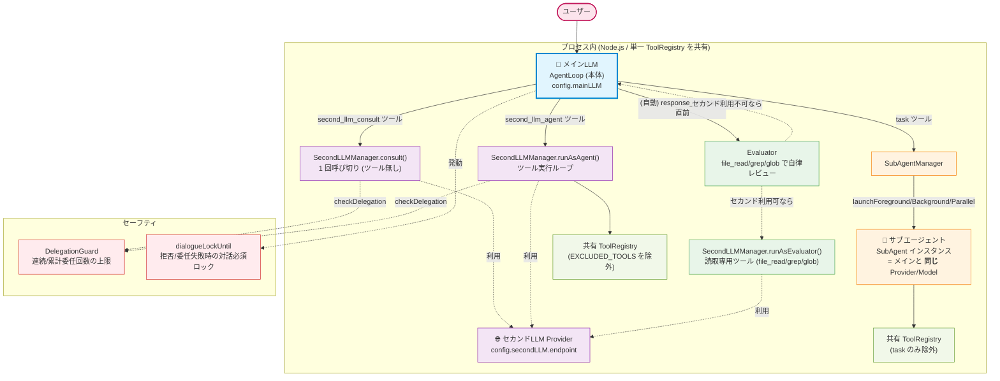
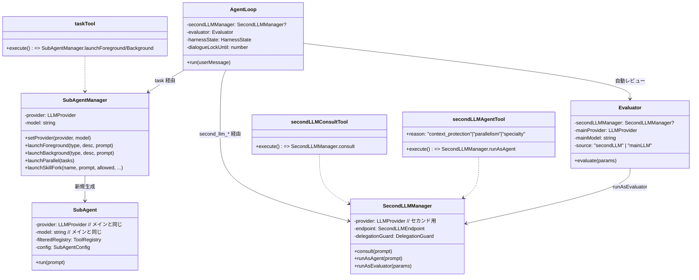
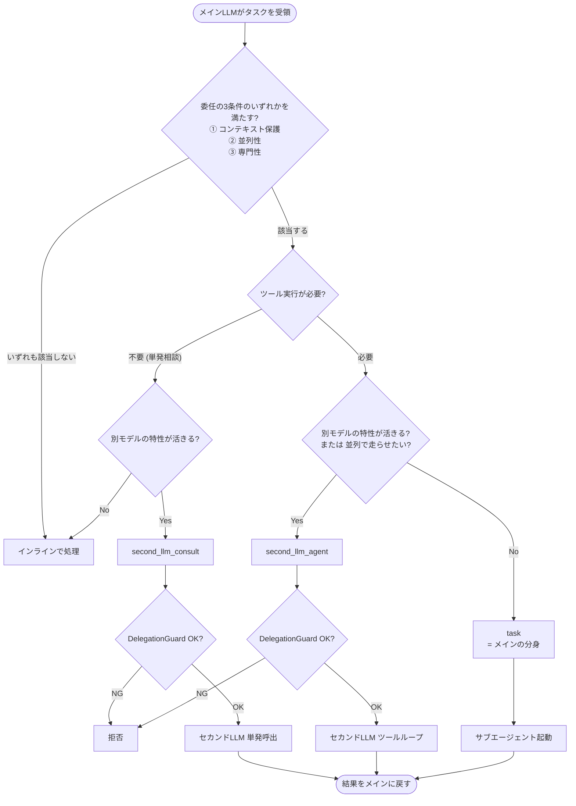
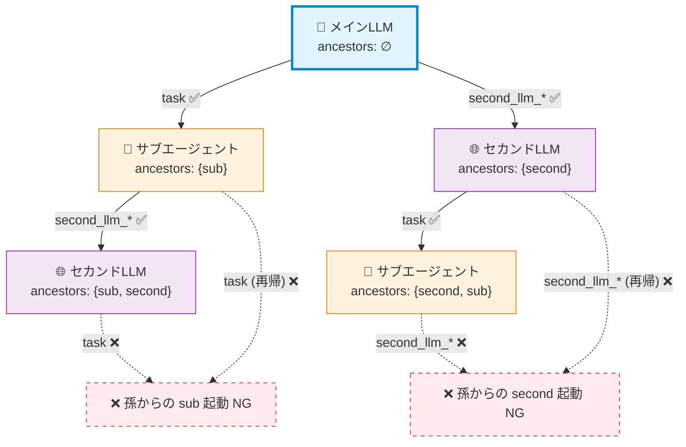

# メインLLM / セカンドLLM / サブエージェント 比較・現状整理

> **作成日**: 2026-04-30
> **目的**: 「メインLLM」「セカンドLLM」「サブエージェント」 という 3 つの実行主体について、**何が違うのか / 何が同じなのか** を 1 か所に集約し、現在のコード実装と過去の設計書の間に生じているズレを可視化する。
> **位置付け**: 修正の足掛かりとなる現状把握資料。 設計の最終形ではない。
> **関連設計書**:
> - 元設計: `docs/v030_second_llm_design.md` (Orchestrator-Worker パターン、 階層型委任ルール)
> - 対称化: `docs/main_second_swap_design.md` (型統一・swap 機能、 主従の対称性)
> - 補助情報: `docs/llm-profile-descriptions.md` (description によるルーティング誘導)
> - ハーネス: `docs/harness-engineering.md`, `docs/harness-engineering-phase5.md` (委任ガード、 Evaluator 統合)

---

## 1. 一言でまとめると

| 主体 | 何者か | LLM | 起動契機 |
|------|--------|-----|----------|
| **メインLLM** | ユーザーと対話する オーケストレータ。 `AgentLoop` 本体 | `config.mainLLM` で指定された Provider/Model | アプリ起動時に 1 つだけ |
| **サブエージェント (task)** | メインLLMの **「分身」**。 同じ Provider/Model を別コンテキストで再起動 | メインLLMと同一 (`SubAgentManager` がメインの provider/model を保持) | メインLLMが `task` ツールを呼んだとき |
| **セカンドLLM consult** | **別の** LLM への単発相談 (ツール無し) | `config.secondLLM.endpoint` で指定された別 Provider/Model | メインLLMが `second_llm_consult` を呼んだとき |
| **セカンドLLM agent** | **別の** LLM をサブエージェント化したもの (ツール有り) | 同上 | メインLLMが `second_llm_agent` を呼んだとき |
| **Evaluator** | 成果物を独立レビューする「第三者」 役 | セカンドLLM があればそちら、 無ければメイン | メインLLMが file_write/edit を完了して response_complete を呼ぶ直前に自動起動 |

ポイント:
- **「サブエージェント」 ≠ 「セカンドLLM」**。 サブエージェント = メインの分身 (同一モデル) / セカンドLLM = 別モデル
- サブエージェントは **メインの能力を別コンテキストでもう一度走らせる** (コンテキスト分離が主目的)
- セカンドLLMは **異なる特性を持った別モデルに渡す** (専門性 / コスト効率 / 並列性が主目的)
- Evaluator は v0.3.0 設計書には無い、 後付けの概念。 セカンドLLMがあれば自動的にレビュー役を兼ねる

---

## 2. 全体俯瞰図



凡例:
- **🎯 メインLLM** = ユーザーと直接対話する。 1 プロセスに 1 つ
- **👤 サブエージェント** = メインの分身 (同 Provider/Model)。 task ツールで起動
- **🌐 セカンドLLM** = 別 Provider/Model。 consult / agent / evaluator の 3 用途
- 共有部分: `ToolRegistry` / `PermissionManager` / `Sandbox` / `HarnessState` (各エージェントごとにインスタンスを分けるが、 contract は共通)

---

## 3. 比較表 — どこが同じでどこが違うか

### 3.1 LLM・コンテキスト面

| 観点 | メインLLM | サブエージェント (task) | セカンドLLM consult | セカンドLLM agent | Evaluator |
|------|-----------|--------------------------|----------------------|-------------------|-----------|
| **Provider/Model** | `config.mainLLM` | メインと **同一** (継承) | `config.secondLLM.endpoint` | 同左 | セカンドが利用可 ⇒ セカンド / 不可 ⇒ メイン |
| **会話履歴** | 永続 (`MessageHistory`) | **新規** (1 タスク完了で破棄) | **新規** (1 リクエストで破棄) | **新規** (1 タスク完了で破棄) | **新規** (1 評価で破棄) |
| **System Prompt** | `buildSystemPrompt()` (フル) | 各サブエージェント定義 (`explore`/`plan`/`general-purpose`/`bash`) または `.md` 定義 | 「単発相談用」 圧縮版 | `buildSubAgentStrategyPrompt()` (戦略原則を継承) | `EVALUATOR_SYSTEM_PROMPT_AGENTIC` (評価専用) |
| **コンテキスト圧縮** | あり (`ContextManager`) | なし (短命のため) | なし | なし (15 ターン上限のため) | なし |

### 3.2 ツールアクセス面

| 観点 | メインLLM | サブエージェント (task) | セカンドLLM consult | セカンドLLM agent | Evaluator |
|------|-----------|--------------------------|----------------------|-------------------|-----------|
| **使えるツール** | 全ツール | `allowedTools` 指定があればホワイトリスト / 無ければ **`task` のみ除外** | **無し** | 共有 ToolRegistry から `EXCLUDED_TOOLS` を除いた全て | `file_read` / `grep` / `glob` の 3 つ |
| **EXCLUDED_TOOLS** | (なし) | `task` のみ | n/a | `task`, `task_output`, `second_llm_consult`, `second_llm_agent`, `enter_plan_mode`, `exit_plan_mode` | n/a (ホワイトリスト方式) |
| **ハーネス介入** | あり (`harnessState`) | なし | なし | あり (`HarnessState` 独立インスタンス) | あり (`HarnessState` 独立インスタンス) |
| **dialogueLock の影響** | 受ける (file_write/edit を tool 層で拒否) | 受けない | 受けない | 受けない | 受けない |

### 3.3 制御・上限面

| 観点 | メインLLM | サブエージェント | セカンドLLM consult | セカンドLLM agent | Evaluator |
|------|-----------|------------------|---------------------|-------------------|-----------|
| **ターン上限** | `MAX_TOOL_ITERATIONS` | `maxTurns` (定義) または `MAX_SUB_ITERATIONS = 30` | 1 (構造的に) | `MAX_ITERATIONS = 15` | `params.maxIterations ?? 10` |
| **委任ガード対象** | n/a | n/a | あり (`checkDelegation`) | あり | **無し** (独立レビューと位置付け) |
| **DelegationGuard 上限** | n/a | n/a | maxConsecutive=5 / maxTotal=20 | 同左 | n/a |
| **サンプリング (温度)** | `samplingParams` で `/model temperature` 等から指定 | メイン継承 | endpoint 設定 ?? **0.2** (fallback) | endpoint 設定 ?? **0.2** | endpoint 設定 ?? **0.1** |

### 3.4 ライフサイクル

| 観点 | メインLLM | サブエージェント | セカンドLLM consult | セカンドLLM agent | Evaluator |
|------|-----------|------------------|---------------------|-------------------|-----------|
| **生成タイミング** | アプリ起動時 (`src/index.ts`) | `task` ツール実行時に都度 `new SubAgent(...)` | `second_llm_consult` 実行時にメッセージ列を都度組成 | 同上 | response_complete 直前に毎回 `evaluator.evaluate(...)` |
| **再利用** | 1 プロセスを通じて | 1 タスクで使い捨て | 1 リクエストで使い捨て | 1 タスクで使い捨て | 1 評価で使い捨て |
| **swap で置換** | `/swap` で endpoint 入替 | 親が swap されればその後生成される子は新 endpoint | `/swap` で endpoint 入替 | 同左 | セカンド endpoint 入替時に `setMainProvider` で再判定 |

---

## 4. コード構造のマッピング



主要ファイル:
- `src/agent/agent-loop.ts` — メインLLM の本体
- `src/agent/sub-agent.ts` — `SubAgent` / `SubAgentManager`
- `src/second-llm/second-llm-manager.ts` — セカンドLLM の 3 モード
- `src/second-llm/delegation-guard.ts` — 委任ガード
- `src/agent/evaluator.ts` — Evaluator
- `src/tools/definitions/task.ts` — `task` / `task_output` ツール
- `src/tools/definitions/second-llm.ts` — `second_llm_consult` / `second_llm_agent` ツール

---

## 5. 委任の意思決定フロー (現在の実装)



メイン側のシステムプロンプトに埋め込まれている判定ガイド (`src/agent/system-prompt.ts:151-176`):

> 委任は 3 条件のいずれかが満たされる時のみ。 それ以外はインライン処理。
> 1. コンテキスト保護: 大量ファイル読込で本セッションのコンテキストを浪費したくない
> 2. 並列性: 独立した複数タスクを同時に走らせたい
> 3. 専門性: 別モデルの特性 (高速/別視点等) が活きるタスク
>
> 委任時のレジスター継承 [必須]: delegate メッセージには ① レジスター ② 完成基準 ③ 仕様ファイルパス ④ 成果物保存先 を必ず含める。

`second_llm_agent` には `reason` 引数 (`context_protection` / `parallelism` / `specialty`) のハードガードがあり、 該当しない委任は tool 層で拒否される (`src/tools/definitions/second-llm.ts:177-190`)。

---

## 6. 設計意図と現状のズレ — 決定事項 (2026-04-30)

> 初版では「修正検討材料」 として並べていた項目について、 ユーザーとの議論を経て方針を確定した。 各項に **【決定】** / **【現状維持】** / **【後続実装】** のラベルを付ける。

### 6.1 委任の階層ガードを再設計する 【決定 + 後続実装】

#### 許可される委任関係 (新ルール)



要約:
- **メイン → sub**: OK / **メイン → second**: OK
- **sub → second**: OK (子の異種起動は 1 段だけ許可)
- **second → sub**: OK (同上)
- **sub → second → sub**: ❌ (孫からの異種起動は禁止)
- **second → sub → second**: ❌ (同上)
- **sub → sub** (同種再帰): ❌ (現状 `task` 除外で実現済み)
- **second → second** (同種再帰): ❌ (現状 `EXCLUDED_TOOLS` で実現済み)

#### 実装方針 — `ancestorTypes` ベースの委任階層トラッキング

各エージェント実行コンテキストに `ancestorTypes: ReadonlySet<"sub" | "second">` を持たせる:

```ts
// 新規型 (src/agent/delegation-context.ts などに置く)
export type DelegationOrigin = "sub" | "second";
export type AncestorTypes = ReadonlySet<DelegationOrigin>;

export const ROOT_ANCESTORS: AncestorTypes = new Set();

export function extendAncestors(
  current: AncestorTypes,
  origin: DelegationOrigin,
): AncestorTypes {
  const next = new Set(current);
  next.add(origin);
  return next;
}

/** ancestorTypes から ToolRegistry の除外対象を計算する */
export function excludedToolsFor(ancestors: AncestorTypes): Set<string> {
  const excluded = new Set<string>([
    // plan モード系は子では常に禁止 (リーダー専権)
    "enter_plan_mode",
    "exit_plan_mode",
  ]);
  if (ancestors.has("sub")) {
    excluded.add("task");
    excluded.add("task_output");
  }
  if (ancestors.has("second")) {
    excluded.add("second_llm_consult");
    excluded.add("second_llm_agent");
  }
  return excluded;
}
```

伝播経路:

| 呼出 | 親 ancestors | 子 ancestors |
|------|--------------|---------------|
| メイン → sub (`task`) | ∅ | {sub} |
| メイン → second (`second_llm_*`) | ∅ | {second} |
| sub → second (`second_llm_*`) | {sub} | {sub, second} |
| second → sub (`task`) | {second} | {second, sub} |
| sub → sub (`task`) | {sub} | **拒否** (`excludedToolsFor` で task が除外されているため、 そもそもツールが見えない) |
| second → second (`second_llm_*`) | {second} | **拒否** (同上) |
| 孫 → 何か | {sub, second} | task と second_llm_* の両方が除外 → 起動できない |

#### 実装変更点 (概要)

| ファイル | 変更内容 |
|---------|----------|
| `src/agent/delegation-context.ts` (新規) | `AncestorTypes`, `ROOT_ANCESTORS`, `extendAncestors`, `excludedToolsFor` |
| `src/agent/agent-loop.ts` | `ToolExecutor` 生成時に `ancestors = ROOT_ANCESTORS` を渡す |
| `src/tools/tool-executor.ts` | `ancestors: AncestorTypes` フィールドを保持。 task / second_llm_* 実行時に子へ伝播 |
| `src/agent/sub-agent.ts` | `parentAncestors` 引数を追加し、 `excludedToolsFor(parent ∪ {sub})` を `filteredRegistry` に適用 (現在の `task` のみ除外を置き換え) |
| `src/second-llm/second-llm-manager.ts` | `consult` / `runAsAgent` に `parentAncestors` 引数追加。 ツール定義 (`tools/definitions/second-llm.ts`) では現状 hard-coded な `EXCLUDED_TOOLS` を `excludedToolsFor(parent ∪ {second})` に置き換え |
| `src/tools/definitions/task.ts` | `subAgentManager.launchForeground` の呼び出しで `parentAncestors` を伝播 |
| `src/tools/definitions/second-llm.ts` | `secondLLMManager.runAsAgent / consult` の呼び出しで `parentAncestors` を伝播 |

ガード破りの試み (現 `EXCLUDED_TOOLS` のような単純除外を回避するモデル) でも、 **ToolRegistry レベルでツール定義そのものが見えない** ため構造的に呼び出し不可。 これは v030 設計書 §2.3 の「C1 制約」 を ancestorTypes ベースで再構築したもの。

**Phase A**: 設計書反映 (本ドキュメント + v030 更新) → **Phase B**: コード実装 (上記の変更) → **Phase C**: テスト追加 (sub → second → sub が拒否されることを確認するユニットテスト)

### 6.2 「メイン=ローカル限定」 の前提を撤回する 【決定 + 後続文書更新】

**決定**: メインLLMもセカンドLLMも、 ローカル / クラウドの両方をサポート。 アプリケーション全体がクラウドLLMだけで動作する構成も正規構成として認める。

実装側はすでに `mainLLM: LLMEndpoint` で cloud Provider (vertex-ai / azure-openai / azure-anthropic) を指定可能 (型統一は `docs/main_second_swap_design.md` §2.1)。 残作業は **設計書側の表現修正のみ**:

- `docs/v030_second_llm_design.md` §1.1 / §1.2: 「メインLLM (ローカルLLM) を補完する」「メインLLM = ローカルLLMのみ」 を撤回
- README / setup-wizard ドキュメント: クラウドのみ構成の手順を併記

> 本ドキュメントの §2 / §3 では既に「メイン = `config.mainLLM`」 (provider を限定しない) という記述になっている。 v030 を本ドキュメントの方針に合わせて改訂する。

### 6.3 Evaluator を設計書に追加する 【決定 + 後続文書更新】

**決定**: Evaluator は **セカンドLLMの 3 用途のうちの 1 つ** ではなく、 **ハーネス側のレビュー機構** として独立記述する。 ただし「セカンドLLMが利用可能ならそちらを使う / 不可ならメインLLMで 1 回呼び切り」 のフォールバック挙動は維持。

理由: Evaluator は委任ガード (DelegationGuard) の対象外で、 ユーザーターンごとに必ず動く構造的な機構。 ユーザーの委任意図とは独立した責務。

設計書反映:
- `docs/v030_second_llm_design.md` §1.3 「動作モード」 の表に注記を追加し、 詳細は `docs/harness-engineering*.md` に委ねる
- `docs/v030_second_llm_design.md` §4.1 (`SecondLLMMode` 型) に `evaluator` を追加 (ただし「ハーネス起源」 と注記)

### 6.4 DelegationGuard の数値を実装に合わせる 【決定 + 後続文書更新】

実装値を正とし、 v030 設計書側を実装値に揃える:

| 項目 | 実装値 (`src/second-llm/second-llm-manager.ts:74-78`) |
|------|------------------------------------------------------|
| 連続委任上限 | `maxConsecutiveDelegations = 5` |
| セッション全体上限 | `maxTotalDelegations = 20` |
| エージェントモードのループ上限 | `MAX_ITERATIONS = 15` |

> Phase 5 のハーネス試行錯誤で実用最適点として落ち着いた値。 設計書 §2.3, §4.2 をこの値に書き換える。

### 6.5 「@second」 プレフィックス / `/second ask` は不採用 【決定】

**決定**: v030 §7.3 の `@second` プレフィックスや `/second ask` コマンドは **採用しない**。 ユーザーがセカンドLLMに直接アクセスする手段としては、 後発機能の `/swap` (`docs/main_second_swap_design.md`) が代替する:

- **通常運用**: メインLLMが自身の判断で `second_llm_consult` / `second_llm_agent` を呼ぶ (description によるルーティング誘導)
- **明示切替**: ユーザーが一時的にセカンドを「メイン化」 したい場合は `/swap` で endpoint を入れ替え、 用件後に再度 `/swap` で戻す
- 熟練ユーザーが「セカンドにだけ声がけ」 する操作は不要 (swap で目的を達成できる)

設計書反映:
- `docs/v030_second_llm_design.md` §7.3 の経路 1 (`@second`) と経路 2 (`/second ask`) を **打ち消し線 + 「不採用、 swap で代替」** の注記に置き換え
- 経路 3 (LLM の自発的呼出) のみを残す

### 6.6 SubAgent コンストラクタの Provider 任意性は将来拡張余地として残す 【現状維持】

`SubAgent` のコンストラクタが任意の `provider` / `model` を受け取れる現状は、 **設計思想通り**:

- 現状は `SubAgentManager` 経由でメインの provider/model だけが渡される運用 (= task はメイン固定)
- 将来 `task` ツールが `use_model: "main" | "second"` を取るような拡張をしたいとき、 `SubAgent` 側の構造を変更しなくて済むため、 任意 Provider 受け入れは「拡張余地」 として残す
- 現時点ではそのメリットが見込まれないため、 コードを閉じる (型を絞る) 修正は **行わない**

文書化のみ: `src/agent/sub-agent.ts` のコンストラクタ JSDoc に「現運用ではメインの provider/model のみ。 将来 task が `use_model` を取る場合の拡張余地として任意 Provider を受け付ける形を残してある」 を追記する (実装変更ではないので低優先)。

### 6.7 セカンドLLMの 3 用途 — 現状維持 + 将来余地として記述 【現状維持】

評価器を別 endpoint で走らせるニーズが顕在化していないため現状維持。 ただし `docs/v030_second_llm_design.md` の Future Work 節に「`evaluatorLLM` endpoint を別建てするオプション」 を将来拡張候補として記載する。

### 6.8 SubAgent にハーネス介入を必須化する 【決定 + 後続実装】

**決定**: SubAgent もメイン / セカンドと同等のハーネス介入レイヤを通す。

実装方針 (`src/agent/sub-agent.ts:214` の `run()` 内):

```ts
import { HarnessState, enrichToolResult } from "./harness-intervention.js";

async run(prompt: string): Promise<SubAgentResult> {
  // ...
  const harnessState = new HarnessState();
  // 各 toolExecutor.execute(...) の直後で:
  const enriched = enrichToolResult(toolCall, result.success, raw, harnessState);
  this.history.addToolResult(toolCall.id, enriched);
  // ...
}
```

これにより `SubAgent` でも以下が効くようになる:
- 壁ドンループ警告 (同一ツール / 同一エラーの連続検出)
- Read→Edit 契約 (file_read を経ない盲目 file_edit のブロック)
- 連続委任ガード (孫レベルでの想定外の sub→second 連打を 5 回で警告)
- 旧エラーパターンへのガイダンス追加

既存の `SubAgent` 専用ロジック (`hasLargeCodeBlock` / `extractFakeFileWriteCalls` / `isStructurallyIncomplete`) はそのまま維持し、 ハーネス層と並行して効かせる。

### 6.9 サンプリング fallback を設定に外出しする 【決定 + 後続実装】

**決定**: `consult=0.2` / `runAsAgent=0.2` / `runAsEvaluator=0.1` のハードコードを廃止し、 `config.secondLLM` 配下に明示する。

設定スキーマ (`src/config/types.ts`) の追加:

```ts
export interface SecondLLMSamplingDefaults {
  /** 単発相談時の温度 (consult)。 endpoint.temperature が未指定の場合の fallback */
  consultTemperature?: number;     // default: 0.2
  /** エージェント実行時の温度 (runAsAgent)。 同上 */
  agentTemperature?: number;       // default: 0.2
  /** Evaluator 実行時の温度 (runAsEvaluator)。 同上 */
  evaluatorTemperature?: number;   // default: 0.1
}

export interface SecondLLMConfig {
  enabled: boolean;
  endpoint: SecondLLMEndpoint;
  budget: BudgetConfig | null;
  cost: CostConfig;
  /** サンプリング fallback (用途別)。 endpoint.temperature が指定されていればそちら優先 */
  samplingDefaults?: SecondLLMSamplingDefaults;
}
```

優先順位:
1. `endpoint.temperature` (個別 endpoint で明示された値、 `/second temperature` 経由で設定可)
2. `secondLLM.samplingDefaults.{consultTemperature | agentTemperature | evaluatorTemperature}` (用途別 default)
3. ハードコード fallback (`0.2` / `0.2` / `0.1` — 後方互換のため残す)

`SecondLLMManager.resolveSampling(fallbackTemperature)` のシグネチャを `resolveSampling(mode: "consult" | "agent" | "evaluator")` に変更し、 内部で上記の優先順位を適用する。

`top_p` / `top_k` / `repetition_penalty` も同様の優先順位で外出しする。

新たな REPL コマンド (任意):
- `/second sampling consult <値>` / `agent <値>` / `evaluator <値>` で `samplingDefaults` を直接設定可能に。 既存の `/second temperature` (= endpoint.temperature) との使い分けを `/help` に明記。

---

## 7. 設計の決定事項 — まとめ

| ID | 決定内容 | 性質 |
|----|----------|------|
| D1 | `ancestorTypes` ベースの委任階層ガードを導入。 sub→second→sub と second→sub→second を構造的に拒否 | 後続実装 |
| D2 | メインもセカンドもクラウドLLM可。 全クラウド構成を正規としてサポート | 後続文書更新 |
| D3 | Evaluator はハーネス側の独立機構。 セカンドLLM 不在時はメインで 1 回呼び切りフォールバック (現状維持) | 文書整備 |
| D4 | DelegationGuard 数値は実装値 (5/20/15) を正とし、 v030 設計書を揃える | 文書更新 |
| D5 | `@second` プレフィックス / `/second ask` は **不採用**。 直接アクセスは `/swap` で代替 | 確定 |
| D6 | `SubAgent` の Provider 任意性は将来拡張余地として残す | 現状維持 |
| D7 | Evaluator 用に別 endpoint を持たせる構造は現状不要、 将来余地として記述 | 現状維持 |
| D8 | `SubAgent` にもハーネス介入 (`HarnessState` + `enrichToolResult`) を入れる。 必須 | 後続実装 |
| D9 | サンプリング fallback (温度等) を `config.secondLLM.samplingDefaults` に外出し | 後続実装 |

---

## 8. 後続実装タスクリスト

D1, D8, D9 は実装を伴う。 ファイル単位での予定:

| # | ファイル | 主な変更 | 関連 D |
|---|----------|---------|--------|
| 1 | `src/agent/delegation-context.ts` (新規) | `AncestorTypes`, `ROOT_ANCESTORS`, `extendAncestors`, `excludedToolsFor` を実装 | D1 |
| 2 | `src/tools/tool-executor.ts` | `ancestors: AncestorTypes` フィールドを追加。 task / second_llm_* に対する子コンテキスト生成時に伝播 | D1 |
| 3 | `src/agent/agent-loop.ts` | ToolExecutor に `ROOT_ANCESTORS` を渡す | D1 |
| 4 | `src/agent/sub-agent.ts` | `parentAncestors` 引数を受け取り、 `excludedToolsFor(parent ∪ {sub})` でフィルタリング。 `HarnessState + enrichToolResult` を導入 | D1, D8 |
| 5 | `src/second-llm/second-llm-manager.ts` | `consult` / `runAsAgent` に `parentAncestors` 引数。 `EXCLUDED_TOOLS` 定数を `excludedToolsFor(parent ∪ {second})` 呼び出しに置換。 `resolveSampling(mode)` に変更 | D1, D9 |
| 6 | `src/tools/definitions/task.ts` | `parentAncestors` を `subAgentManager.launchForeground/Background/Parallel` に伝播 | D1 |
| 7 | `src/tools/definitions/second-llm.ts` | `parentAncestors` を `secondLLMManager.runAsAgent/consult` に伝播 | D1 |
| 8 | `src/config/types.ts` | `SecondLLMSamplingDefaults` 型追加、 `SecondLLMConfig.samplingDefaults` フィールド追加 | D9 |
| 9 | `src/cli/repl.ts` | `/second sampling consult/agent/evaluator <値>` コマンドを追加 (任意) | D9 |
| 10 | `tests/agent/delegation-context.test.ts` (新規) | sub→second→sub と second→sub→second が拒否されることを確認 | D1 |
| 11 | `tests/agent/sub-agent-harness.test.ts` (新規) | 壁ドンループが SubAgent でも検出されることを確認 | D8 |
| 12 | `docs/v030_second_llm_design.md` | §1.2, §1.3, §2.3, §4.1, §4.2, §7.3 の更新 | D2, D3, D4, D5 |

---

## 9. 関連ファイル一覧 (現状把握用)

| 役割 | ファイル |
|------|----------|
| メインLLM | `src/agent/agent-loop.ts` |
| メイン用 system prompt | `src/agent/system-prompt.ts` |
| サブエージェント | `src/agent/sub-agent.ts` |
| サブエージェント定義 | `src/agents/agent-loader.ts` + `~/.localllm/agents/*.md` |
| セカンドLLM | `src/second-llm/second-llm-manager.ts` |
| セカンドLLM ガード | `src/second-llm/delegation-guard.ts` |
| Evaluator | `src/agent/evaluator.ts` |
| ハーネス共通介入 | `src/agent/harness-intervention.ts` |
| LLM プロファイル | `src/agent/llm-profiles.ts` |
| task ツール | `src/tools/definitions/task.ts` |
| second_llm_* ツール | `src/tools/definitions/second-llm.ts` |
| 起動・初期化 | `src/index.ts` (Line 215〜260, 330〜332, 457) |
| swap コマンド | `src/cli/repl.ts` (`/swap`, `/second *`, `/model *`) |
| 型定義 | `src/config/types.ts` (`LLMEndpoint`, `SecondLLMEndpoint`, `SecondLLMConfig`) |

**設計書一覧 (時系列)**:
1. `docs/v030_second_llm_design.md` (2026-03-15) — Orchestrator-Worker パターン、 階層型委任、 Credential Vault
2. `docs/llm-profile-descriptions.md` (時期不明) — description によるルーティング誘導
3. `docs/harness-engineering.md` / `harness-engineering-phase5.md` (Phase 5: 2026 春) — Evaluator・ハーネス介入の導入
4. `docs/main_second_swap_design.md` (2026-04-29) — 型統一・主従対称化
