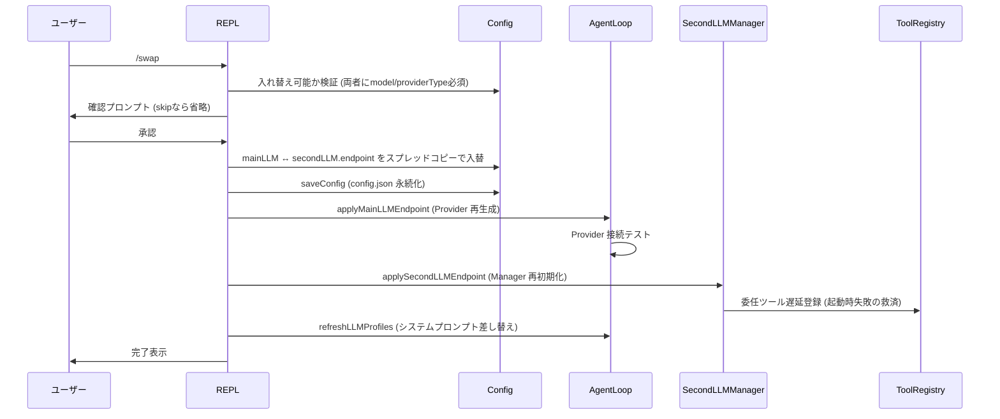

# メイン⇔セカンド LLM 入れ替え機能 設計書

> **ステータス**: 実装済み (2026-04-29)
> **作成日**: 2026-04-29
> **関連**:
> - 上位設計: `docs/v030_second_llm_design.md` (セカンドLLM 機能全体)
> - 構成リファレンス: `docs/config-reference.md` §secondLLM
> - LLM プロファイル: `docs/llm-profile-descriptions.md`

---

## 1. 動機

### 1.1 背景 — 主従関係の最適解は実験対象

メインLLM (Orchestrator) とセカンドLLM (Worker) の役割分担について、 「どちらが賢い方が良いか」 は一意に決まらない。 大別して2つの戦略がある:

| 戦略 | メイン | セカンド | 想定される用途 |
|------|--------|----------|----------------|
| **A. 重メイン + 軽セカンド** | 高品質モデル (例: Claude Sonnet) | 軽量・高速モデル (例: Qwen 7B) | ユーザー要望を高品質モデルが解釈 → 細分化したサブタスクを軽量モデルに委任。 並列性・コスト効率を重視 |
| **B. 軽メイン + 重セカンド** | 軽量・高速モデル | 高品質モデル | 軽量モデルでユーザー対話を回し、 重要な判断のみ重いモデルに翻訳して投げる。 コスト最小化を重視 |

「賢くて速くて安い」 モデルが理想だが現実には存在しない。 ユーザー固有のワークロード・予算・モデル可用性によって最適解が変わるため、 **両方を気軽に試行錯誤できる** ことが価値となる。

### 1.2 既存の障害

v0.3.0 セカンドLLM 設計 (`docs/v030_second_llm_design.md`) では `LLMEndpoint` (メインLLM) と `SecondLLMEndpoint` (セカンドLLM) が **異なる型** で定義されていた:

| 項目 | LLMEndpoint | SecondLLMEndpoint (旧) |
|------|-------------|------------------------|
| `providerType` | ✓ | ✓ |
| `model` / `baseUrl` / `contextWindow` | ✓ | ✓ |
| `endpoint` / `apiKey` / `deploymentName` (Azure) | ✓ | ✓ |
| `projectId` / `region` (Vertex AI) | ✓ | ✓ |
| `description` (特性説明) | ✓ | ✓ |
| **`temperature` / `top_p` / `top_k` / `repetition_penalty`** | ✓ | **✗ (型に無し)** |

サンプリングパラメータが セカンド側に無いため:

- ユーザーが `/model temperature 0.8` でメイン側を設定 → swap → セカンド側に保持できない
- `second_llm_consult` / `second_llm_agent` / `second_llm_evaluator` のサンプリング温度は **ハードコード** (consult/agent=0.2, evaluator=0.1) で外から触れない
- メインに昇格してもサーバー既定値で動作 → `/model` で調整しても次の swap で消える

これは 「気軽に試行錯誤」 の原則に反する。

---

## 2. 仕様

### 2.1 型統一

`SecondLLMEndpoint` を `LLMEndpoint` の型エイリアスに変更する:

```ts
// src/config/types.ts
export type SecondLLMEndpoint = LLMEndpoint;
```

これにより両者は構造的に区別がなくなり、 swap 時の片道情報損失が原理的に発生しなくなる。

### 2.2 セカンドLLM サンプリングパラメータ反映

`SecondLLMManager` に `resolveSampling(fallbackTemperature)` ヘルパーを追加し、 endpoint 設定値があればそれを優先、 無ければ各メソッド固有の fallback 温度を使う:

```ts
private resolveSampling(fallbackTemperature: number): {
  temperature: number;
  top_p?: number;
  top_k?: number;
  repetition_penalty?: number;
} {
  const ep = this.endpoint;
  return {
    temperature: ep?.temperature ?? fallbackTemperature,
    ...(ep?.top_p !== undefined && { top_p: ep.top_p }),
    ...(ep?.top_k !== undefined && { top_k: ep.top_k }),
    ...(ep?.repetition_penalty !== undefined && { repetition_penalty: ep.repetition_penalty }),
  };
}
```

| メソッド | fallback temperature | 用途 |
|----------|---------------------|------|
| `consult` | 0.2 | 単発相談 (ツール無し) |
| `runAsAgent` | 0.2 | サブエージェント実行 (ツール有り) |
| `runAsEvaluator` | 0.1 | 評価モード (低温度で決定的) |

ユーザーが `/second temperature` 等で endpoint に値を設定すれば、 fallback を上書きできる。

### 2.3 `/swap` (alias `/switch`) コマンド

メイン⇔セカンドの設定を一括入れ替え:

```
/swap          # 確認あり (デフォルト)
/swap -y       # 確認スキップ
/switch        # alias
```

#### 動作シーケンス



#### 入れ替えの厳密性

```ts
const newMain: LLMEndpoint = { ...sec };           // セカンドの全フィールド (description, sampling含む)
const newSecondEndpoint: SecondLLMEndpoint = { ...cur };  // メインの全フィールド
```

スプレッド構文により以下のすべてが両方向に保持される:

- 接続情報 (`providerType` / `baseUrl` / `endpoint` / `apiKey` / `deploymentName` / `projectId` / `region`)
- モデル情報 (`model` / `contextWindow`)
- **`description` (特性説明)** — システムプロンプトに注入される選択判断材料
- **サンプリングパラメータ** (`temperature` / `top_p` / `top_k` / `repetition_penalty`)

入れ替え後 `refreshLLMProfiles()` がシステムプロンプトを再構築するため、 description の入れ替わりが直ちに反映される。

### 2.4 セカンドLLM サンプリングコマンド

メインLLM の `/model temperature` 等と完全に同一仕様:

| コマンド | 機能 |
|----------|------|
| `/second temperature <値>` | サンプリング温度 (0.0〜2.0) |
| `/second top_p <値>` | Top-p (0.0〜1.0) |
| `/second top_k <値>` | Top-k (整数、 Ollama 系で有効) |
| `/second rep_penalty <値>` | 繰り返しペナルティ |

各コマンドで:
- 引数なし → 現在値・推奨値・範囲を表示
- `auto` または `clear` → 設定削除 (内部既定にフォールバック)
- 数値 → 検証してから設定、 `applySecondLLMEndpoint()` で即時反映

### 2.5 委任ツールの遅延登録

`applySecondLLMEndpoint()` 内で `secondLLMManager.isAvailable()` が真になったら、 以下を冪等に実行:

```ts
setSecondLLMManager(this.secondLLMManager);
const reg = this.agent.getToolRegistry();
reg.register(secondLLMConsultTool);
reg.register(secondLLMAgentTool);
```

これにより以下のシナリオでも `second_llm_consult` / `second_llm_agent` が使えるようになる:

- 起動時に secondLLM が **無効** → `/second setup` で初設定 → 委任ツール利用可
- 起動時に secondLLM が **接続失敗** → `/second url` で復旧 → 委任ツール利用可
- 起動時に secondLLM が **接続失敗** → `/swap` で経路を切り替え → 委任ツール利用可

`ToolRegistry.register` は内部 `Map.set` ベースで冪等のため、 通常起動経路 (`src/index.ts` で起動時登録済み) との二重登録も無害。

---

## 3. 設計上の原則

### 3.1 「主従の対称性」

`docs/v030_second_llm_design.md` では Orchestrator-Worker パターンとして主従を区別したが、 本設計では **どちらの側にも構造的な優劣を持ち込まない**:

- 型を分けない (`LLMEndpoint = SecondLLMEndpoint`)
- 機能を片側だけに提供しない (サンプリングコマンドはメイン/セカンド両方)
- 既定値を片側に偏らせない (sampling fallback は consult/agent/evaluator の 用途別 であって メイン/セカンド の役割別ではない)

### 3.2 「切替コストを上げない」

`/swap` は以下を満たす:

- **再起動不要** — `applyMainLLMEndpoint` / `applySecondLLMEndpoint` で実行時反映
- **情報の片道損失なし** — type unification によりスプレッドで全フィールド保持
- **承認コストの最小化** — `-y` で確認スキップ可能 (慣れたユーザー向け)
- **委任機能の継続性** — 遅延登録により起動時状態に依らずツールが使える

### 3.3 「メイン主導の委任は壊さない」

ユーザーが手動で `/swap` を使わない場合でも、 メインLLMが自身の判断でセカンドに委任する経路 (`second_llm_consult` / `second_llm_agent` / `task` 経由のサブエージェント) は引き続き動作する。 swap はこの経路に **影響しない** (=メイン側のシステムプロンプト・委任ツール定義は維持され、 単にセカンド側の Provider が切り替わるだけ)。

---

## 4. 影響範囲

### 4.1 変更ファイル

| ファイル | 変更内容 |
|---------|----------|
| `src/config/types.ts` | `SecondLLMEndpoint = LLMEndpoint` の型エイリアス化 |
| `src/second-llm/second-llm-manager.ts` | `resolveSampling()` 追加、 consult/runAsAgent/runAsEvaluator 3箇所で利用 |
| `src/cli/repl.ts` | `/swap`, `/switch`, `/second temperature` 等を実装、 `applySecondLLMEndpoint` で遅延登録 |
| `src/cli/completer.ts` | `/swap`, `/swap -y`, `/switch`, `/second temperature` 等を補完候補に追加 |
| `src/cli/renderer.ts` | `/help` に `/swap` を追記 |

### 4.2 後方互換性

- 既存 `config.json` でセカンドLLM のサンプリングフィールドが無い場合 → `undefined` (auto) として扱われ、 内部既定 (consult/agent=0.2, evaluator=0.1) で動作 → **挙動変更なし**
- 起動時にセカンドLLM が利用可能だった場合の swap 経路 → 同一の `SecondLLMManager` オブジェクト参照を維持 → 委任ツールは自動的に新しい設定で動作

### 4.3 性能

- `/swap` は I/O 1回 (saveConfig) + Provider 再生成 + 接続テスト で完了。 通常 1〜2秒
- 委任ツール冪等再登録のオーバーヘッド: `Map.set` 2回。 無視できる

---

## 5. テスト

### 5.1 自動テスト

`SecondLLMEndpoint` 型変更による既存テストへの影響なし (254 tests pass)。

### 5.2 手動検証 (要)

| 項目 | 期待動作 |
|------|----------|
| 起動時 secondLLM 有効 → `/swap` → メインに新モデル、 セカンドに旧モデル | 設定 + 接続が両側で実行時反映 |
| `/swap` 後の `second_llm_consult` 呼び出し | 新セカンド側のモデルで応答 |
| `/swap` 後の description 表示 (`/model` / `/second`) | 両側の特性説明が入れ替わっている |
| `/second temperature 0.8` → 委任実行 | 0.8 で呼ばれる (fallback ではなく) |
| 起動時 secondLLM 無効 → `/second setup` → 委任実行 | 委任ツールが使える (遅延登録の動作確認) |

---

## 6. 制約 / 既知の制限

### 6.1 暗号化 apiKey の扱い

CredentialVault で暗号化された apiKey は起動時にパスフレーズで復号され、 復号済み値が `Provider` 内部に保持される。 `/swap` は `apiKey` 文字列 (encrypted: で始まる暗号化済み形式) をそのまま転記するだけなので、 既に解錠済みのセッション中であれば追加入力なしで切替できる。 ただし、 アプリ再起動後は再度パスフレーズ入力が必要。

### 6.2 swap 履歴は保持されない

`/swap` は config.json を直接書き換える。 「元に戻す」 には再度 `/swap` を実行する。 swap 履歴を辿る機能は提供しない (実装の単純さを優先)。

### 6.3 サンプリングパラメータの妥当性

サーバー (Provider) によっては `top_k` / `repetition_penalty` を無視するものがある (例: Claude API は `top_k` のみ受理)。 設定可能と表示されるが、 実際の効果は Provider 依存。

---

## 7. 関連メモリ

- `~/.claude/projects/.../memory/main_second_swap_rationale.md` — 主従関係を試行錯誤対象とする設計思想 (本設計書 §1.1 の根拠)
