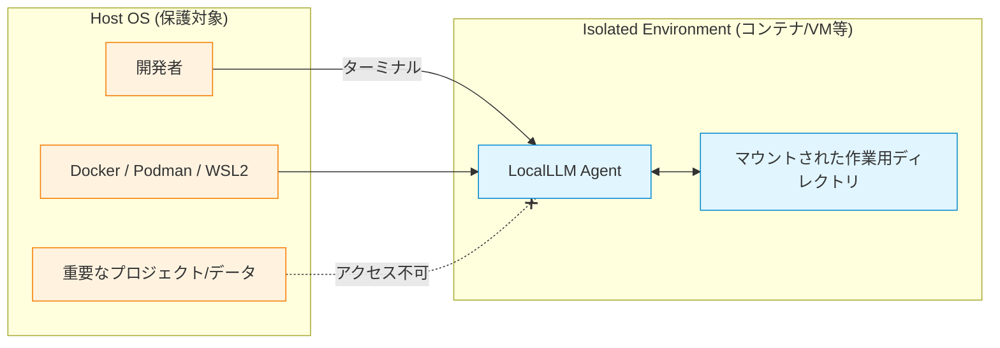

# セキュリティ評価と対策 (Security Assessment)

本プロジェクト（LocalLLM Agent）は「ユーザーのPC上でファイル操作やコマンド実行を自律的に行う」という性質上、本質的なセキュリティリスクを抱えています。現在の実装は粗削りな部分があり、システム的な制限と運用によるカバーの双方で安全性を担保する必要があります。

## 1. 攻撃と防御モデルの概要

システムには3つの防御層が存在しますが、それぞれに限界があります。

```mermaid
graph TD
    classDef safe fill:#d4edda,stroke:#28a745,color:#155724;
    classDef danger fill:#f8d7da,stroke:#dc3545,color:#721c24;
    
    Attacker[LLMのハルシネーション / 悪意あるプロンプト]:::danger
    
    subgraph "Defense Layers"
        L1(Layer 1: PermissionManagerの3層権限)
        L2(Layer 2: SecurityRulesの正規表現)
        L3(Layer 3: Sandboxによるパス制限)
    end
    
    Target[(ホストOSのファイル・システム)]:::safe
    
    Attacker --> L1
    L1 --> L2
    L2 --> L3
    L3 --> Target
    
    note_L1[迂回リスク: ユーザーが盲目的に許可(always)してしまう] -.-> L1
    note_L2[迂回リスク: 難読化コマンド、エイリアス等] -.-> L2
    note_L3[迂回リスク: シンボリックリンク、ディレクトリトラバーサル] -.-> L3
```

## 2. 潜在的なリスクと技術的限界

現状の「粗削り」な実装において、以下のリスクが潜んでいます。

### 2.1 サンドボックスのバイパスリスクとOS固有の挙動
現在のシステムは Node.js の `path.resolve` を用いた単純な前方一致（`startsWith`）に依存しているため、プラットフォームごとに特有のバイパスリスクがあります。

- **Windows 固有のリスク (パス解決の脆弱性)**
  Windowsのファイルシステム（NTFS等）は**大文字・小文字を区別しません**が、現在のサンドボックス実装は文字列の厳密な比較（Case-sensitive）を行っています。また、`C:\PROGRA~1` のような「8.3形式のショートパス」やUNCパスを使用された場合、許可されたディレクトリと異なる文字列形式で解決されるため、チェックをすり抜けて不正な領域へのアクセスが許可される、あるいは正当なアクセスが拒否される問題を引き起こす可能性があります。
- **Linux / macOS 固有のリスク (シンボリックリンク)**
  Posix系OSではシンボリックリンクが多用されます。悪意のあるLLM、または攻撃者が許可されたディレクトリ内に`/etc/`等に対するシンボリックリンクを作成した場合、Node.jsの単純なPathチェックでは実体パスが解決されず、サンドボックス外のファイル（`/etc/passwd` など）に読み書きされてしまう深刻なディレクトリトラバーサルのリスクが存在します。
- **TOCTOU (Time-of-Check to Time-of-Use) 脆弱性**
  権限の確認時点と実際のファイル操作の実行時点とのタイムラグを狙った攻撃や、意図しないファイルパスの書き換えのリスクが完全に排除されていません。

### 2.2 コマンド実行時の回避 (Obfuscation) リスク
- **正規表現による検知の限界**
  `rules.ts` で定義されている危険コマンドパターンの検知は、コマンド文字列の静的マッチングに依存しています。
  悪意のある、またはハルシネーション（幻覚）による予測不可能なコマンド表現（例: 変数展開を組み合わせたコマンド `r$()m -r$()f /` や、エイリアスの使用、スクリプトへの動的書き出しからの実行）に対しては、正規表現をすり抜けてしまう可能性があります。
- **実行環境への影響**
  `bash` コマンドツールはシェル環境を直接呼び出すため、パスワードの平文出力や環境変数の意図しない漏洩（例: AWSクレデンシャルの `echo`出力）につながる可能性があります。

### 2.3 LLMのハルシネーションによる意図しない破壊
- LLMが意図せず不要なファイル削除コマンドを生成したり、重要な設定ファイル（`.git`の中身など）を編集してしまうリスクがあります。`ask`（要確認）権限であっても、ユーザーが惰性で「許可 (always)」を選んでしまうことで被害が拡大する恐れがあります。

### 2.4 各ツール固有の機能的セキュリティ・リスクと脆弱性
本システムが提供する15種類の機能ツール（`src/tools/definitions/`配下）の利用において、それぞれ特有のリスクが存在します。運用時はこれらの特性を理解しておく必要があります。

| 影響機能 (ツール名) | 想定される具体的なリスクシナリオ |
| :--- | :--- |
| `file_write`<br>`file_edit` | **データ上書き・破壊リスク**: `file_edit` による置換が一意性を満たさない場合のエラー抑止はありますが、`file_write` による全体上書きが行われた場合、誤ったコードによる既存実装の深刻なロストを招きます。Git等のバージョン管理がない環境での利用は極めて危険です。 |
| `bash` | **リソース枯渇 / DDoSリスク**: タイムアウト設定を行っていますが、悪意ある、またはバグのあるシェルスクリプト（無限ループ、大量プロセスのFork、不正なマイニングコマンド等）を実行された場合、ホストOSのCPU/メモリリソースが枯渇する恐れがあります。 |
| `browser`<br>(`navigate`, `click`, `type`) | **意図しないセッション操作 / SSRFリスク**: ホストPCで起動するブラウザの認証済みクッキー等を利用して、LLMが社内ネットワーク（例 `localhost` やイントラネット）の管理画面にアクセスし、機密データの流出や不正なフォーム送信(データ削除等)を行う危険性があります。 |
| `web_fetch`<br>`vision` | **ローカルファイル流出リスク**: `file://` 等のプロトコルハンドラを解釈させられた場合、サンドボックスを迂回してシステムの機密設定ファイル（`/etc/shadow` 等）を出力・要約してしまうリスクが否定しきれません（現在 fetch/vision 内部での厳密なURLスキーム制限が未成熟な場合）。 |
| `task` (子エージェント) | **再帰呼び出しによる暴走**: `general-purpose` 以外の制限をかけていますが、子エージェントが更に自律的にタスクを起票し続けることで、LLMプロバイダへのリクエストが無限にスパイクし、不要な負荷（あるいはクラウドアプローチであった場合はAPI利用料の高騰）を引き起こす恐れがあります。 |

## 3. 運用案立案（運用による隔離アーキテクチャ）

上記の技術的限界を踏まえ、システムを安全に利用するためには以下の**運用（オペレーション）による隔離**が必須です。



### 3.1 隔離された実行環境（推奨）
本システムをホストOS（重要なデータが保存されているPC本体）で直接稼働させることは避け、隔離された環境での利用を強く推奨します。
- **Docker コンテナ内での実行**: エージェントをコンテナに閉じ込め、ホストOSのファイルシステムやネットワークから隔離します。
- **VM (仮想マシン) / WSL2 での実行**: 専用の仮想環境下で実行し、最悪のケースでも被害を仮想環境内に留めます。

### 3.2 ユーザーリテラシーへの依存と注意喚起
- **`ask` (要確認) 権限の厳格な運用**
  ツール実行時に表示される確認プロンプトにおいて、ユーザーは提案されたコマンドや操作対象ファイルを**必ず目視で確認**する必要があります。
  特に `always`（セッション中常に許可）の選択は、ファイル変更やコマンド実行において潜在的リスクを高めるため、最小限の利用に留めるルール付けが必要です。

## 4. 今後の改善に向けた課題

将来的にはシステム面で以下の強化を行うことで、運用への依存度を下げることができます。
- **AST（抽象構文木）解析の導入**: 単なる正規表現ではなくシェルのASTをパースし、難読化された危険コマンドを検知する機能。
- **Chroot / eBPF 等によるシステムレベルの隔離**: アプリケーションレイヤーのサンドボックスではなく、OSレベルでのアクセス制限の実装。
- **Git等との自動連携**: 破壊的な変更が行われる前に自動でコミット/スタッシュの退避スナップショットを作成する「Undo機能」の組み込み。
