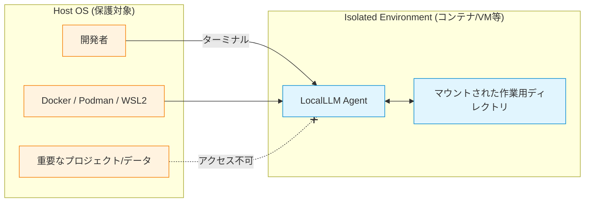

# セキュリティ評価と対策 (Security Assessment)

> **バージョン**: 統合版 (2026-03-15)

本プロジェクト（LocalLLM Agent）は「ユーザーのPC上でファイル操作やコマンド実行を自律的に行う」という性質上、本質的なセキュリティリスクを抱えています。本ドキュメントでは脅威モデル・防御設計・既知リスク・運用指針を定義します。

---

## 1. 攻撃と防御モデルの概要

システムには4つの防御層が存在しますが、それぞれに限界があります。

```mermaid
graph TD
    classDef safe fill:#d4edda,stroke:#28a745,color:#155724;
    classDef danger fill:#f8d7da,stroke:#dc3545,color:#721c24;
    classDef warn fill:#fff3cd,stroke:#ffc107,color:#856404;

    Attacker[LLMのハルシネーション / 悪意あるプロンプト]:::danger

    subgraph "Defense Layers"
        L0(Layer 0: パターンルールエンジン deny/allow/ask):::warn
        L1(Layer 1: PermissionManagerの権限チェック)
        L2(Layer 2: SecurityRulesの正規表現)
        L3(Layer 3: Sandboxによるパス制限)
    end

    Target[(ホストOSのファイル・システム)]:::safe

    Attacker --> L0
    L0 --> L1
    L1 --> L2
    L2 --> L3
    L3 --> Target

    NoteL0[CLIとDiscord両方に適用。denyは強制ブロック] -.-> L0
    NoteL1[迂回リスク: ユーザーが盲目的に許可(always)してしまう] -.-> L1
    NoteL2[迂回リスク: 難読化コマンド、エイリアス等] -.-> L2
    NoteL3[迂回リスク: 歴史的にはシンボリックリンク等、現在は対策済み] -.-> L3
```

### 1.1 パターンルールエンジン（Layer 0）

`src/security/rule-engine.ts` に実装された Claude Code 互換のパターンルールエンジンです。ツール名リストより高い優先度で評価され、**CLI・Discord 双方に適用** されます。

**評価順序**: `deny` → `allow` → `ask` → ツール名リスト（autoApproveTools/requireApprovalTools）

| ルールタイプ | 動作 | 適用チャネル |
|---|---|---|
| `deny` | 強制ブロック（ユーザー確認なし） | CLI + Discord |
| `allow` | 強制許可（ユーザー確認なし） | CLI のみ |
| `ask` | 必ず確認ダイアログ表示 | CLI のみ |

`deny` ルールを Discord にも適用することで、Discord 経由の悪意ある操作を防止します。

---

## 2. サンドボックスの実装状況

### 2.0 OS-level プロセスサンドボックス（Claude Code 同等の仕組み）

`src/security/process-sandbox.ts` に実装された **`ProcessSandbox`** クラスが、bash ツール実行時にカーネルレベルの隔離を付加します。Claude Code と同等の「deny default → 必要な権限のみ allow」ホワイトリスト方式を採用。

```
config.security.processSandbox.enabled = true  （デフォルト: false）
config.security.processSandbox.level   = "network" | "full"
```

| レベル | Linux | macOS | Windows |
|--------|-------|-------|---------|
| `network` | `unshare --net` でネットワーク名前空間隔離 | `sandbox-exec` で network deny | 未サポート |
| `full` | `bwrap` で read-only rootfs + 許可ディレクトリのみ writable bind mount | `sandbox-exec` で filesystem + network 制限 | 未サポート |

**書き込み許可ディレクトリ（full レベル）**: `cwd`, `~/.localllm`, `allowedDirectories` 設定値のみ writable。

**フォールバック**: `bwrap`/`unshare`/`sandbox-exec` が存在しない場合は自動的に `none` にデグレード（ログに警告なし）。`sandbox_info` ツールでツール有無を確認できる。

**注意**: `processSandbox.enabled = false`（デフォルト）では従来どおりアプリレベルのみ。有効化はユーザーの明示的な設定変更が必要。

### 2.1 対策済みリスク

以下のリスクに対して `safeResolvePath()` / `pathStartsWith()` / `normalizeWindowsPath()` を実装し、`Sandbox.isPathAllowed()` に統合済みです（`src/utils/platform.ts`, `src/security/sandbox.ts`）。

**Windows 固有のリスク → 対策済み**
- 大文字・小文字の不一致: `normalizeWindowsPath()` でパス全体を小文字化、case-insensitive比較
- 8.3短縮パス（`PROGRA~1`等）: `fs.realpathSync()` で実パスに解決後に比較
- UNCパス（`\\?\`、`\\.\`プレフィックス）: `normalizeWindowsPath()` でプレフィックス除去・正規化
- パスセパレータの混在（`/` と `\`）: 統一的にバックスラッシュへ正規化

**Linux / macOS 固有のリスク → 対策済み**
- `safeResolvePath()` で `fs.realpathSync()` を使用し、シンボリックリンクを実体パスに解決
- 新規ファイルの場合は親ディレクトリの実体パスを解決してから比較
- 許可ディレクトリ自体もコンストラクタ時に `safeResolvePath()` で解決済み

### 2.2 部分的に緩和されたリスク

**TOCTOU (Time-of-Check to Time-of-Use) 脆弱性**
- `fs.realpathSync()` によりチェック時点で実パスを解決するため、シンボリックリンク経由のTOCTOUは緩和
- ただし、チェック後にファイルが差し替えられるレースコンディションの完全な排除にはOSレベルの隔離（chroot/eBPF等）が必要

**テストカバレッジ**: `tests/security/sandbox.test.ts` に20テスト（symlink回避、Windowsパス正規化、トラバーサル、prefix誤マッチ防止等）

---

## 3. 潜在的なリスクと技術的限界

### 3.1 コマンド実行時の回避（Obfuscation）リスク

`rules.ts` で定義されている危険コマンドパターンの検知は、コマンド文字列の静的マッチングに依存しています。悪意のある、またはハルシネーションによる予測不可能なコマンド表現（例: 変数展開を組み合わせたコマンド `r$()m -r$()f /` や、エイリアスの使用、スクリプトへの動的書き出しからの実行）に対しては、正規表現をすり抜けてしまう可能性があります。

`bash` コマンドツールはシェル環境を直接呼び出すため、パスワードの平文出力や環境変数の意図しない漏洩（例: AWSクレデンシャルの `echo` 出力）につながる可能性があります。

### 3.2 LLMのハルシネーションによる意図しない破壊

LLMが意図せず不要なファイル削除コマンドを生成したり、重要な設定ファイル（`.git` の中身など）を編集してしまうリスクがあります。`ask`（要確認）権限であっても、ユーザーが惰性で「許可 (always)」を選んでしまうことで被害が拡大する恐れがあります。

### 3.3 各ツール固有のセキュリティリスク

| 影響機能 (ツール名) | 想定される具体的なリスクシナリオ |
| :--- | :--- |
| `file_write`, `file_edit` | **データ上書き・破壊リスク**: `file_write` による全体上書きが行われた場合、誤ったコードによる既存実装の深刻なロスを招きます。Git等のバージョン管理がない環境での利用は極めて危険です。 |
| `bash` | **リソース枯渇 / DDoSリスク**: タイムアウト設定を行っていますが、悪意ある、またはバグのあるシェルスクリプト（無限ループ、大量プロセスのFork、不正なマイニングコマンド等）を実行された場合、ホストOSのCPU/メモリリソースが枯渇する恐れがあります。 |
| `browser_navigate`, `browser_click`, `browser_type` | **意図しないセッション操作 / SSRFリスク**: ホストPCで起動するブラウザの認証済みクッキー等を利用して、LLMが社内ネットワーク（`localhost` やイントラネット）の管理画面にアクセスし、機密データの流出や不正なフォーム送信を行う危険性があります。 |
| `browser_screenshot`, `vision_analyze` | **画面情報漏洩リスク**: スクリーンショットにはログイン状態のセッション情報やトークンが表示されている可能性があります。`vision_analyze` による画像解析が外部LLMに委譲される構成の場合、画面内容が意図せず外部送信される恐れがあります。 |
| `web_fetch` | **ローカルファイル流出リスク**: `file://` 等のプロトコルハンドラを解釈させられた場合、サンドボックスを迂回してシステムの機密設定ファイル（`/etc/shadow` 等）を出力・要約してしまうリスクがあります（URLスキーム制限の実装状況に依存）。 |
| `task` (子エージェント) | **再帰呼び出しによる暴走**: 子エージェントには `task` ツールを付与しない制限をかけていますが、子エージェントが大量のツール呼び出しを行うことで、LLMプロバイダへのリクエストが無限にスパイクし、不要な負荷を引き起こす恐れがあります。 |
| `enter_plan_mode`, `exit_plan_mode` | **計画バイパスリスク**: プランモード中はread-onlyツールのみ使用可能ですが、LLMがプランモードを即座に終了して承認なしで実行に移る「計画スキップ」を試みる可能性があります。 |
| `skill` | **悪意あるスキル実行リスク**: スキルファイルはMarkdown形式のプロンプトですが、プロジェクトディレクトリの `.localllm/skills/` からも読み込まれるため、悪意のあるリポジトリに仕込まれた不正なスキルが自動ロードされる可能性があります。 |

---

## 4. 運用案立案（運用による隔離アーキテクチャ）

上記の技術的限界を踏まえ、システムを安全に利用するためには以下の**運用（オペレーション）による隔離**が必須です。


```mermaid
graph LR
    classDef host fill:#fff3e0,stroke:#f57c00;
    classDef container fill:#e1f5fe,stroke:#0288d1;

    subgraph "Host OS (保護対象)"
        HostUser[開発者]:::host
        HostDir[重要なプロジェクト/データ]:::host
        DockerEngine[Docker / Podman / WSL2]:::host
    end

    subgraph "Isolated Environment (コンテナ/VM等)"
        Agent[LocalLLM Agent]:::container
        WorkDir[マウントされた作業用ディレクトリ]:::container
    end

    HostUser --> |ターミナル| Agent
    DockerEngine --> Agent
    Agent <--> WorkDir

    HostDir -.-x |アクセス不可| Agent
```

### 4.1 隔離された実行環境（推奨）

本システムをホストOS（重要なデータが保存されているPC本体）で直接稼働させることは避け、隔離された環境での利用を強く推奨します。

- **Docker コンテナ内での実行**: エージェントをコンテナに閉じ込め、ホストOSのファイルシステムやネットワークから隔離します。
- **VM (仮想マシン) / WSL2 での実行**: 専用の仮想環境下で実行し、最悪のケースでも被害を仮想環境内に留めます。

### 4.2 ユーザーリテラシーへの依存と注意喚起

ツール実行時に表示される確認プロンプトにおいて、ユーザーは提案されたコマンドや操作対象ファイルを**必ず目視で確認**する必要があります。特に `always`（セッション中常に許可）の選択は、ファイル変更やコマンド実行において潜在的リスクを高めるため、最小限の利用に留めるルール付けが必要です。

---

## 5. セカンドLLM（クラウドLLM）利用時のデータプライバシーリスク

LocalLLM Agent の主要な設計目標の1つは「データプライバシーの絶対的な保護」です。しかし v0.3.0 でセカンドLLMとしてクラウドLLM（Vertex AI / Azure AI）を利用できる機能が追加されています。このオプション機能を利用する場合、以下のリスクを十分に理解した上で使用してください。

### ⚠️ 注意: セカンドLLMにクラウドを設定した場合

| リスク項目 | 内容 |
|---|---|
| **コード・ファイルの外部送信** | `second_llm_consult` や `second_llm_agent` ツール経由でクラウドLLMに渡したプロンプトは、**インターネット経由で外部サーバーに送信**されます |
| **機密情報の漏洩** | APIキー、パスワード、個人情報、企業秘密などがプロンプトに含まれている場合、クラウドプロバイダーのサーバーに送信されます |
| **ログ・学習データへの利用** | クラウドプロバイダーのポリシーによっては、送信データがログに記録・学習に利用される場合があります |

### 安全な利用方針

- セカンドLLMのクラウド設定は**意図的に有効化した場合のみ**機能します（デフォルト: 無効）
- 機密情報を含むプロジェクトでは、セカンドLLMに**ローカルLLM**（Ollama/LM Studio等）を指定してください
- クラウドLLMを利用する場合は、プロンプトに含まれる情報を**事前に確認**し、機密情報が含まれないようにしてください
- 企業・組織での利用時は、情報セキュリティ部門の確認を受けることを推奨します

---

## 6. 今後の改善に向けた課題

将来的にはシステム面で以下の強化を行うことで、運用への依存度を下げることができます。

| 課題 | 説明 |
|---|---|
| **AST解析の導入** | 単なる正規表現ではなくシェルのASTをパースし、難読化された危険コマンドを検知する機能 |
| ~~Chroot / eBPF 等による隔離~~ | ~~アプリケーションレイヤーのサンドボックスではなく、OSレベルでのアクセス制限の実装~~ → **実装済み** (`ProcessSandbox`: Linux `unshare`/`bwrap`, macOS `sandbox-exec`, 設定で有効化) |
| **Git等との自動連携** | 破壊的な変更が行われる前に自動でコミット/スタッシュの退避スナップショットを作成する「Undo機能」の組み込み |
| ~~web_fetch のURLスキーム制限~~ | ~~`file://` 等のプロトコルハンドラを明示的にブロック~~ → **実装済み** (`http://` / `https://` のみ許可) |
