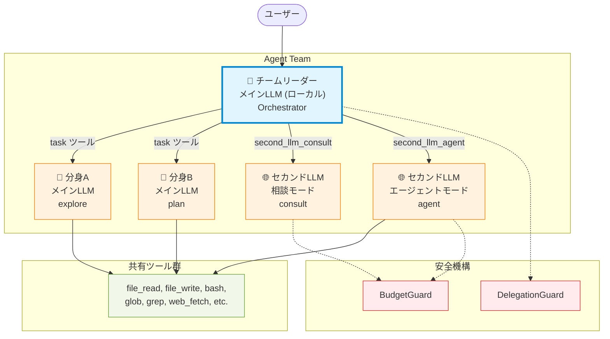
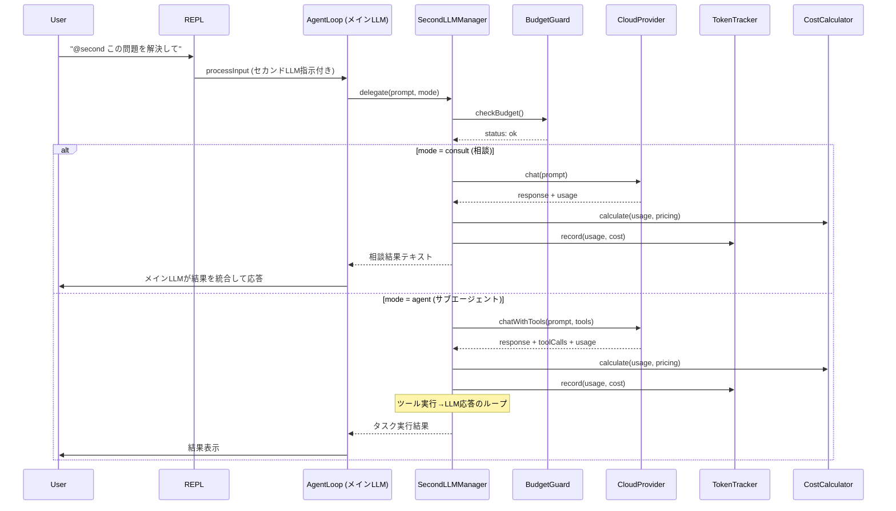
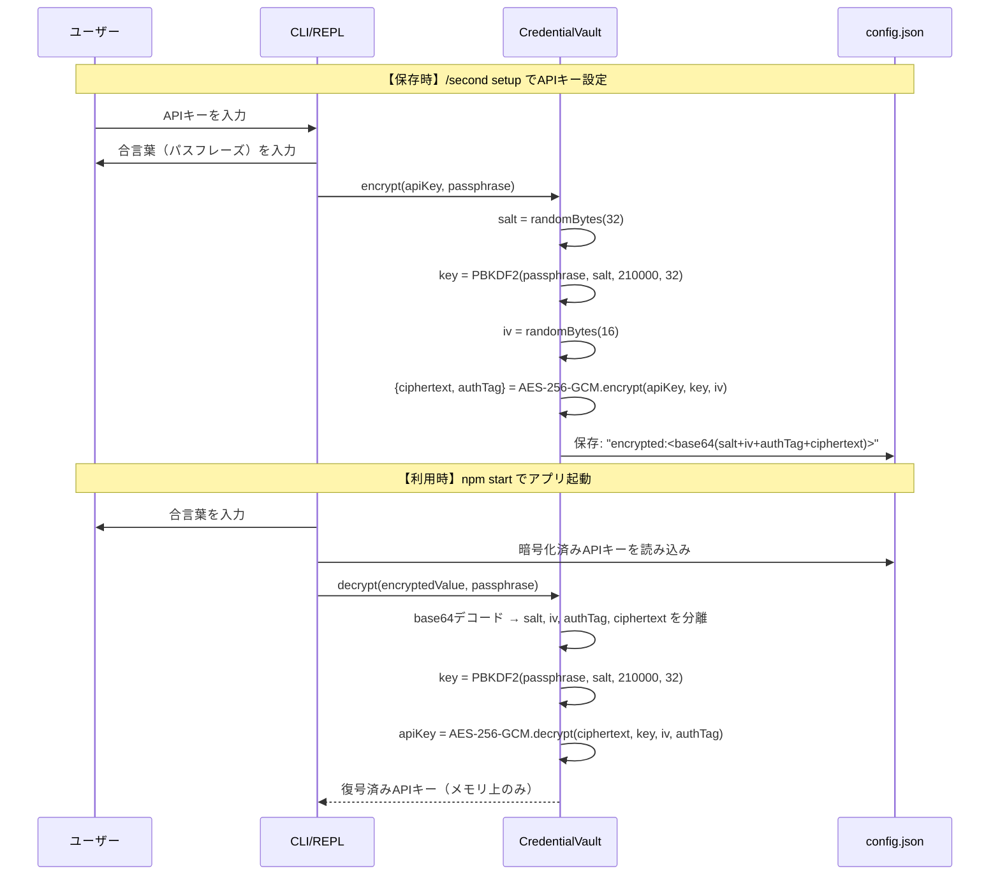

# v0.3.0 セカンドLLM機能 設計書

## 1. 概要

### 1.1 目的

メインLLM（ローカルLLM）を補完する**セカンドLLM**として、クラウドLLM（Vertex AI / Azure AI）を利用可能にする。これにより、ローカルLLMでは困難な高度な推論や多言語処理を、ユーザーの明示的な指示に基づいてクラウドLLMに委任できる。

### 1.2 基本方針

| 項目 | 方針 |
|---|---|
| メインLLM | **ローカルLLMのみ**（Ollama / LM Studio / llama.cpp / vLLM）。変更なし |
| セカンドLLM | **ローカルLLM または クラウドLLM**。**オプション機能** |
| 起動条件 | セカンドLLM設定が有効 **かつ** ユーザーが明示的に利用を指示。クラウドLLMの場合は追加で予算の95%未満であることが必要 |
| 動作モード | ① メインLLMへの相談 ② サブエージェントとしてタスク実行 |
| ツールアクセス | メインエージェントと**同一のツール群**をすべて使用可能 |
| コスト管理 | クラウドLLM: トークン使用量を記録し、目安金額を算出。予算上限で自動停止。ローカルLLM: 予算不要（参考コストのみ表示） |

### 1.3 対応プロバイダとモデル

#### ローカルLLM（メインLLMと同種、または別インスタンス）

| プラットフォーム | 認証方式 | 備考 |
|---|---|---|
| **Ollama** | なし | メインLLMと異なるモデル/サーバーを指定可 |
| **LM Studio** | なし | |
| **llama.cpp** | なし | |
| **vLLM** | なし | |

#### クラウドLLM

| プラットフォーム | 利用可能モデル | 認証方式 |
|---|---|---|
| **Vertex AI** | Gemini (3 Pro, 3 Flash, 2.5系), Claude (Opus, Sonnet, Haiku) | Google Cloud サービスアカウント / ADC |
| **Azure OpenAI** | GPT (5.x系, 4o系) | API Key / Azure AD |
| **Azure AI Foundry** | Claude (Opus, Sonnet, Haiku) | API Key |

---

## 2. Agent Team アーキテクチャ

### 2.1 設計思想 — Orchestrator-Worker パターン

Anthropic社の Agent Team パターンに基づき、**メインLLMをチームリーダー（Orchestrator）**、チームメンバーを**メインLLMの分身（サブエージェント）またはセカンドLLM**として構成する。



**設計原則（Anthropicベストプラクティス準拠）:**

| 原則 | 適用 |
|---|---|
| **コンテキスト分離** | 各チームメンバーは独立したコンテキストウィンドウを持つ。リーダーのコンテキスト肥大化を防止 |
| **構造化ハンドオフ** | リーダー↔メンバー間の情報伝達はJSON構造化メッセージで行い、曖昧さを排除 |
| **ロール特化** | リーダーは判断・統合、メンバーは実行に集中。ツール権限はロールに紐付け |
| **一方向の委任** | メンバーからリーダーへの逆委任を禁止。再帰を構造的に防止 |
| **コスト最適化** | 高性能モデル（Orchestrator）と軽量モデル（Worker）を使い分け可能 |

### 2.2 変更前後の比較

```
[変更前 v0.2.0]
User → REPL → AgentLoop(Leader) → LocalLLM Provider
                    ↓
                SubAgentManager → SubAgent(分身) → LocalLLM Provider

[変更後 v0.3.0]
User → REPL → AgentLoop(Leader) → LocalLLM Provider (メインLLM)
                    │
                    ├── SubAgentManager → SubAgent(分身) → LocalLLM Provider
                    │
                    ├── SecondLLMManager → consult (相談) → Local or Cloud Provider
                    │                  └→ agent (委任) → Local or Cloud Provider
                    │                       ↑
                    │                 DelegationGuard + BudgetGuard
                    │
                    └── TokenTracker → CostCalculator → usage log
```

### 2.3 階層型委任ルールと安全制約（無限ループ防止の核心）

Agent Team では**厳格な階層構造**と**2つの安全制約**により再帰・ループを構造的に防止する。

```
Level 0: ユーザー
  └─ Level 1: チームリーダー (メインLLM AgentLoop)
       ├─ Level 2a: 分身サブエージェント (SubAgent, メインLLM)
       ├─ Level 2b: セカンドLLM consultor (相談, 1回応答)
       └─ Level 2c: セカンドLLM agent (委任, ツール実行ループ)
```

#### 安全制約

| 制約ID | 制約 | 実装方法 |
|---|---|---|
| **C1** | セカンドLLMは**サブエージェントを作成できない** | `EXCLUDED_TOOLS` に `task`, `task_output` を含め、機能自体を提供しない |
| **C2** | セカンドLLMは**結果のみを返す**（質問を質問で返さない、依頼に対する結果を返すのみ） | システムプロンプトで強制 + `DelegationResult` に `type: "answer"` のみ許可 |

> [!IMPORTANT]
> C1 + C2 により、R1（無限ループ）とR2（再帰タスク起動）の重大リスクは**構造的にほぼ解消**される。`DelegationGuard` はメインLLMの品質ガードレールとして機能する。

#### ルール
1. **Level 2 のメンバーは Level 2 以上のメンバーを起動できない**（C1）
   - セカンドLLMは `second_llm_consult`, `second_llm_agent`, `task` ツールを使用不可
   - 分身サブエージェントも現行通り `task` ツールを除外済み
2. **セカンドLLMは結果のみを返す**（C2）
   - メインLLMへの逆質問・逆委任は禁止
   - 不明点がある場合は最善の推測で回答する
3. **consult モードは1回のリクエスト-レスポンスで完結**（ツール不使用）
4. **agent モードは `maxTurns` 制限付き**（デフォルト30回、設定可能）
5. **DelegationGuard がセッション内の委任回数を追跡**（品質ガードレール）
   - 連続的セカンドLLM呼び出しの上限: 3回/ターン
   - セッション全体の呼び出し上限: 設定可能（デフォルト50回）

### 2.4 コンポーネント構成

```
src/
├── providers/
│   ├── base-provider.ts       # [MODIFY] ChatChunk に usage フィールド追加
│   ├── openai-compat.ts       # [MODIFY] ストリーム最終チャンクから usage 抽出
│   ├── provider-factory.ts    # [MODIFY] クラウドプロバイダ対応追加
│   ├── vertex-ai.ts           # [NEW] Vertex AI プロバイダ (Gemini + Claude)
│   ├── azure-openai.ts        # [NEW] Azure OpenAI プロバイダ (GPT)
│   └── azure-claude.ts        # [NEW] Azure AI Foundry プロバイダ (Claude)
│
├── cost/
│   ├── pricing-table.ts       # [NEW] モデル別単価テーブル
│   ├── token-tracker.ts       # [NEW] トークン使用量記録・集計
│   ├── cost-calculator.ts     # [NEW] コスト算出ロジック
│   └── budget-guard.ts        # [NEW] 金額上限ストッパー
│
├── second-llm/
│   ├── second-llm-manager.ts  # [NEW] セカンドLLM管理
│   └── delegation-guard.ts   # [NEW] 委任制御ガードレール
│
├── security/
│   ├── permission-manager.ts # [既存] セキュリティ設定
│   └── credential-vault.ts   # [NEW] APIキー暗号化ボールト
│
├── config/
│   ├── types.ts               # [MODIFY] SecondLLMConfig, BudgetConfig 追加
│   └── config-manager.ts      # [MODIFY] セカンドLLM設定の読み書き + 暗号化統合
│
├── agent/
│   ├── agent-loop.ts          # [MODIFY] SecondLLMManager 組み込み
│   └── sub-agent.ts           # [MODIFY] セカンドLLMプロバイダ選択対応
│
├── cli/
│   └── repl.ts                # [MODIFY] /second, /cost コマンド追加
│
└── index.ts                   # [MODIFY] セカンドLLM初期化フロー追加
```

### 2.5 データフロー



---

## 3. 設定と初期化

### 3.1 Config 型定義の拡張

```typescript
// src/config/types.ts への追加

export type CloudProviderType = "vertex-ai" | "azure-openai" | "azure-claude";

// セカンドLLMはローカルまたはクラウドのいずれかを指定可能
export type SecondLLMProviderType = ProviderType | CloudProviderType;

export interface SecondLLMEndpoint {
  providerType: SecondLLMProviderType;
  model: string;
  // ローカルLLM用
  baseUrl?: string;        // http://localhost:11434 等
  // Vertex AI用
  projectId?: string;
  region?: string;
  // Azure用
  endpoint?: string;       // https://xxx.openai.azure.com/ 等
  apiKey?: string;
  deploymentName?: string;
}

export interface BudgetConfig {
  limitUsd: number;        // 予算上限 (USD)
  warningThreshold: number; // 警告閾値 (0.0〜1.0、デフォルト0.8)
  stopThreshold: number;    // 停止閾値 (0.0〜1.0、デフォルト0.95)
}

export interface CostConfig {
  referenceModels: string[];  // ローカルLLM利用時の参考コスト比較対象
}

export interface SecondLLMConfig {
  enabled: boolean;
  endpoint: SecondLLMEndpoint;
  budget: BudgetConfig | null;  // ローカルLLMの場合は null（予算不要）
  cost: CostConfig;
}

// Config に追加
export interface Config {
  mainLLM: LLMEndpoint;
  visionLLM: LLMEndpoint | null;
  secondLLM: SecondLLMConfig | null;   // ← 追加
  security: SecurityConfig;
  context: ContextConfig;
}

// ヘルパー: セカンドLLMがクラウドかローカルかを判定
export function isCloudProvider(type: SecondLLMProviderType): boolean {
  return ["vertex-ai", "azure-openai", "azure-claude"].includes(type);
}
```

### 3.2 設定ファイル例 (`~/.localllm/config.json`)

**例1: セカンドLLMにクラウドLLMを指定**
```json
{
  "mainLLM": {
    "providerType": "ollama",
    "baseUrl": "http://localhost:11434",
    "model": "qwen3:32b"
  },
  "secondLLM": {
    "enabled": true,
    "endpoint": {
      "providerType": "vertex-ai",
      "model": "gemini-3-flash",
      "projectId": "my-project-123",
      "region": "us-central1"
    },
    "budget": {
      "limitUsd": 5.00,
      "warningThreshold": 0.8,
      "stopThreshold": 0.95
    },
    "cost": {
      "referenceModels": ["gemini-3-flash", "claude-sonnet-4.6", "gpt-5.2"]
    }
  }
}
```

**例2: セカンドLLMに別のローカルLLMを指定**
```json
{
  "mainLLM": {
    "providerType": "ollama",
    "baseUrl": "http://localhost:11434",
    "model": "qwen3:32b"
  },
  "secondLLM": {
    "enabled": true,
    "endpoint": {
      "providerType": "ollama",
      "baseUrl": "http://localhost:11434",
      "model": "deepseek-r1:70b"
    },
    "budget": null,
    "cost": {
      "referenceModels": ["gemini-3-flash", "claude-sonnet-4.6", "gpt-5.2"]
    }
  }
}
```

> [!NOTE]
> ローカルLLMをセカンドLLMに指定した場合、`budget` は `null` となり予算チェックは行われない。同一Ollamaサーバー上の別モデルや、別ホスト上のLMStudio等を指定することで、異なるモデルの知見を組み合わせて利用できる。

### 3.3 動的設定 — `/second setup` コマンド

`npm start` 実行中に REPL から `/second setup` コマンドでセカンドLLMを設定・変更できる。

```
/second setup          → 対話式セカンドLLM設定ウィザードを起動
/second status         → 現在の設定と利用状況を表示
/second enable         → セカンドLLMを有効化
/second disable        → セカンドLLMを無効化
/second budget <金額>  → 予算上限を変更 (USD)
```

設定ウィザードのフロー：
1. プロバイダ種別選択: ローカルLLM (Ollama / LM Studio / llama.cpp / vLLM) or クラウドLLM (Vertex AI / Azure OpenAI / Azure AI Foundry)
2. 接続情報入力:
   - ローカルLLM: ホスト名・ポート番号
   - クラウドLLM: 認証情報 (API Key / プロジェクトID等)
3. 接続テスト
4. モデル選択（利用可能モデル一覧から）
5. 予算上限設定 (クラウドLLMの場合のみ、USD)
6. `config.json` に保存

---

## 4. セカンドLLM管理 (`SecondLLMManager`)

### 4.1 クラス設計

```typescript
// src/second-llm/second-llm-manager.ts

export type SecondLLMMode = "consult" | "agent";

export class SecondLLMManager {
  private provider: LLMProvider;
  private isCloud: boolean;          // クラウドか否か
  private tokenTracker: TokenTracker;
  private costCalculator: CostCalculator;
  private budgetGuard: BudgetGuard;
  private model: string;

  constructor(
    endpoint: SecondLLMEndpoint,
    budget: BudgetConfig | null,    // ローカルLLMの場合は null
    private toolRegistry: ToolRegistry,
    private permissions: PermissionManager,
  );

  /**
   * セカンドLLMが利用可能かを判定。
   * ローカルLLM: 設定が有効 かつ 接続可能
   * クラウドLLM: 設定が有効 かつ 予算の95%未満 かつ 接続可能
   */
  isAvailable(): boolean;

  /**
   * 相談モード: メインLLMの代わりに1回のやり取りを行う。
   * ツールは使用しない。応答テキストを返す。
   */
  async consult(prompt: string, context?: string): Promise<ConsultResult>;

  /**
   * エージェントモード: サブエージェントとして自律的にタスクを実行。
   * すべてのツールを使用可能。
   */
  async runAsAgent(
    type: SubAgentType,
    description: string,
    prompt: string,
  ): Promise<SubAgentResult>;

  /**
   * 現在の利用状況を取得。
   */
  getUsageSummary(): UsageSummary;
}

interface ConsultResult {
  content: string;
  usage: TokenUsageRecord;
}

interface UsageSummary {
  totalInputTokens: number;
  totalOutputTokens: number;
  totalCostUsd: number;
  budgetLimitUsd: number | null; // ローカルLLMの場合は null
  budgetUsedPercent: number | null;
  budgetStatus: "ok" | "warning" | "exceeded" | "n/a";
}
```

### 4.2 DelegationGuard — 品質ガードレール

安全制約 C1（サブエージェント作成禁止）と C2（結果のみ返す）により、無限ループ・再帰のリスクは構造的に解消されている。`DelegationGuard` の主な役割は、メインLLMが**不必要に繰り返しセカンドLLMを呼び出すパターン**を検知・抑制する**品質ガードレール**である。

```typescript
// src/second-llm/delegation-guard.ts

interface DelegationLimits {
  maxConsecutiveCalls: number;  // 連続呼び出し上限 (デフォルト: 3)
  maxSessionCalls: number;     // セッション全体の上限 (デフォルト: 50)
  maxAgentTurns: number;       // エージェントモードのツール実行ループ上限 (デフォルト: 30)
}

type DelegationCheckResult =
  | { allowed: true }
  | { allowed: false; reason: string };

export class DelegationGuard {
  private consecutiveCount = 0;
  private sessionCount = 0;

  constructor(private limits: DelegationLimits);

  /** 委任要求の可否を判定 */
  checkDelegation(mode: "consult" | "agent"): DelegationCheckResult;

  /** 委任完了を記録 */
  recordDelegation(): void;

  /** ユーザーのターン開始時にconsecutiveCountをリセット */
  onUserTurn(): void;

  /** 現在の統計を取得 */
  getStats(): { consecutive: number; session: number; limits: DelegationLimits };
}
```

**補足**: C2 制約によりセカンドLLM→メインLLMの逆委任は発生しないため、`DelegationGuard` が検知するのは「メインLLMが不十分な結果に対して再委任を繰り返す」パターンのみ。

### 4.2 利用可能判定ロジック

```typescript
isAvailable(): boolean {
  // 1. 設定が有効か
  if (!this.config.enabled) return false;

  // 2. プロバイダが接続可能か（キャッシュ付き判定）
  if (!this.connectionVerified) return false;

  // 3. 委任回数の上限チェック
  const delegationCheck = this.delegationGuard.checkDelegation(mode);
  if (!delegationCheck.allowed) return false;

  // 4. クラウドLLMの場合のみ予算チェック
  if (this.isCloud && this.budgetGuard) {
    const summary = this.getUsageSummary();
    return summary.budgetUsedPercent! < (this.config.budget!.stopThreshold * 100);
  }

  // ローカルLLMの場合は予算チェック不要
  return true;
}
```

### 4.4 AgentLoop との統合

AgentLoop 側でセカンドLLMの呼び出しを認識する仕組み：

1. **ユーザー入力に `@second` プレフィックスがある場合**、REPL がフラグを付けて AgentLoop に渡す
2. **メインLLMが `second_llm_consult` / `second_llm_agent` ツールを呼び出した場合**、ToolExecutor がセカンドLLMに委任

```typescript
// Agent Loop への追加ツール
// src/tools/definitions/second-llm.ts

export const secondLLMConsultTool: ToolHandler = {
  definition: {
    type: "function",
    function: {
      name: "second_llm_consult",
      description: "セカンドLLM（クラウド）に相談する。高度な推論や分析が必要な場合に使用。",
      parameters: {
        type: "object",
        properties: {
          prompt: { type: "string", description: "セカンドLLMへの質問・相談内容" },
          context: { type: "string", description: "追加コンテキスト（オプション）" },
        },
        required: ["prompt"],
      },
    },
  },
  permission: "ask",
  execute: async (args) => { /* SecondLLMManager.consult() を呼び出す */ },
};

export const secondLLMAgentTool: ToolHandler = {
  definition: {
    type: "function",
    function: {
      name: "second_llm_agent",
      description: "セカンドLLMをサブエージェントとして起動し、タスクを実行させる。",
      parameters: {
        type: "object",
        properties: {
          type: { type: "string", description: "エージェントタイプ (explore, plan, general-purpose, bash)" },
          description: { type: "string", description: "タスクの説明" },
          prompt: { type: "string", description: "タスクの詳細指示" },
        },
        required: ["description", "prompt"],
      },
    },
  },
  permission: "ask",
  execute: async (args) => { /* SecondLLMManager.runAsAgent() を呼び出す */ },
};
```

### 4.5 セカンドLLMのツール制限

セカンドLLM（Level 2）が使用できないツールのリスト:

```typescript
// second-llm-manager.ts 内
const EXCLUDED_TOOLS_FOR_SECOND_LLM = [
  "task",                // サブエージェント起動の禁止（再帰防止）
  "task_output",         // 同上
  "second_llm_consult",  // セカンドLLMからの自己呼び出し禁止
  "second_llm_agent",    // 同上
  "enter_plan_mode",     // プランモードはリーダーの責務
  "exit_plan_mode",      // 同上
];
```

このリストにより、セカンドLLMは:
- ✅ ファイル操作（read/write/edit）、bash、glob、grep、web系、browser系、vision、skill、ask_user、todo_write が使用可能
- ❌ 他のエージェントの起動やプランモードの制御は不可（リーダーのみの権限）
```

---

## 5. クラウドプロバイダ実装

### 5.1 Vertex AI プロバイダ

```typescript
// src/providers/vertex-ai.ts

export class VertexAIProvider implements LLMProvider {
  readonly providerType: CloudProviderType = "vertex-ai";

  constructor(
    private projectId: string,
    private region: string,
    private model: string,
  );

  // Gemini API: POST https://{region}-aiplatform.googleapis.com/v1/projects/{project}/locations/{region}/publishers/google/models/{model}:streamGenerateContent
  // Claude via Model Garden: POST https://{region}-aiplatform.googleapis.com/v1/projects/{project}/locations/{region}/publishers/anthropic/models/{model}:streamRawPredict

  // 認証: Google Cloud ADC (Application Default Credentials)
  // gcloud auth application-default login、またはサービスアカウントキー

  protected getAuthHeaders(): Promise<Record<string, string>>;
  // → { "Authorization": "Bearer <access_token>" }

  async *chat(params: ChatParams): AsyncGenerator<ChatChunk>;
  async *chatWithTools(params: ChatWithToolsParams): AsyncGenerator<ChatChunk>;
  // → レスポンスの usageMetadata からトークン使用量を抽出
}
```

**Vertex AI レスポンスからのトークン取得:**
```json
{
  "candidates": [...],
  "usageMetadata": {
    "promptTokenCount": 1234,
    "candidatesTokenCount": 567,
    "totalTokenCount": 1801,
    "cachedContentTokenCount": 0
  }
}
```

### 5.2 Azure OpenAI プロバイダ

```typescript
// src/providers/azure-openai.ts

export class AzureOpenAIProvider extends OpenAICompatProvider {
  constructor(
    private endpoint: string,
    private apiKey: string,
    private deploymentName: string,
  );

  // API URL: POST {endpoint}/openai/deployments/{deployment}/chat/completions?api-version=2024-10-21
  // 認証: api-key ヘッダー

  protected getChatUrl(): string;
  protected getAuthHeaders(): Record<string, string>;
  // → { "api-key": this.apiKey }
}
```

**Azure OpenAI は OpenAI互換APIのため、`OpenAICompatProvider` を継承**してURL構成と認証ヘッダーのみオーバーライドする。

### 5.3 Azure AI Foundry (Claude) プロバイダ

```typescript
// src/providers/azure-claude.ts

export class AzureClaudeProvider implements LLMProvider {
  readonly providerType: CloudProviderType = "azure-claude";

  constructor(
    private endpoint: string,
    private apiKey: string,
    private model: string,
  );

  // API URL: POST {endpoint}/v1/messages
  // 認証: x-api-key ヘッダー
  // Anthropic Messages API 互換

  protected getAuthHeaders(): Record<string, string>;
  // → { "x-api-key": this.apiKey, "anthropic-version": "2024-01-01" }
}
```

### 5.4 共通: ストリーミングでの usage 取得

すべてのクラウドプロバイダで、ストリーミング応答の最終チャンクから `usage` 情報を抽出する。

```typescript
// base-provider.ts の ChatChunk に追加
export interface TokenUsage {
  promptTokens: number;
  completionTokens: number;
  cachedTokens?: number;
}

export interface ChatChunk {
  type: "text" | "thinking" | "tool_call" | "done" | "error";
  text?: string;
  toolCall?: ToolCall;
  finishReason?: string;
  error?: string;
  usage?: TokenUsage;  // ← 追加
}
```

リクエスト時の追加パラメータ:
- **Azure OpenAI**: `stream_options: { include_usage: true }` をリクエストボディに追加
- **Vertex AI (Gemini)**: デフォルトで `usageMetadata` が返される
- **Azure Claude / Vertex AI Claude**: メッセージ完了時に `usage` が返される

---

## 6. コスト計算・トークン記録

### 6.1 料金テーブル (`pricing-table.ts`)

```typescript
export interface ModelPricing {
  inputPerMToken: number;    // USD per 1M input tokens
  outputPerMToken: number;   // USD per 1M output tokens
  cachedInputPerMToken?: number; // キャッシュヒット時の入力単価
}

// 組み込み料金テーブル (2026年3月時点)
export const BUILTIN_PRICING: Record<string, ModelPricing> = {
  // --- Gemini (Vertex AI) ---
  "gemini-3-pro":        { inputPerMToken: 2.00,  outputPerMToken: 12.00 },
  "gemini-3-flash":      { inputPerMToken: 0.50,  outputPerMToken: 3.00 },
  "gemini-2.5-pro":      { inputPerMToken: 1.25,  outputPerMToken: 10.00 },
  "gemini-2.5-flash":    { inputPerMToken: 0.30,  outputPerMToken: 2.50 },
  "gemini-2.5-flash-lite": { inputPerMToken: 0.10, outputPerMToken: 0.40 },

  // --- GPT (Azure OpenAI) ---
  "gpt-5.4":    { inputPerMToken: 2.50,  outputPerMToken: 15.00 },
  "gpt-5.2":    { inputPerMToken: 1.75,  outputPerMToken: 14.00 },
  "gpt-5.1":    { inputPerMToken: 1.25,  outputPerMToken: 10.00 },
  "gpt-5-mini": { inputPerMToken: 0.25,  outputPerMToken: 2.00 },
  "gpt-5-nano": { inputPerMToken: 0.05,  outputPerMToken: 0.40 },
  "gpt-4o":     { inputPerMToken: 5.00,  outputPerMToken: 15.00 },
  "gpt-4o-mini": { inputPerMToken: 0.15, outputPerMToken: 0.60 },

  // --- Claude (Azure AI Foundry / Vertex AI Model Garden) ---
  "claude-opus-4.6":     { inputPerMToken: 5.00,   outputPerMToken: 25.00 },
  "claude-sonnet-4.6":   { inputPerMToken: 3.00,   outputPerMToken: 15.00 },
  "claude-haiku-4.5":    { inputPerMToken: 1.00,   outputPerMToken: 5.00 },
};

// ユーザーカスタム単価: ~/.localllm/pricing.json で上書き可能
export function loadPricing(): Record<string, ModelPricing>;
export function getModelPricing(model: string): ModelPricing | null;
```

### 6.2 トークン記録 (`token-tracker.ts`)

```typescript
export interface TokenUsageRecord {
  timestamp: string;         // ISO 8601
  provider: string;          // "vertex-ai" | "azure-openai" | "azure-claude"
  model: string;
  inputTokens: number;
  outputTokens: number;
  cachedTokens: number;
  estimatedCostUsd: number;
  sessionId?: string;
}

export class TokenTracker {
  private sessionRecords: TokenUsageRecord[] = [];

  /** API呼び出し後にトークン使用量を記録 */
  record(usage: TokenUsageRecord): void;

  /** セッション全体のトークン合計・コスト合計を取得 */
  getSessionTotal(): SessionTotal;

  /** 月次ログファイルに永続化 */
  flush(): void;
  // 保存先: ~/.localllm/usage/YYYY-MM.jsonl
  // 形式: 1行1レコードの JSON Lines
}

interface SessionTotal {
  totalInputTokens: number;
  totalOutputTokens: number;
  totalCostUsd: number;
  recordCount: number;
}
```

**永続化形式（JSON Lines）:**
```jsonl
{"timestamp":"2026-03-06T06:30:00Z","provider":"vertex-ai","model":"gemini-3-flash","inputTokens":1234,"outputTokens":456,"cachedTokens":0,"estimatedCostUsd":0.00199,"sessionId":"sess-abc123"}
```

### 6.3 コスト算出 (`cost-calculator.ts`)

```typescript
export class CostCalculator {
  /**
   * 通常のコスト計算
   */
  calculate(
    inputTokens: number,
    outputTokens: number,
    pricing: ModelPricing,
  ): number {
    return (inputTokens * pricing.inputPerMToken / 1_000_000)
         + (outputTokens * pricing.outputPerMToken / 1_000_000);
  }

  /**
   * キャッシュ考慮のコスト計算
   */
  calculateWithCache(
    inputTokens: number,
    outputTokens: number,
    cachedTokens: number,
    pricing: ModelPricing,
  ): number {
    const uncachedInput = inputTokens - cachedTokens;
    const cachedRate = pricing.cachedInputPerMToken ?? pricing.inputPerMToken;
    return (uncachedInput * pricing.inputPerMToken / 1_000_000)
         + (cachedTokens * cachedRate / 1_000_000)
         + (outputTokens * pricing.outputPerMToken / 1_000_000);
  }

  /**
   * ローカルLLM利用時のクラウド参考コスト算出
   */
  calculateReferencesCosts(
    inputTokens: number,
    outputTokens: number,
    referenceModels: string[],
  ): ReferenceCost[];
}

interface ReferenceCost {
  model: string;
  estimatedCostUsd: number;
}
```

### 6.4 予算ストッパー (`budget-guard.ts`)

```typescript
export type BudgetStatus =
  | { status: "ok" }
  | { status: "warning"; usedPercent: number; remainingUsd: number; message: string }
  | { status: "exceeded"; message: string };

export class BudgetGuard {
  constructor(private budgetConfig: BudgetConfig);

  /** 予算チェック */
  checkBudget(currentTotalCostUsd: number): BudgetStatus;

  /** 予算上限を動的に変更 */
  updateLimit(newLimitUsd: number): void;

  /** 予算をリセット（月次等） */
  resetUsage(): void;
}
```

**チェックロジック:**
```
if (currentTotal >= limit * stopThreshold)  → "exceeded" (処理停止 + ユーザーに確認)
if (currentTotal >= limit * warningThreshold) → "warning" (警告表示のみ)
else → "ok"
```

---

## 7. REPL コマンド拡張

### 7.1 セカンドLLM操作コマンド (`/second`)

| コマンド | 説明 |
|---|---|
| `/second` | セカンドLLMの状態表示 |
| `/second setup` | セカンドLLM設定ウィザード起動 |
| `/second enable` | セカンドLLMを有効化 |
| `/second disable` | セカンドLLMを無効化 |
| `/second budget <USD>` | 予算上限を設定 |
| `/second model <name>` | セカンドLLMのモデルを変更 |
| `/second model list` | 利用可能なクラウドモデル一覧 |

### 7.2 コスト表示コマンド (`/cost`)

```
> /cost

📊 利用状況 (セッション)
  メインLLM:     qwen3:32b (ローカル)
  入力トークン:  12,345
  出力トークン:   3,456
  実コスト:      $0.00 (ローカル)
  ── クラウド参考コスト ──
  Gemini 3 Flash で利用した場合:   $0.0165
  Claude Sonnet 4.6 で利用した場合: $0.0889
  GPT-5.2 で利用した場合:          $0.0700

  セカンドLLM:   gemini-3-flash (Vertex AI)
  入力トークン:  5,678
  出力トークン:  1,234
  実コスト:      $0.0066
  予算:          $0.01 / $5.00 (0.1%) [████████████████████████████░░] OK
```

### 7.3 ユーザーからのセカンドLLM呼び出し方法

ユーザーが明示的にセカンドLLMを利用する方法は2つ：

1. **`@second` プレフィックス**: 入力の先頭に `@second` を付ける
   ```
   > @second この設計のレビューをお願いします
   ```

2. **`/second ask` コマンド**: コマンドとして直接相談
   ```
   > /second ask この関数のリファクタリング案を教えて
   ```

3. **メインLLMが判断**: メインLLMが `second_llm_consult` / `second_llm_agent` ツールを自発的に呼び出す（ユーザーがセカンドLLM利用を促した場合のみ）

---

## 8. クラウド参考コスト表示

### 8.1 仕組み

ローカルLLM使用時に、同等のクラウドLLMを利用した場合の参考コストを常に算出し、`/cost` コマンドで表示する。

1. ローカルLLMのAPI応答から `usage` を取得（返されない場合は tiktoken ベースで推定）
2. `config.json` の `cost.referenceModels` に設定された比較対象モデルの単価で参考コストを算出
3. デフォルト比較対象: `["gemini-3-flash", "claude-sonnet-4.6", "gpt-5.2"]`

### 8.2 openai-compat.ts の変更

既存の `OpenAICompatProvider.doChat()` を修正し、ストリーム最終チャンクの `usage` フィールドを `ChatChunk` に含める。

```typescript
// SSE の最終チャンク or [DONE] 直前のチャンクに含まれる usage
interface SSEUsage {
  prompt_tokens: number;
  completion_tokens: number;
  total_tokens: number;
}

// doChat() 内のパース処理に追加
if (chunk.usage) {
  lastUsage = {
    promptTokens: chunk.usage.prompt_tokens,
    completionTokens: chunk.usage.completion_tokens,
  };
}

// [DONE] 時に usage を付与して yield
yield { type: "done", finishReason: "stop", usage: lastUsage };
```

---

## 9. index.ts エントリポイントの変更

```typescript
// src/index.ts への追加 (main関数内)

// --- セカンドLLM初期化 (オプション) ---
let secondLLMManager: SecondLLMManager | null = null;

if (config.secondLLM?.enabled) {
  try {
    const secondProvider = createSecondLLMProvider(config.secondLLM.endpoint);
    const connected = await secondProvider.testConnection();
    if (connected) {
      secondLLMManager = new SecondLLMManager(
        config.secondLLM.endpoint,
        config.secondLLM.budget,  // ローカルLLMの場合は null
        toolRegistry,  // メインエージェントと同一のツール群
        permissions,
      );
      const providerLabel = isCloudProvider(config.secondLLM.endpoint.providerType)
        ? config.secondLLM.endpoint.providerType
        : `ローカル/${config.secondLLM.endpoint.providerType}`;
      console.log(chalk.dim(
        `  Second LLM: ${config.secondLLM.endpoint.model} (${providerLabel})`
      ));
    } else {
      console.log(chalk.yellow("  Second LLM: 接続できませんでした (無効化)"));
    }
  } catch (e) {
    console.log(chalk.yellow(`  Second LLM: 初期化エラー (${e})`));
  }
}

// セカンドLLMツールの登録（セカンドLLMが有効な場合のみ）
if (secondLLMManager) {
  const { secondLLMConsultTool, secondLLMAgentTool, setSecondLLMManager }
    = await import("./tools/definitions/second-llm.js");
  setSecondLLMManager(secondLLMManager);
  toolRegistry.register(secondLLMConsultTool);
  toolRegistry.register(secondLLMAgentTool);
}

// REPL に secondLLMManager を渡す
const repl = new REPL(agent, config, skillRegistry, planManager, contextModeManager, secondLLMManager);
```

**重要**: セカンドLLMのツール（`second_llm_consult`, `second_llm_agent`）は、セカンドLLM設定が有効な場合のみ ToolRegistry に登録される。無効時はメインLLMのシステムプロンプトにこれらのツールが現れないため、呼び出されることはない。

---

## 10. provider-factory.ts の拡張

```typescript
// src/providers/provider-factory.ts への追加

import { VertexAIProvider } from "./vertex-ai.js";
import { AzureOpenAIProvider } from "./azure-openai.js";
import { AzureClaudeProvider } from "./azure-claude.js";
import { isCloudProvider } from "../config/types.js";

/**
 * セカンドLLM用プロバイダを作成。
 * ローカルLLMの場合は既存のcreateProviderByTypeを利用。
 * クラウドLLMの場合は専用プロバイダを生成。
 */
export function createSecondLLMProvider(endpoint: SecondLLMEndpoint): LLMProvider {
  // ローカルLLMの場合: 既存のプロバイダファクトリをそのまま利用
  if (!isCloudProvider(endpoint.providerType)) {
    return createProviderByType(
      endpoint.providerType as ProviderType,
      endpoint.baseUrl!,
    );
  }

  // クラウドLLMの場合
  switch (endpoint.providerType) {
    case "vertex-ai":
      return new VertexAIProvider(
        endpoint.projectId!,
        endpoint.region!,
        endpoint.model,
      );
    case "azure-openai":
      return new AzureOpenAIProvider(
        endpoint.endpoint!,
        endpoint.apiKey!,
        endpoint.deploymentName!,
      );
    case "azure-claude":
      return new AzureClaudeProvider(
        endpoint.endpoint!,
        endpoint.apiKey!,
        endpoint.model,
      );
    default:
      throw new Error(`Unknown cloud provider type: ${endpoint.providerType}`);
  }
}
```

---

## 12. APIキー暗号化（Credential Vault）

### 12.1 概要

クラウドLLMのAPIキーを**合言葉（パスフレーズ）ベースで暗号化**し、`config.json` に平文が保存されない仕組みを提供する。

| 項目 | 仕様 |
|---|---|
| 鍵導出 | **PBKDF2-SHA-512** (Node.js `crypto` 標準) |
| ソルト | 32バイト (暗号論的乱数) |
| 反復回数 | 210,000回 (OWASP 2024推奨) |
| 暗号化 | **AES-256-GCM** (認証付き暗号) |
| IV/Nonce | 16バイト (実行ごとに新規生成) |
| 認証タグ | 16バイト (GCMが自動生成) |
| 保存形式 | `"encrypted:<base64(salt + iv + authTag + ciphertext)>"` |

> [!NOTE]
> 合言葉を間違えた場合、ログインのようなエラーにはならず、**不正な値に復号されたAPIキーがそのまま使用される**。クラウドAPI側で認証エラーが返るだけとなる。ユーザーにとっては「APIキーが正しくない」と同等の挙動。

### 12.2 処理フロー



### 12.3 config.json での保存形式

```json
{
  "secondLLM": {
    "endpoint": {
      "providerType": "azure-openai",
      "endpoint": "https://my-resource.openai.azure.com/",
      "apiKey": "encrypted:kd8f2j3k5L+salt32bytes...iv16bytes...authTag16bytes...ciphertext...",
      "deploymentName": "gpt-5.2"
    }
  }
}
```

**APIキーの3つの指定方法（優先度順）:**

| 優先度 | 形式 | 例 |
|---|---|---|
| 1 | 環境変数参照 | `"env:AZURE_OPENAI_API_KEY"` |
| 2 | 暗号化済み | `"encrypted:<base64データ>"` |
| 3 | 平文（非推奨） | `"sk-abc123..."` |

### 12.4 クラス設計

```typescript
// src/security/credential-vault.ts

import { randomBytes, pbkdf2Sync, createCipheriv, createDecipheriv } from "node:crypto";

const ALGORITHM = "aes-256-gcm";
const SALT_LENGTH = 32;
const IV_LENGTH = 16;
const AUTH_TAG_LENGTH = 16;
const KEY_LENGTH = 32;       // AES-256用: 256bit = 32byte
const ITERATIONS = 210_000;  // OWASP 2024推奨
const DIGEST = "sha512";
const ENCRYPTED_PREFIX = "encrypted:";

export class CredentialVault {

  /**
   * パスフレーズでAPIキーを暗号化する。
   * @returns "encrypted:<base64(salt + iv + authTag + ciphertext)>"
   */
  static encrypt(plaintext: string, passphrase: string): string {
    const salt = randomBytes(SALT_LENGTH);
    const key = pbkdf2Sync(passphrase, salt, ITERATIONS, KEY_LENGTH, DIGEST);
    const iv = randomBytes(IV_LENGTH);

    const cipher = createCipheriv(ALGORITHM, key, iv);
    const encrypted = Buffer.concat([
      cipher.update(plaintext, "utf8"),
      cipher.final(),
    ]);
    const authTag = cipher.getAuthTag();

    // salt(32) + iv(16) + authTag(16) + ciphertext(N)
    const combined = Buffer.concat([salt, iv, authTag, encrypted]);
    return `${ENCRYPTED_PREFIX}${combined.toString("base64")}`;
  }

  /**
   * パスフレーズで暗号化済みAPIキーを復号する。
   * 合言葉が間違っている場合、不正な値が返るか例外がスローされる。
   */
  static decrypt(encryptedValue: string, passphrase: string): string {
    if (!encryptedValue.startsWith(ENCRYPTED_PREFIX)) {
      throw new Error("Not an encrypted value");
    }

    const combined = Buffer.from(
      encryptedValue.slice(ENCRYPTED_PREFIX.length),
      "base64",
    );

    const salt = combined.subarray(0, SALT_LENGTH);
    const iv = combined.subarray(SALT_LENGTH, SALT_LENGTH + IV_LENGTH);
    const authTag = combined.subarray(
      SALT_LENGTH + IV_LENGTH,
      SALT_LENGTH + IV_LENGTH + AUTH_TAG_LENGTH,
    );
    const ciphertext = combined.subarray(
      SALT_LENGTH + IV_LENGTH + AUTH_TAG_LENGTH,
    );

    const key = pbkdf2Sync(passphrase, salt, ITERATIONS, KEY_LENGTH, DIGEST);

    const decipher = createDecipheriv(ALGORITHM, key, iv);
    decipher.setAuthTag(authTag);

    try {
      const decrypted = Buffer.concat([
        decipher.update(ciphertext),
        decipher.final(),
      ]);
      return decrypted.toString("utf8");
    } catch {
      // GCM認証タグ検証失敗 = 合言葉が間違っている
      // → 空文字を返し、API側で認証エラーにさせる
      return "";
    }
  }

  /** 値が暗号化済みかどうかを判定 */
  static isEncrypted(value: string): boolean {
    return value.startsWith(ENCRYPTED_PREFIX);
  }

  /** 値が環境変数参照かどうかを判定 */
  static isEnvReference(value: string): boolean {
    return value.startsWith("env:");
  }

  /**
   * APIキー値を解決する。優先度: 環境変数 > 暗号化 > 平文
   */
  static resolve(value: string, passphrase?: string): string {
    // 環境変数参照
    if (CredentialVault.isEnvReference(value)) {
      const envName = value.slice(4);
      return process.env[envName] ?? "";
    }

    // 暗号化済み
    if (CredentialVault.isEncrypted(value)) {
      if (!passphrase) return "";
      return CredentialVault.decrypt(value, passphrase);
    }

    // 平文（非推奨）
    return value;
  }
}
```

### 12.5 起動時フロー

```typescript
// src/index.ts への統合

// クラウドLLMを使用する場合のみ合言葉を要求
if (config.secondLLM?.enabled && isCloudProvider(config.secondLLM.endpoint.providerType)) {
  const apiKeyValue = config.secondLLM.endpoint.apiKey ?? "";

  if (CredentialVault.isEncrypted(apiKeyValue)) {
    // 暗号化済みAPIキーがある場合、合言葉を入力してもらう
    const passphrase = await promptPassphrase("合言葉を入力してください: ");
    const resolvedKey = CredentialVault.resolve(apiKeyValue, passphrase);
    config.secondLLM.endpoint.apiKey = resolvedKey; // メモリ上のみ
  } else if (CredentialVault.isEnvReference(apiKeyValue)) {
    // 環境変数参照
    config.secondLLM.endpoint.apiKey = CredentialVault.resolve(apiKeyValue);
  }
  // 平文の場合はそのまま使用（非推奨の警告表示）
}
```

### 12.6 設計上の選択理由

| 選択 | 理由 |
|---|---|
| PBKDF2 over Argon2 | Node.js `crypto` 標準モジュールで利用可能。外部依存なし。Argon2はメモリハード性で優れるが `argon2` パッケージ（ネイティブアドオン）が必要 |
| AES-256-GCM | 認証付き暗号（AEAD）により改竄検知が可能。Node.js標準で高速 |
| 認証失敗時に空文字返却 | ユーザーの要件「ログインと異なりAPIキーに間違った値が使われるだけ」を実現。GCM認証タグ検証で合言葉の正誤は検知可能だが、あえてエラーにしない |
| 反復回数 210,000 | OWASP 2024ガイドラインのPBKDF2-SHA-512推奨値。ブルートフォース耐性を確保しつつ、起動時の鍵導出を1秒以内に完了 |

---

## 13. リスク分析・対策・改善提案

> [!NOTE]
> 安全制約 C1（セカンドLLMはサブエージェント作成不可）と C2（セカンドLLMは結果のみ返す、質問を質問で返さない）の適用により、R1・R2の重大リスクは構造的にほぼ解消されている。

### 11.1 リスクサマリー

| リスク | C1/C2 適用前 | C1/C2 適用後 | 変化 |
|---|---|---|---|
| R1: 無限ループ | 🔴 重大 | 🟢 ほぼ解消 | ⬇⬇ |
| R2: 再帰タスク起動 | 🔴 重大 | 🟢 完全解消 | ⬇⬇⬇ |
| R3: APIキー漏洩 | 🔴 重大 | 🟢 Credential Vaultで解消 | ⬇⬇ |
| R4: usage欠損 | 🟡 中程度 | 🟡 わずかに改善 | ⬇ |
| R5: Vertex認証期限 | 🟡 中程度 | 🟡 変化なし | ー |
| R6: 予算精度 | 🟡 中程度 | 🟢 改善 | ⬇ |
| R7: サーバー競合 | 🟡 中程度 | 🟢 改善 | ⬇ |

### 11.2 各リスク詳細

#### R1: メインLLM ↔ セカンドLLM 間の無限ループ → 🟢 ほぼ解消

| 項目 | 内容 |
|---|---|
| **元リスク** | メインLLMが `second_llm_consult` を呼び出し → セカンドLLMが「メインに聞け」と返答 → メインLLMが再度呼び出す…のループ |
| **C2 による解消** | セカンドLLMは**結果のみを返して終了**し、逆質問・逆委任を返さない。ピンポンの構造的発生を防止 |
| **残存リスク** | メインLLMが「結果不十分」と判断し**自発的に再呼び出し**するパターンのみ残る |
| **対策** | `DelegationGuard` の連続呼び出し上限（3回/ターン）で品質ガードレールとして対処 |

#### R2: セカンドLLM サブエージェントモードの再帰的タスク起動 → 🟢 完全解消

| 項目 | 内容 |
|---|---|
| **元リスク** | セカンドLLMが `task` ツールでサブエージェントを起動 → 再帰的にサブエージェントが増殖 |
| **C1 による解消** | `task`, `task_output` ツールを提供しないため、物理的にサブエージェントを起動不可 |
| **C2 による補強** | 「タスクを分割してサブエージェントで実行すべき」という提案自体も返らない |
| **残存リスク** | なし |

#### R3: APIキーの平文保存と漏洩 → 🟢 Credential Vault で解消

| 項目 | 内容 |
|---|---|
| **元リスク** | `config.json` にAPIキーが平文で保存され、Gitリポジトリにコミットされるリスク |
| **対策** | **Credential Vault** による暗号化保存（セクション12参照）<br/>① ユーザーの合言葉（パスフレーズ）から PBKDF2 で鍵を導出<br/>② AES-256-GCM でAPIキーを暗号化<br/>③ `config.json` には `[salt, iv, ciphertext]` のみ保存（平文なし）<br/>④ 環境変数からの読み込みも並行サポート |
| **残存リスク** | 合言葉を忘れた場合、APIキーを再入力が必要（復号不可） |

### 11.2 中程度リスク

#### R4: ストリーミング切断時のトークン使用量欠損 → 🟡 わずかに改善

| 項目 | 内容 |
|---|---|
| **リスク** | ストリームが途中切断された場合、最終チャンクの `usage` が取得できず予算ストッパーが正確に動かない |
| **C1/C2 による改善** | consultは確実に1回のリクエストで完結。agentもサブエージェント起動がないためループが浅く、切断リスクの発生回数自体が減少 |
| **対策** | ① 取得失敗時は tiktoken で推定入力トークン数を記録、② 推定値に `estimated: true` フラグを付与 |

#### R5: Vertex AI の認証トークン有効期限

| 項目 | 内容 |
|---|---|
| **リスク** | OAuth2 アクセストークン（有効期限1時間）が長時間セッションで失効し認証エラー |
| **対策** | ① `VertexAIProvider` にトークンリフレッシュ機構を組み込む<br/>② `google-auth-library` の ADC 自動リフレッシュ、または `gcloud auth print-access-token` 都度実行を検討 |

#### R6: 予算計算の精度（免責） → 🟢 改善

| 項目 | 内容 |
|---|---|
| **リスク** | 料金テーブルの古い単価と実際の請求額との乖離 |
| **C1/C2 による改善** | セカンドLLMの動作が予測可能になり、「想定外の爆発的トークン消費」のリスクが構造的に低下 |
| **対策** | ① コスト表示を常に「推定」と明示、② `pricing.json` でユーザーが手動で最新単価を設定可能 |

#### R7: 同一サーバーでのメインLLM / セカンドLLM 競合 → 🟢 改善

| 項目 | 内容 |
|---|---|
| **リスク** | 同一Ollamaサーバー上の異なるモデルが指定された場合、同時リクエストでモデルのアンロード→ロードが頻発しパフォーマンス低下 |
| **C1/C2 による改善** | C2により一方通行フローが保証され、C1により複数LLMリクエストの同時発生もない。逐次実行が保証されモデル入れ替え頻度が安定 |
| **対策** | ① 同一サーバー検知時に警告を表示、② VRAM要件のドキュメント整備 |

### 11.3 改善提案

#### P1: `@second consult` / `@second agent` の明示分離

```
@second この関数のレビューをお願い        → デフォルト: consult
@second agent このバグを修正して          → 明示的: agent モード
@second consult リファクタリング案を教えて → 明示的: consult モード
```

#### P2: 各セカンドLLM呼び出し後の自動コスト通知

REPLに1行のインラインコスト表示を自動出力:
```
💰 [Second LLM] gemini-3-flash | in:1,234 out:567 | $0.005 | 累計: $0.15/$5.00 (3%)
```

#### P3: `http-client.ts` の認証ヘッダー対応

現在の `httpPostStream()` は `Content-Type` のみ。クラウドプロバイダ用に:
- 各プロバイダが独自に `fetch` を実行する設計に統一
- `httpPostStream()` にはオプショナルな `headers` パラメータを追加

#### P4: 依存パッケージの最小化

Vertex AI認証に `google-auth-library` が必要になる可能性:
- クラウドプロバイダの依存は `optionalDependencies` にする
- ローカルLLMのみのユーザーに不要なパッケージを強制しない

#### P5: セカンドLLM応答の構造化ハンドオフ

Anthropic のベストプラクティスに従い、リーダー↔メンバー間の情報伝達は構造化:
```typescript
interface DelegationHandoff {
  taskId: string;
  mode: "consult" | "agent";
  prompt: string;
  context?: string;         // リーダーが提供するコンテキスト
  constraints?: string[];   // 制約条件
  expectedOutput?: string;  // 期待する出力形式
}

interface DelegationResult {
  taskId: string;
  success: boolean;
  result: string;
  usage?: TokenUsageRecord;
  toolsUsed?: string[];     // 使用したツール一覧
}
```

---

## 14. API レスポンスのトークン使用量フィールド一覧

| プラットフォーム | フィールド | 内容 |
|---|---|---|
| **Azure OpenAI** (GPT) | `usage.prompt_tokens` | 入力トークン数 |
| | `usage.completion_tokens` | 出力トークン数 |
| | `usage.prompt_tokens_details.cached_tokens` | キャッシュヒットトークン数 |
| **Azure AI Foundry** (Claude) | `usage.input_tokens` | 入力トークン数 |
| | `usage.output_tokens` | 出力トークン数 |
| **Vertex AI** (Gemini) | `usageMetadata.promptTokenCount` | 入力トークン数 |
| | `usageMetadata.candidatesTokenCount` | 出力トークン数 |
| | `usageMetadata.cachedContentTokenCount` | キャッシュ済みトークン数 |
| **Vertex AI Model Garden** (Claude) | `usage.input_tokens` | 入力トークン数 |
| | `usage.output_tokens` | 出力トークン数 |

> [!IMPORTANT]
> ストリーミング時、usage 情報は最終チャンク（`[DONE]`直前）にのみ含まれる。Azure OpenAI ではリクエスト時に `stream_options: {"include_usage": true}` の指定が必要。

---

## 15. 料金表（2026年3月時点、1Mトークンあたり USD）

### Gemini（Vertex AI）

| モデル | Input | Output | 備考 |
|---|---|---|---|
| Gemini 3 Pro | $2.00 | $12.00 | コンテキスト≤200K |
| Gemini 3 Pro (long) | $4.00 | $18.00 | コンテキスト>200K |
| Gemini 3 Flash | $0.50 | $3.00 | コスト効率良 |
| Gemini 2.5 Pro | $1.25〜2.50 | $10〜15 | |
| Gemini 2.5 Flash | $0.30 | $2.50 | |
| Gemini 2.5 Flash-Lite | $0.10 | $0.40 | 最安値 |

### GPT（Azure OpenAI）

| モデル | Input | Output | 備考 |
|---|---|---|---|
| GPT-5.4 | $2.50 | $15.00 | 最新 |
| GPT-5.2 | $1.75 | $14.00 | |
| GPT-5.1 | $1.25 | $10.00 | |
| GPT-5 Mini | $0.25 | $2.00 | 軽量 |
| GPT-5 Nano | $0.05 | $0.40 | 最安値 |
| GPT-4o | $5.00 | $15.00 | 旧世代 |
| GPT-4o mini | $0.15 | $0.60 | |

### Claude（Azure AI Foundry / Vertex AI Model Garden）

| モデル | Input | Output | 備考 |
|---|---|---|---|
| Claude Opus 4.5/4.6 | $5.00 | $25.00 | 最高性能 |
| Claude Opus (long) | $10.00 | $37.50 | 入力>200K |
| Claude Sonnet 4.5/4.6 | $3.00 | $15.00 | バランス型 |
| Claude Sonnet (long) | $6.00 | $22.50 | 入力>200K |
| Claude Haiku 4.5 | $1.00 | $5.00 | 高速・軽量 |

---

## 16. 実装順序

以下の順序で段階的に実装する。各ステップはコミット単位とする。

### Phase 1: 基盤（コスト計算・トークン記録・暗号化）
1. `src/config/types.ts` — 型定義の拡張
2. `src/security/credential-vault.ts` — APIキー暗号化ボールト
3. `src/cost/pricing-table.ts` — 料金テーブル
3. `src/cost/cost-calculator.ts` — コスト算出ロジック
4. `src/cost/token-tracker.ts` — トークン記録
5. `src/cost/budget-guard.ts` — 予算ストッパー
6. `src/providers/base-provider.ts` — `ChatChunk` に `usage` 追加
7. `src/providers/openai-compat.ts` — ストリームから `usage` 抽出
8. テスト: `tests/cost/` 配下のユニットテスト

### Phase 2: クラウドプロバイダ
9. `src/providers/vertex-ai.ts` — Vertex AI プロバイダ
10. `src/providers/azure-openai.ts` — Azure OpenAI プロバイダ
11. `src/providers/azure-claude.ts` — Azure Claude プロバイダ
12. `src/providers/provider-factory.ts` — クラウドプロバイダファクトリ追加
13. テスト: 各プロバイダの接続テスト

### Phase 3: セカンドLLM管理
14. `src/second-llm/second-llm-manager.ts` — セカンドLLM管理
15. `src/tools/definitions/second-llm.ts` — セカンドLLMツール定義
16. `src/index.ts` — セカンドLLM初期化統合
17. テスト: SecondLLMManager のユニットテスト

### Phase 4: CLI統合
18. `src/cli/repl.ts` — `/second`, `/cost` コマンド追加
19. `src/cli/renderer.ts` — ウェルカム画面のセカンドLLM表示
20. `src/config/config-manager.ts` — 設定の読み書き対応

### Phase 5: 仕上げ
21. `package.json` — バージョン `0.3.0` に更新
22. `docs/` — 設計書・READMEの更新
23. 統合テスト
24. `npm run setup` の廃止検討（他の要件と合わせて）

---

## 17. テスト方針

| テスト対象 | テスト種別 | 内容 |
|---|---|---|
| `CredentialVault` | ユニット | 暗号化・復号・合言葉誤り時の挙動・環境変数参照 |
| `CostCalculator` | ユニット | 各モデルのコスト算出が正しいか |
| `BudgetGuard` | ユニット | 閾値に応じた status 判定 |
| `TokenTracker` | ユニット | 記録・集計・永続化 |
| `PricingTable` | ユニット | モデル名→単価の解決、カスタム単価の上書き |
| `SecondLLMManager` | ユニット (mock) | 利用可能判定、consult/agent モードの動作 |
| クラウドプロバイダ | 統合 (opt-in) | 実際のAPIに接続してのリクエスト・レスポンス検証 |
| REPL コマンド | 統合 | `/second`, `/cost` の出力検証 |
